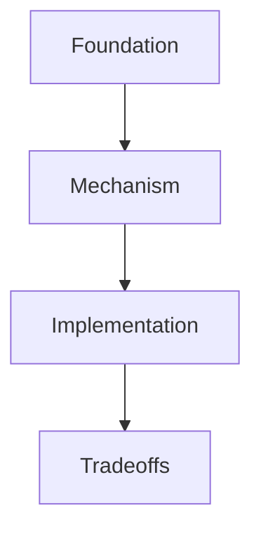

# <Topic Title>

## 1. Scope

State what this topic covers and what it does not cover.

## 2. Short Answer

Give the reader a compact mental model.

## 3. Reading Order

1. [Foundation](./01-foundation.md)
   Explain the prerequisite concepts covered by this chapter.
2. [Mechanism](./02-mechanism.md)
   Explain the runtime, causal, or structural mechanism.
3. [Implementation](./03-implementation.md)
   Explain implementation choices, examples, and verification.

## 4. Knowledge Map

Follow the diagram with a short textual interpretation.

## 5. Key Conclusions

1. First conclusion.
2. Second conclusion.
3. Third conclusion.

