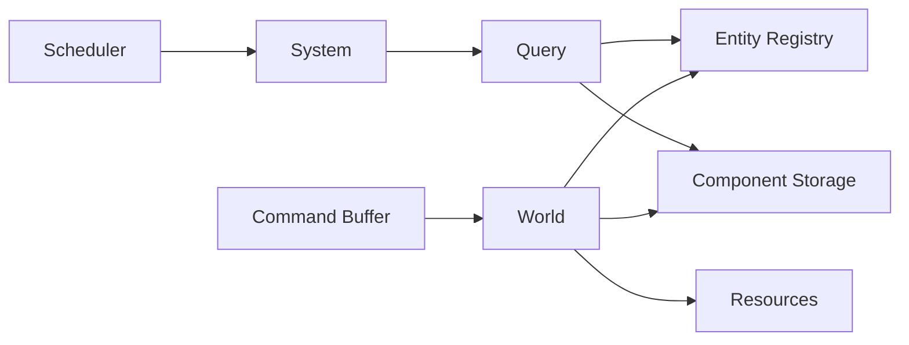
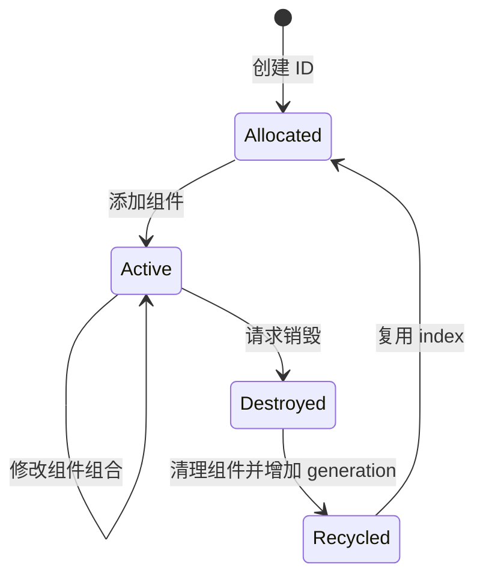

# ECS 核心结构

## 1. 总体关系

一个可运行的 ECS 通常不只有 Entity、Component 和 System，还需要负责存储、查询和调度的基础设施。



| 结构 | 责任 |
|---|---|
| World | 容纳一个独立 ECS 世界中的实体、组件和资源 |
| Entity Registry | 分配、回收并校验 Entity ID |
| Component Storage | 存储各类型组件 |
| Query | 筛选满足组件条件的实体 |
| System | 读取或修改查询结果 |
| Scheduler | 安排 System 的顺序和并行关系 |
| Command Buffer | 延迟执行实体创建、销毁和组件变更 |
| Resource | 保存不属于单个实体的全局数据 |

## 2. World

`World` 是 ECS 数据的所有者和访问入口。多个 World 可以彼此隔离，例如：

- 游戏主场景 World。
- 后台预演或编辑器 World。
- 服务端权威仿真 World。
- 客户端预测 World。

World 通常提供以下能力：

```text
createEntity()
destroyEntity(entity)
addComponent(entity, component)
removeComponent(entity, componentType)
query(componentTypes...)
getResource(resourceType)
```

业务 System 最好通过受约束的 Query 和 Resource 访问数据，而不是任意修改整个 World。

## 3. Entity 生命周期

Entity 的典型生命周期如下：



### 3.1 为什么需要 generation

假设实体 `(index=42, generation=3)` 被销毁，槽位 42 随后分配给新实体。若只保存 index，旧引用会错误地指向新实体。

回收时增加 generation：

```text
旧实体：(42, 3) -> 已失效
新实体：(42, 4) -> 有效
```

访问实体前同时校验 index 和 generation，即可识别悬空引用。

## 4. Component 类型

### 4.1 数据组件

保存普通状态：

```text
Transform { position, rotation, scale }
Health { current, maximum }
Lifetime { remainingSeconds }
```

### 4.2 标签组件

标签组件不需要字段，只表示某种分类或状态：

```text
Player
Enemy
Sleeping
PendingDestroy
```

System 可以通过标签快速筛选实体，避免在数据组件中增加大量布尔字段。

### 4.3 共享组件或资源

多个实体共同引用且很少变化的数据，可以使用资源句柄或共享组件：

```text
MeshHandle
MaterialHandle
NavigationMap
GameTime
```

大型资源不宜复制到每个实体中。组件通常只保存稳定句柄，资源管理器负责真实对象的生命周期。

## 5. Query

Query 用组件条件描述 System 的输入集合。

```text
必需：Position, Velocity
排除：Sleeping
可选：Acceleration
```

可表示为：

```text
With(Position, Velocity)
Without(Sleeping)
Optional(Acceleration)
```

查询条件应尽量稳定并可缓存。每帧扫描所有实体再逐个判断组件是否存在，会削弱 ECS 的主要优势。

## 6. Component Storage

存储模型决定了查询和结构变更的成本。

### 6.1 Sparse Set

Sparse Set 常为每种组件维护一组紧凑数据：

```text
dense entities:   [E7, E2, E9]
dense components: [C7, C2, C9]
sparse index:     Entity ID -> dense 下标
```

特点：

- 按 Entity 查找组件通常为 O(1)。
- 添加和删除单个组件较直接。
- 遍历单种组件很高效。
- 同时遍历多个组件时，数据不一定完全对齐。

它适合组件组合变化较频繁、实现复杂度需要可控的场景。

### 6.2 Archetype

Archetype 将组件组合完全相同的实体放在同一存储块中：

```text
Archetype A: Position + Velocity
Archetype B: Position + Velocity + Health
Archetype C: Position + Collider
```

特点：

- 查询可直接选择匹配的 Archetype。
- 多组件数据可以紧凑、连续地批量遍历。
- 添加或删除组件会让实体迁移到另一个 Archetype。
- 结构变更成本通常高于普通字段更新。

它适合实体数量大、组件组合相对稳定、批处理性能要求高的场景。

### 6.3 选择对比

| 维度 | Sparse Set | Archetype |
|---|---|---|
| 单组件访问 | 高效 | 高效 |
| 多组件连续遍历 | 一般 | 通常更好 |
| 添加/删除组件 | 较直接 | 需要迁移实体 |
| 实现复杂度 | 较低 | 较高 |
| 典型侧重点 | 灵活变更 | 极致批处理 |

不同 ECS 框架可能混合使用两种模型，不能只凭框架名称推断其性能特征。

关于 Archetype Chunk、连续组件列、Query Cache 和空间压缩的实现方案，参见[高性能存储设计](./07-high-performance-storage.md)。

## 7. Resource

Resource 表示 World 级别的数据，而不是单个 Entity 的数据，例如：

```text
DeltaTime
InputState
PhysicsWorld
RandomGenerator
GameConfig
```

将全局数据显式声明为 Resource，有助于调度器分析 System 的读写冲突：

```text
InputSystem: 只读 InputState，写 PlayerInput
MovementSystem: 只读 DeltaTime 和 Velocity，写 Position
```

## 8. Event

事件适合表达瞬时事实：

```text
DamageEvent { source, target, amount }
CollisionEvent { entityA, entityB, contact }
```

事件与组件的区别：

| 类型 | 表达内容 | 生命周期 |
|---|---|---|
| Component | 持续存在的状态 | 随实体或组件删除而结束 |
| Event | 已发生或待处理的事实 | 通常只保留一帧或有限队列 |

不要用事件替代所有状态，也不要用临时组件模拟所有事件。选择标准是信息是否需要持续存在并可被查询。

[上一章：基本原理](./01-fundamentals.md) | [返回目录](./README.md) | [下一章：运行流程](./03-runtime-flow.md)
