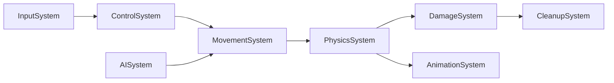
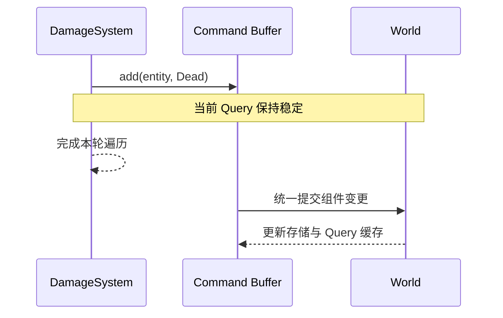
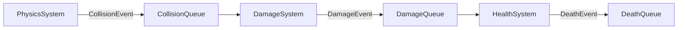

# ECS 运行流程

## 1. 一帧的基本过程

实时 ECS 通常按帧或固定时间步执行多个 System：


一个简单的调度阶段可以是：

```text
1. Input
2. PreUpdate
3. FixedUpdate
4. Physics
5. PostUpdate
6. ApplyCommands
7. RenderExtract
8. Render
```

阶段名称不是 ECS 标准。关键是让数据在何时可见、哪些系统可以并行、结构变更何时生效都具有明确规则。

## 2. System 的输入与输出

System 应显式声明读取和写入的数据：

```text
MovementSystem
读取：Velocity、DeltaTime
写入：Position
```

读写声明有三个用途：

- 帮助开发者理解副作用。
- 让调度器检测冲突。
- 为并行执行提供依据。

### 2.1 冲突规则

两个 System 访问同一数据类型时：

| System A | System B | 是否冲突 |
|---|---|---|
| 读 Position | 读 Position | 否 |
| 读 Position | 写 Position | 是 |
| 写 Position | 写 Position | 是 |
| 写 Position | 读 Velocity | 否 |

没有冲突不代表业务上一定可以并行。若 System B 逻辑上依赖 System A 生成的事件或状态，仍需显式声明先后关系。

## 3. System 调度

调度器根据阶段、依赖和读写冲突建立有向无环图：



其中 `DamageSystem` 和 `AnimationSystem` 若无数据冲突，可以并行执行。

关于总 DAG、动态剪枝、System 级与 Chunk 级并行的设计分析，参见[调度 DAG 方案分析](./08-scheduler-dag-analysis.md)。

### 3.1 显式排序

常见声明方式包括：

```text
ControlSystem.before(MovementSystem)
PhysicsSystem.after(MovementSystem)
CleanupSystem.inStage(PostUpdate)
```

不要依赖系统注册顺序形成隐式规则。随着模块增多，这种规则难以维护，也难以并行化。

### 3.2 固定时间步

物理或确定性仿真通常使用固定时间步：

```text
accumulator += frameTime

while accumulator >= fixedDelta:
    runFixedUpdate(fixedDelta)
    accumulator -= fixedDelta
```

优点：

- 仿真结果不直接依赖渲染帧率。
- 物理行为更稳定。
- 更容易实现回放、预测和确定性测试。

渲染可根据前后两个仿真状态进行插值，减少固定步长带来的视觉跳动。

## 4. 为什么需要延迟结构变更

结构变更包括：

- 创建或销毁 Entity。
- 添加或移除 Component。
- 将实体迁移到其他 Archetype。

若 System 正在遍历查询结果时直接改变其结构，可能导致：

- 迭代器失效。
- 当前实体被跳过或重复处理。
- 存储移动后引用失效。
- 并行任务发生数据竞争。

因此，System 通常只记录命令：

```text
commands.create(...)
commands.destroy(entity)
commands.add(entity, Dead)
commands.remove(entity, Velocity)
```

调度阶段结束后再统一提交：



## 5. 数据可见性

延迟提交意味着“写入何时可见”必须有明确约定。

### 5.1 普通字段修改

修改已有组件字段通常立即写入内存。后续 System 能否读取新值，取决于调度顺序和任务同步点。

### 5.2 结构修改

通过 Command Buffer 添加或删除组件，通常要到提交点后才对 Query 可见。

示例：

```text
DamageSystem 添加 Dead 标签（延迟）
LootSystem 在同一阶段查询 Dead
```

若两者之间没有提交点，`LootSystem` 可能要到下一阶段或下一帧才能看到 `Dead`。这不是错误，但必须是设计明确的行为。

## 6. Event 的处理流程

事件常采用双缓冲或分阶段队列：

```text
本阶段写入队列 -> 下一阶段读取队列 -> 读取完成后清空
```

例如：



需要明确以下规则：

- 一个事件可被一个还是多个 System 消费。
- 事件何时过期。
- 同帧事件是否允许级联。
- 队列溢出时如何处理。
- 多线程写入时如何保证顺序或确定性。

## 7. Entity 引用关系

组件可以保存另一个 Entity 的 ID：

```text
Target { entity }
Parent { entity }
Owner { entity }
```

使用前必须校验目标实体是否仍有效。ECS 通常不会自动维护所有引用完整性，因为全量反向索引成本较高。

常见策略：

- 每次访问时检查 `isAlive(entity)`。
- 销毁时发出事件，由相关 System 清理引用。
- 对强关系建立专门的关系组件或图结构。
- 对关键引用使用带 generation 的 Entity 句柄。

## 8. 完整帧示例

```text
Frame Start
├── 采集设备输入并更新 InputState
├── InputSystem：InputState -> PlayerInput
├── AISystem：感知数据 -> AIIntent
├── MovementSystem：Velocity -> Position
├── PhysicsSystem：Position -> CollisionEvent
├── DamageSystem：CollisionEvent -> Health
├── DeathSystem：Health <= 0 -> commands.add(Dead)
├── ApplyCommands：提交 Dead 标签和实体销毁
├── RenderExtractSystem：Transform + Mesh -> RenderWorld
└── RenderSystem：提交绘制命令
Frame End
```

这一流程体现了 ECS 的主要运行原则：**系统按明确依赖批量处理数据，结构变更在稳定边界统一提交。**

[上一章：核心结构](./02-core-model.md) | [返回目录](./README.md) | [下一章：工程实践](./04-engineering-practices.md)
