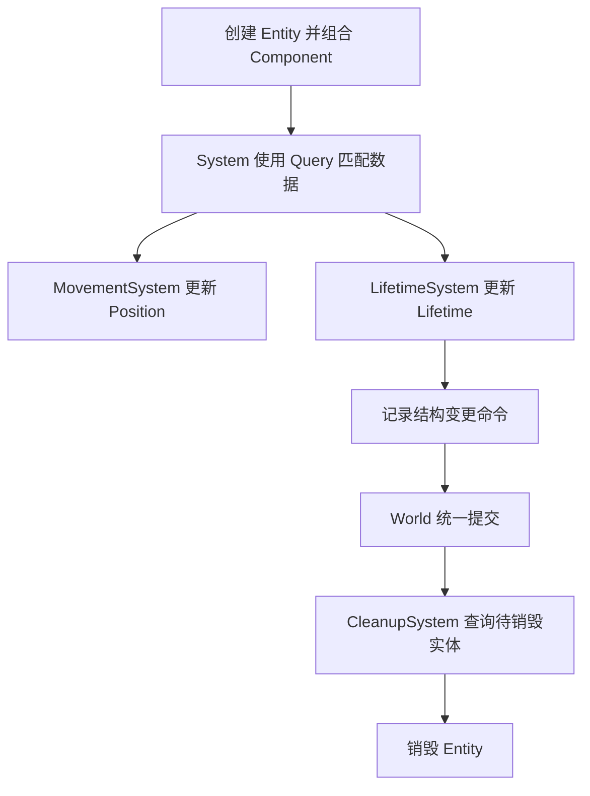

# ECS 最小示例

## 1. 目标

本例用与语言无关的伪代码实现一个二维移动流程，展示：

- 创建 Entity。
- 添加 Component。
- 使用 Query 匹配实体。
- 运行 System。
- 延迟销毁 Entity。

示例强调数据流，不包含完整存储和调度器实现。

## 2. 定义组件

```text
component Position {
    x: Float
    y: Float
}

component Velocity {
    x: Float
    y: Float
}

component Lifetime {
    remaining: Float
}

tag PendingDestroy
```

组件只保存状态：

- `Position`：当前位置。
- `Velocity`：每秒移动速度。
- `Lifetime`：剩余生存时间。
- `PendingDestroy`：等待销毁的标签。

## 3. 创建实体

```text
world = World()

player = world.createEntity()
world.add(player, Position(0, 0))
world.add(player, Velocity(3, 1))

projectile = world.createEntity()
world.add(projectile, Position(10, 5))
world.add(projectile, Velocity(20, 0))
world.add(projectile, Lifetime(2.0))

obstacle = world.createEntity()
world.add(obstacle, Position(30, 5))
```

三个实体没有类名，它们由组件组合区分：

| Entity | Position | Velocity | Lifetime |
|---|---:|---:|---:|
| player | 是 | 是 | 否 |
| projectile | 是 | 是 | 是 |
| obstacle | 是 | 否 | 否 |

## 4. MovementSystem

```text
system MovementSystem(deltaTime):
    query = world.query(
        write(Position),
        read(Velocity),
        without(PendingDestroy)
    )

    for each (position, velocity) in query:
        position.x += velocity.x * deltaTime
        position.y += velocity.y * deltaTime
```

该 Query 只匹配同时拥有 `Position` 和 `Velocity`，且没有 `PendingDestroy` 的实体：

- `player`：匹配。
- `projectile`：匹配。
- `obstacle`：不匹配，因为没有 `Velocity`。

System 不需要判断实体类型。

## 5. LifetimeSystem

```text
system LifetimeSystem(deltaTime, commands):
    query = world.query(
        read(Entity),
        write(Lifetime)
    )

    for each (entity, lifetime) in query:
        lifetime.remaining -= deltaTime

        if lifetime.remaining <= 0:
            commands.add(entity, PendingDestroy)
```

这里不立即修改组件结构，而是把添加标签的操作写入 Command Buffer。

## 6. CleanupSystem

```text
system CleanupSystem(commands):
    query = world.query(
        read(Entity),
        with(PendingDestroy)
    )

    for each entity in query:
        commands.destroy(entity)
```

为了让 `CleanupSystem` 看到 `LifetimeSystem` 新增的标签，两者之间需要一个提交点：

```text
run MovementSystem
run LifetimeSystem
apply commands
run CleanupSystem
apply commands
```

也可以规定清理发生在下一帧，从而减少提交点：

```text
run MovementSystem
run LifetimeSystem
run CleanupSystem  // 处理上一帧已经存在的标签
apply commands
```

两种设计都可行，区别是销毁延迟和同步成本不同。

## 7. 运行两帧

假设 `deltaTime = 1.0`：

### 7.1 第一帧

```text
player.position:     (0, 0)  -> (3, 1)
projectile.position: (10, 5) -> (30, 5)
projectile.lifetime: 2.0     -> 1.0
```

没有实体进入待销毁状态。

### 7.2 第二帧

```text
player.position:     (3, 1)  -> (6, 2)
projectile.position: (30, 5) -> (50, 5)
projectile.lifetime: 1.0     -> 0.0
```

`LifetimeSystem` 记录 `add(projectile, PendingDestroy)`，提交后由 `CleanupSystem` 记录销毁命令，最终 projectile 的所有组件被移除，Entity ID 失效。

## 8. 数据流总结



这个最小例子体现了 ECS 的完整闭环：

1. Entity 只提供身份。
2. Component 决定实体拥有什么数据。
3. Query 根据组件组合选择实体。
4. System 批量处理匹配数据。
5. Command Buffer 在稳定边界提交结构变更。

## 9. 进一步扩展

可以在不修改现有实体类型的情况下添加能力：

```text
新增 Acceleration 组件
新增 AccelerationSystem：Acceleration -> Velocity

新增 Collider 组件
新增 CollisionSystem：Position + Collider -> CollisionEvent

新增 NetworkReplicated 标签
新增 ReplicationSystem：筛选需要同步的组件
```

扩展方式仍是“增加数据 + 增加处理规则”，不需要建立新的继承层级。

[上一章：工程实践](./04-engineering-practices.md) | [返回目录](./README.md) | [下一章：组件存储与查询实现](./06-component-query-implementation.md)
