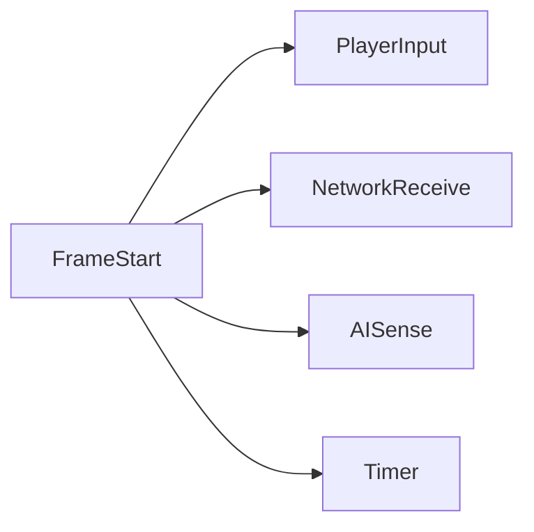
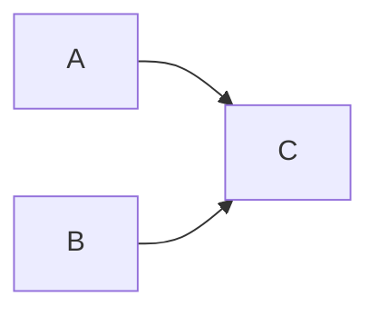
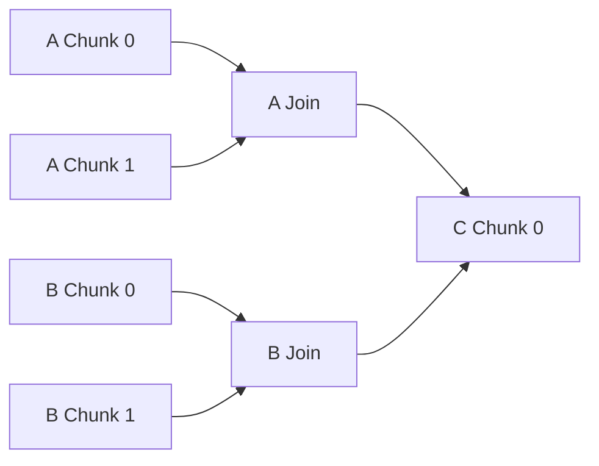
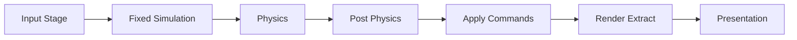

# ECS 调度 DAG 方案分析

## 1. 方案概述

待分析的方案可以概括为：

```text
1. 根据所有 System 的输入/输出构建总 DAG
2. 找到入口，例如玩家输入
3. 根据本帧实时输入剪枝，保留最简 DAG
4. 从入口正向搜索并生成完整运行顺序
5. System 之间单线程串行调度
6. 每个 System 内部使用多线程批处理实体
```

总体判断：

| 部分 | 判断 |
|---|---|
| 预先构建依赖图 | 正确方向 |
| 显式声明 System 读写关系 | 必要但不充分 |
| 按运行条件跳过无效工作 | 正确方向 |
| 从玩家输入正向剪枝 | 通常不正确 |
| 将 DAG 转成唯一串行顺序 | 正确但损失并行性 |
| 只在 System 内部并行 | 可作为第一版，但不是理想终态 |
| 每帧重新寻找最简 DAG | 收益不确定，可能得不偿失 |

核心问题是：**ECS System 通常是有状态、带副作用的状态转换，不是纯函数组成的数据流管线。**

## 2. 方案中合理的部分

### 2.1 显式建图

System 之间的先后关系不应隐藏在注册顺序中。用图表示依赖可以：

- 检测循环依赖。
- 验证数据冲突。
- 生成稳定执行顺序。
- 找出可并行节点。
- 输出可视化调度信息。

### 2.2 跳过无工作量的 System

以下运行条件可以减少无效工作：

```text
Query 为空
事件队列为空
相关 Chunk 自上次执行后未变化
定时器尚未到期
功能模块未启用
当前 World 不包含对应场景
```

但这些条件必须由 System 明确声明，不能只由玩家输入推导。

### 2.3 System 内按 Chunk 并行

同一 System 的 Query 通常访问相同组件列，按 Chunk 分片具有良好局部性：

```text
MovementSystem
├── Task 0：Chunk 0
├── Task 1：Chunk 1
├── Task 2：Chunk 2
└── Join
```

这种并行方式容易控制读写集合，也是合理的初始实现。

## 3. 问题一：DAG 有入口，但不一定是玩家输入

有限 DAG 至少存在一个入度为 0 的节点，但它可能：

- 有多个入口。
- 与玩家输入无关。
- 属于彼此不连通的子图。
- 只是人为划分阶段后的根节点。

典型根节点包括：

```text
PlayerInputSystem
NetworkReceiveSystem
AISenseSystem
TimerSystem
SpawnSystem
WeatherSystem
ReplicationSystem
BackgroundStreamingSystem
```

即使玩家没有输入，以下逻辑仍可能必须运行：

- 敌人 AI 继续行动。
- 子弹继续飞行。
- Buff 和技能冷却继续计时。
- 物理对象受重力影响。
- 网络消息继续到达。
- 实体生命周期继续减少。
- 服务端继续生成权威快照。

可以人为添加 `FrameStart` 超级入口：



但超级入口只方便遍历，不代表所有节点在语义上都由它产生数据。

## 4. 问题二：输入/输出关系不足以确定依赖方向

只知道 System 读写哪些组件，只能发现潜在冲突，不能总是推导业务顺序。

假设：

```text
System A：写 Position
System B：读 Position
```

至少存在两种合法语义：

```text
A -> B：B 读取 A 在本帧更新后的 Position
B -> A：B 读取上一状态，A 随后更新 Position
```

例如：

```text
MovementSystem 写 Position
PreviousTransformCaptureSystem 读 Position
```

如果 Capture 需要保存移动前的位置，它必须在 Movement 之前；如果 RenderExtract 需要移动后的位置，它必须在 Movement 之后。

### 4.1 数据访问冲突

| A 访问 | B 访问 | 是否冲突 | 能否自动决定方向 |
|---|---|---|---|
| 读 X | 读 X | 否 | 无需排序 |
| 写 X | 读 X | 是 | 不能，仅凭读写无法判断 |
| 读 X | 写 X | 是 | 不能，仅凭读写无法判断 |
| 写 X | 写 X | 是 | 不能，需要业务规则或归并语义 |

因此，调度边至少来自两部分：

```text
显式语义依赖：before / after / stage
+ 自动生成的冲突约束
```

自动冲突分析适合验证并行安全，不应代替业务语义声明。

## 5. 问题三：一种边不能表达所有语义

原方案容易把以下概念都表示为 `A -> B`：

1. A 和 B 同时运行时，A 必须先完成。
2. B 运行意味着 A 本帧也必须运行。
3. A 产生事件后才触发 B。
4. A 与 B 之间需要提交 Command Buffer。
5. B 必须读取 A 本帧生成的新数据。

这些语义并不相同。

### 5.1 排序依赖

```text
A 和 B 都激活时，A 在 B 之前
```

若 A 本帧跳过，B 仍可能读取已有状态并正常运行。

### 5.2 激活依赖

```text
只有 A 产生特定结果时，B 才需要运行
```

例如 Collision Event 队列为空时，可以跳过 DamageSystem。

### 5.3 数据新鲜度依赖

```text
B 要求读取 A 在当前 Tick 生成的数据
```

如果 A 被跳过，B 也应跳过、读取默认值，或者报告调度错误。必须显式定义。

### 5.4 屏障依赖

```text
A 完成
-> 提交结构变更
-> B 才能查询到新组件组合
```

这条边中间包含同步和可见性语义，不只是普通先后顺序。

推荐将不同语义分别建模，而不是只维护一个无类型边集合。

## 6. 问题四：实时输入不能决定完整执行子图

玩家输入只是本帧状态变化的一个来源。System 是否运行还可能取决于：

- World 中已有的持续状态。
- 上一帧遗留状态。
- 网络、时钟、AI 或物理。
- Event Queue 是否有数据。
- Query 是否为空。
- 组件版本是否改变。
- 外部设备和异步任务。
- System 自身的定时策略。

### 6.1 没有新按键不等于没有输入状态

玩家持续按住前进键时，本帧可能没有新的按键事件，但 `InputState.forward = true` 仍需驱动移动。

```text
瞬时事件：KeyDown
持续状态：KeyHeld
```

如果只根据本帧新事件剪枝，可能错误跳过持续行为。

### 6.2 System 可以修改持久状态

`LifetimeSystem` 即使不产生任何下游临时输出，也会减少实体剩余生命：

```text
Lifetime.remaining -= deltaTime
```

这次写入本身就是必须保留的仿真结果，不能因为暂时没有消费者而剪掉。

### 6.3 副作用 System 不一定有 ECS 输出

以下 System 可能没有普通组件输出：

```text
AudioSystem：向音频设备提交命令
NetworkSendSystem：发送网络包
TelemetrySystem：写入监控数据
SaveSystem：写入存档
RenderSubmitSystem：提交 GPU 命令
```

只分析组件输入/输出会遗漏这些副作用。

## 7. 问题五：正向搜索不等于最小必要子图

从输入入口正向搜索可以找到“可能受该输入影响的节点”，但不能保证得到本帧必须执行的最小集合。

它会产生两类错误：

### 7.1 漏执行

不从玩家输入可达，但必须独立执行的系统会被漏掉：

```text
AI -> Movement
Timer -> BuffExpiration
Network -> Reconciliation
Lifetime -> Cleanup
```

### 7.2 多执行

从输入可达的节点，其输出本帧可能无人使用。正向遍历仍会将其保留。

在纯函数数据流系统中，删除无用计算通常从 **必须产生的输出端点向后搜索**：

```text
Required Sink
-> 找到它依赖的生产者
-> 继续反向追踪
```

例如从 Render Output 或 Network Snapshot 反向切片。

但 ECS System 会修改持久 World 状态，因此“哪些结果是必需输出”很难自动确定。只有被明确标记为纯计算、无副作用、结果不跨帧保存的节点，才适合安全地做需求驱动剪枝。

## 8. 问题六：“最简 DAG”缺少严格定义

最简可能表示：

- 节点数量最少。
- 预计执行时间最短。
- 满足当前输出需求的最小闭包。
- 保留全部副作用的最小集合。
- 满足帧预算的近似集合。

这些目标不同，结果也不同。

若 System 会读写持久状态或产生外部副作用，判断它是否可删除需要业务语义，不能只看图连通性。

即使能定义最简集合，每帧重新进行：

```text
条件评估
+ 图剪枝
+ 拓扑排序
+ 任务拆分
```

也会产生调度开销、内存访问和执行顺序抖动。System 数量不大时，剪枝成本可能超过被跳过的工作。

更常见的方案是：

```text
初始化时构建静态 DAG 和拓扑结构
运行时只更新节点 active / skipped 状态
```

跳过节点后递减其后继依赖计数，不必重建整张图。

## 9. 问题七：DAG 的拓扑顺序不是唯一的

假设：



合法顺序至少有：

```text
A, B, C
B, A, C
```

把 DAG 转成“完整运行顺序”会把偏序关系强制变成全序关系。结果虽然正确，但丢失了 A 与 B 可以并行的信息。

更合理的运行表示是：

```text
Level 0 / Ready Set：A, B
Level 1：C
```

或者直接维护每个节点的未完成前驱计数，在前驱完成时将节点放入 Ready Queue。

## 10. 问题八：只做 System 内并行会损失并行性

原方案：

```text
System A 的全部 Chunk 并行
-> 全局等待
-> System B 的全部 Chunk 并行
-> 全局等待
-> System C
```

主要问题：

### 10.1 小 System 无法填满 CPU

如果 System A 只有两个 Chunk，而机器有 16 个工作线程，其余线程会空闲。与此同时，独立的 System B 本可以并行运行。

### 10.2 每个 System 之间都有粗粒度屏障

即使 A 和 B 没有数据冲突，也要等待 A 全部结束后才开始 B。

### 10.3 长尾任务导致负载不均

某个 Chunk 较重时，其他工作线程完成后只能等待该 Chunk，而不能去执行另一个 Ready System。

### 10.4 嵌套线程池风险

如果每个 System 自己创建或管理线程，会导致：

- 线程过量创建。
- CPU 过度订阅。
- 调度器无法统一负载均衡。
- 难以控制优先级与帧预算。
- 并行归并和异常处理复杂。

建议由全局 Scheduler 拥有一个工作窃取线程池。System 只描述如何拆成 Chunk Task，不自行管理线程。

## 11. 更合理的并行模型

将 System DAG 展开为 Task DAG：



如果 A 与 B 互不冲突，它们的 Chunk Task 可以同时进入全局 Ready Queue。

推荐结构：

```text
单线程协调器
  负责激活条件、依赖计数和提交边界

全局 Worker Pool
  执行所有 System 的 Chunk Task

Join/Fence
  只在真实依赖、归并或结构提交点等待
```

“调度器本身单线程”通常可以接受，因为依赖计数更新很轻；但不应限制为“一次只允许一个 System 执行”。

## 12. 问题九：总图不一定天然无环

业务数据流可能存在反馈：

```text
Movement -> Physics -> Damage -> State -> Movement
```

跨帧展开后，这是正常反馈：

```text
State(t)
-> Movement(t)
-> Physics(t)
-> Damage(t)
-> State(t+1)
```

如果忽略时间边界并把所有读写关系放进同一帧总图，就可能形成环。

需要通过以下方式打断：

- Stage 边界。
- 固定 Tick 边界。
- 双缓冲状态。
- Event Queue 的当前帧/下一帧语义。
- 显式迭代算法及最大迭代次数。

DAG 是 **某个调度时间域内的执行计划**，不一定是整个业务系统永久且唯一的总图。

## 13. 问题十：组件级读写声明可能过粗或过细

### 13.1 过粗导致假冲突

```text
PlayerMovement：写玩家 Position
EnemyMovement：写敌人 Position
```

如果两个 Query 保证实体集合不相交，它们可以并行。但只看“都写 Position”会强制串行。

调度器可以选择：

- 保守串行，保证简单正确。
- 使用 Query 标签证明集合互斥。
- 在 Chunk 层动态分区。

### 13.2 过细导致分析成本过高

如果依赖精确到每个实体或每个字段，运行时别名分析和建图成本可能过高。

合理粒度通常是：

```text
Component / Resource 级静态冲突分析
+ Archetype / Chunk 级任务分片
+ 少量显式互斥 Query 证明
```

## 14. 原方案缺失的调度语义

完整 Scheduler 至少还需要定义：

| 缺失项 | 需要回答的问题 |
|---|---|
| 时间域 | FixedUpdate 与 RenderUpdate 如何交互 |
| 数据可见性 | 写入何时对后续 System 可见 |
| 结构变更 | Command Buffer 在哪里提交 |
| Event 生命周期 | 同帧还是下一帧消费 |
| 外部副作用 | 网络、音频、GPU 如何建模 |
| 归并规则 | 多任务输出如何确定性合并 |
| 异常处理 | 某 Task 失败后是否继续 |
| 帧预算 | 低优先级任务是否允许延迟 |
| 确定性 | Ready 节点执行顺序是否稳定 |
| 异步任务 | IO、资源加载跨多帧如何完成 |
| World 隔离 | 多 World 是否共享线程池 |
| 调试追踪 | 为什么某 System 本帧运行或跳过 |

## 15. 推荐的修正版架构

### 15.1 System 描述

每个 System 显式声明：

```typescript
interface SystemDescriptor {
  name: string;
  stage: Stage;

  reads: Access[];
  writes: Access[];

  before: SystemId[];
  after: SystemId[];

  consumesEvents: EventType[];
  producesEvents: EventType[];

  structuralChanges: boolean;
  sideEffects: SideEffect[];

  runCondition: RunCondition;
  determinism: DeterminismPolicy;
}
```

访问模式还可以区分：

```text
Read
Write
Atomic
Reduce
Exclusive
Structural
```

### 15.2 初始化阶段

```text
1. 按时间域和 Stage 对 System 分组
2. 加入显式 before / after 语义边
3. 根据读写冲突验证或补充安全边
4. 加入 Event、Fence 和 ApplyCommands 节点
5. 检测环并输出完整诊断路径
6. 缓存拓扑结构、前驱计数和 Query Plan
```

静态图可以包含多个根节点。为了实现方便，可以添加虚拟 `StageStart` 和 `StageEnd`。

### 15.3 每帧运行阶段

```text
1. 固化 Input、Network 和 Time 快照
2. 评估各 System 的 RunCondition
3. 初始化静态 DAG 的依赖计数
4. 将 active 且依赖为 0 的节点放入 Ready Queue
5. skipped 节点直接完成其调度令牌
6. active System 生成一个或多个 Chunk Task
7. Worker Pool 执行所有 Ready Task
8. Join 完成后释放后继节点
9. 在明确 Fence 提交 Event、Reduction 和 Command Buffer
10. 记录运行、跳过原因和耗时
```

伪代码：

```text
for node in staticGraph:
    node.active = node.runCondition.evaluate(frameContext)
    node.remainingDeps = node.predecessorCount

enqueueReadyRoots()

while unfinishedNodes > 0:
    node = readyQueue.pop()

    if not node.active:
        complete(node)
        continue

    tasks = node.buildChunkTasks()
    workerPool.submit(tasks, onJoin = complete(node))
```

实际实现中 Ready Queue 和完成回调可以并发工作，不必由协调线程忙等。

## 16. 推荐的运行条件

运行时优化优先使用显式条件，不要重建最简图：

| 条件 | 示例 |
|---|---|
| `Always` | PhysicsIntegration |
| `QueryNotEmpty` | Movement Query 有实体 |
| `EventNotEmpty` | DamageEvent 队列非空 |
| `Changed` | Transform Chunk 版本改变 |
| `Interval` | 每 10 个 Tick 执行一次 |
| `ResourceState` | 游戏未暂停 |
| `FeatureEnabled` | DebugDraw 开启 |
| `ExternalSignal` | 网络包到达 |

需要注意：

- `QueryNotEmpty` 只能说明存在数据，不能说明数据发生变化。
- `Changed` 应定义“被写访问”还是“值实际变化”。
- 跳过生产者后，消费者读取旧值还是一同跳过必须明确。
- RunCondition 本身应比 System 工作量便宜。

## 17. 如果确实需要动态剪枝

只有满足以下条件的子图适合安全剪枝：

```text
System 是纯函数或副作用已显式建模
输入和输出是版本化数据
输出不会作为跨帧持久状态隐式保存
必需 Sink 已明确
跳过规则不会破坏确定性
```

此时应采用：

```text
1. 从本帧 Required Sinks 反向搜索生产者
2. 形成需求闭包
3. 合并 AlwaysRun 和 SideEffect 节点
4. 再根据输入可用性判断节点是否可执行
```

不是只从玩家输入正向搜索。

对于典型 ECS 仿真，更实用的是：

```text
静态 DAG
+ 节点 RunCondition
+ Event Queue 空检查
+ Chunk Changed Filter
+ Query 空检查
```

## 18. 建议的分阶段图

不要构建一个包含所有时间语义的巨大总图。可以按阶段建立或编译子图：



每个 Stage 内部再使用 DAG 表达可并行关系。阶段之间只在必要处设置 Fence。

这样可以明确：

- 固定步长与可变帧率。
- Event 在哪个阶段可见。
- 结构变更何时提交。
- 渲染读取哪个仿真快照。

## 19. 最终建议

保留原方案中的：

```text
静态依赖建图
显式 System 输入/输出
运行时跳过无工作节点
按 Chunk 批处理
单线程轻量协调器
```

需要修改为：

```text
多个根节点，而不是假定玩家输入是唯一入口
显式语义依赖 + 自动冲突分析，而不是只靠 I/O 推导
静态 DAG + RunCondition，而不是每帧重建最简 DAG
从 Required Sink 反向切片，而不是只从输入正向剪枝
全局 Worker Pool 执行跨 System Chunk Task
只在真实依赖处 Join，而不是每个 System 后全局等待
通过 Stage/Tick/双缓冲打断反馈环
显式建模 Event、结构变更、外部副作用和确定性
```

推荐的核心执行模型：

```text
静态 System DAG
-> 运行时激活掩码
-> Ready Queue
-> 全局 Chunk Task Pool
-> 必要的 Join / Fence
-> Command Buffer 提交
```

这比“输入驱动的最简串行 System 链”更符合 ECS 的有状态仿真特征，也能同时利用系统级与实体批处理级并行。

[上一章：高性能存储设计](./07-high-performance-storage.md) | [返回目录](./README.md) | [下一章：哈希查询与分支预测](./09-hash-and-branch-performance.md)
