# C++ 基础知识

## 1. 文档范围

本文档整理 C++ 语言基础知识，按**标准版本归类**，覆盖以下主题：

- C++98：多重继承与 mix-in 类、虚函数与虚表、RAII 与作用域守卫、拷贝控制与三五法则、`new`/`delete` 与 `std::allocator`、模板特化与类型特征。
- C++11：统一初始化、标准属性说明符、Lambda 表达式、函数类型擦除（`std::function`）、`std::bind` 与引用包装、移动语义、智能指针、常用特性速览。
- C++14：通用 Lambda、变量模板、移动捕获、`std::make_unique`。
- C++17：`std::apply`、结构化绑定、`if constexpr`、常用新增库组件。

> 适用方向：Unreal、自研引擎、渲染和性能相关岗位；同时为阅读 ECS 与面试知识库提供语言层基础。
>
> 引擎层面的内存分配策略与作用域守卫不在本文档范围，见 [引擎基础](../engine/README.md)。

## 2. 阅读导航

按标准版本顺序阅读：

| 顺序 | 标准 | 文件 | 内容 |
|---|---|---|---|
| 1 | C++98 | [01-cpp98](./01-cpp98.md) | 继承与 mix-in、虚函数与虚表、RAII、拷贝控制、内存管理、模板 |
| 2 | C++11 | [02-cpp11](./02-cpp11.md) | 统一初始化、属性、Lambda、类型擦除、bind、移动语义、智能指针 |
| 3 | C++14 | [03-cpp14](./03-cpp14.md) | 通用 Lambda、变量模板、移动捕获、make_unique |
| 4 | C++17 | [04-cpp17](./04-cpp17.md) | std::apply、结构化绑定、if constexpr、库组件 |

## 3. 关于 C++03

C++03 是一次修订性标准：**没有新增主要语言特性**，只修复 C++98 的缺陷并小幅修订标准库。

因此本文不单列 C++03 章节，C++98 与 C++03 视为同一语言基线。

## 4. 知识结构

```mermaid
flowchart TD
    CPP[C++ 基础]
    CPP --> C98[C++98]
    CPP --> C11[C++11]
    CPP --> C14[C++14]
    CPP --> C17[C++17]

    C98 --> Inherit[多重继承与 mix-in]
    C98 --> VTable[虚函数与虚表]
    C98 --> RAII[RAII 与作用域守卫]
    C98 --> Copy[拷贝控制与三五法则]
    C98 --> Mem[new/delete 与 std::allocator]
    C98 --> Template[模板特化与类型特征]

    C11 --> Init[统一初始化]
    C11 --> Attr[标准属性说明符]
    C11 --> Lambda[Lambda 表达式]
    C11 --> Erase[类型擦除 std::function]
    C11 --> Bind[std::bind 与引用包装]
    C11 --> Move[移动语义与右值引用]
    C11 --> Smart[智能指针]

    C14 --> GLambda[通用 Lambda]
    C14 --> VTemplate[变量模板]
    C14 --> Cap[移动捕获]
    C14 --> MakeUnique[std::make_unique]

    C17 --> Apply[std::apply]
    C17 --> SBind[结构化绑定]
    C17 --> IfConstexpr[if constexpr]
    C17 --> Lib[新增库组件]
```

## 5. 阅读结论

掌握本模块时应抓住五个重点：

1. **C++ 的多数机制在编译期定型**：模板实例化、类型特征匹配、Lambda 展开都没有运行时解析成本；运行期唯一的"间接"主要是虚函数与类型擦除。
2. **RAII 是资源管理的统一答案**：锁、句柄、动态内存都依赖"析构必定执行"，拷贝控制（三/五法则）是所有权正确性的前提。
3. **C++11 是分水岭**：统一初始化、属性、Lambda、类型擦除、移动语义与智能指针让"泛型能力"与"运行时多态"可以组合使用。
4. **版本差异决定语法边界**：同一目标在 C++98 需要模板技巧，在 C++11 用 lambda，在 C++14/17 更简洁。
5. **语言与引擎分层**：语言层约定接口（new/delete、std::allocator），引擎层决定策略（线性/池/Arena 分配器、作用域守卫），见 [引擎基础](../engine/README.md)。
