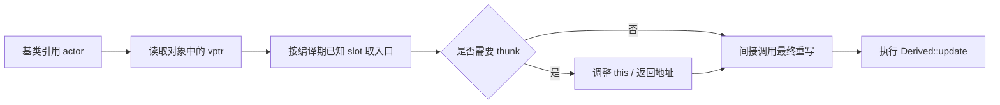

# 对象布局、虚表与完整调用链

## 1. 先划清标准与实现的边界

C++ 标准规定的是可观察行为：

- 经基类指针或引用调用虚函数时，应执行最终重写；
- 对象构造、析构和类型转换必须符合规定语义；
- `dynamic_cast`、`typeid` 等 RTTI 操作应得到正确结果。

标准**没有规定**对象必须含有名为 vptr 的字段，也没有规定虚函数表的排列方式。

不过，GCC/Clang 常用的 Itanium C++ ABI 和 MSVC ABI 都采用相似思路：

- 多态对象内保存一个或多个虚表指针，简称 **vptr**；
- 每个多态类生成一组只读表格，统称 **vtable**；
- 虚调用从表中固定槽位取目标地址并间接调用。

所以下文描述的是主流实现模型。它非常适合解释性能、调试和 ABI，但不能拿来做可移植的指针运算。

## 2. 四个关键名词

| 名词 | 含义 |
|---|---|
| vptr | 存在于对象或多态基类子对象中的隐藏指针，指向对应虚表 |
| vtable | 类级别共享的表，包含虚函数入口和 ABI 所需元数据 |
| slot | 某个虚函数在虚表中的固定位置 |
| thunk | 编译器生成的小跳板，用于调整 `this` 或返回指针后再进入真正函数 |

可以把 vtable 想成酒店总机的分机表：

- 每个房间对象拿着总机号码 vptr；
- "客房服务"在所有同类酒店的分机表里占同一个 slot；
- 不同酒店把该 slot 接到各自的服务台；
- 多继承时地址不在大堂正门，thunk 负责先把来电转到正确入口。

## 3. 单继承下的典型对象布局

```cpp
struct Shape {
    virtual ~Shape() = default;
    virtual double area() const = 0;
    int color = 0;
};

struct Circle final : Shape {
    double radius = 1.0;
    double area() const override;
};
```

在 64 位主流 ABI 上，一个 `Circle` 对象可以概念化为：

```text
Circle object
lower address
+----------------------------+
| vptr ----------------------+------+
+----------------------------+      |
| Shape::color               |      |
+----------------------------+      |
| padding (可能存在)         |      |
+----------------------------+      |
| Circle::radius             |      |
+----------------------------+      |
higher address                      |
                                    v
Circle vtable (class-wide, shared)
+----------------------------+
| RTTI / offset metadata     |  ABI-dependent
+----------------------------+
| destructor entries         |
+----------------------------+
| &Circle::area              |  area 的固定 slot
+----------------------------+
```

重要区别：

- **数据成员属于每个对象**，一万个 `Circle` 就有一万份 `radius`。
- **vptr 通常属于每个对象**，准确地说属于每个需要独立分派的多态子对象。
- **vtable 属于类**，同一类的所有对象共享，不会每个对象复制一张表。

vptr 常位于对象起始处，但这也不是标准保证。主基类选择、虚继承、对齐和 ABI 都可能影响布局。

## 4. 重写如何反映到虚表

假设基类有两个虚函数：

```cpp
struct Actor {
    virtual void update(float dt);
    virtual void draw() const;
    virtual ~Actor() = default;
};

struct Monster : Actor {
    void update(float dt) override;
    // 没有重写 draw
};
```

可以把两张表简化为：

```text
Actor vtable                  Monster vtable
+---------------------+      +-----------------------+
| slot 0: Actor::update|      | slot 0: Monster::update|
| slot 1: Actor::draw  |      | slot 1: Actor::draw    |
| destructor entries  |      | destructor entries     |
+---------------------+      +-----------------------+
```

重写不会让调用点去搜索函数名。编译器早已根据静态类型知道 `update` 对应哪个 slot；派生类只是在自己的表中把该 slot 换成新入口。不重写的 `draw` 则沿用基类入口。

实际 ABI 中，析构函数可能有完整对象析构、基类子对象析构、析构并释放内存等多个入口，slot 排列也未必像示意图一样简单。

## 5. 一次虚函数调用的完整链路

源代码：

```cpp
void simulate(Actor& actor, float dt) {
    actor.update(dt);
}
```

概念上的低级操作：

```cpp
// 伪代码，不是合法的可移植 C++
vtable = load_vptr(&actor);
target = load_slot(vtable, UPDATE_SLOT);
target(&actor, dt);  // this 作为隐藏参数传入
```

完整链路：



从 CPU 视角，常见步骤是：

1. 从对象地址加载 vptr；
2. 从 `vptr + 固定偏移` 加载函数入口；
3. 把对象地址作为隐藏的 `this` 参数；
4. 执行一次间接 `call` 或 `branch`；
5. 进入最终重写。

编译器不需要在运行时比较类型名，也不需要遍历整张虚表。虚调用更像"按固定下标查一次函数指针"，不是在电话簿里从 A 翻到 Z。

## 6. `this` 指针为何重要

非静态成员函数：

```cpp
double Circle::area() const;
```

可以概念化成普通函数：

```cpp
double Circle_area(const Circle* self);
```

成员函数之所以能访问 `radius`，是因为调用者隐式传入了 `this`。虚表保存的不只是"调用哪段代码"，调用过程还必须保证传入的 `this` 指向该函数所期待的子对象位置。

单继承时，派生对象地址和主基类子对象地址通常相同，调整很简单；多继承时，两者可能不同。

## 7. 多继承为何可能有多个 vptr

```cpp
struct Renderable {
    virtual ~Renderable() = default;
    virtual void render() const = 0;
    int layer = 0;
};

struct Updatable {
    virtual ~Updatable() = default;
    virtual void update(float dt) = 0;
    int priority = 0;
};

struct Character final : Renderable, Updatable {
    void render() const override;
    void update(float dt) override;
    int health = 100;
};
```

典型布局可能是：

```text
Character object
+------------------------------------+  <- Character* / Renderable*
| Renderable vptr                    |
| Renderable::layer                  |
+------------------------------------+  <- Updatable*
| Updatable vptr                     |
| Updatable::priority                |
+------------------------------------+
| Character::health                  |
+------------------------------------+
```

`Character*` 转成 `Renderable*` 时地址通常不变；转成 `Updatable*` 时要加上 `Updatable` 子对象的偏移：

```cpp
Character character;
Character* whole = &character;
Updatable* part = &character;

// whole 与 part 的数值地址可能不同，但都指向同一个完整对象的相应部分。
```

因此，不能简单记成"只要类有虚函数，每个完整对象就一定只有一个 vptr"。多继承下，一个完整对象可能包含多个需要独立分派的多态基类子对象，每个子对象通常有自己的 vptr。

## 8. thunk 如何调整 `this`

通过 `Updatable*` 调用：

```cpp
part->update(0.016f);
```

`part` 指向对象中间的 `Updatable` 子对象，但 `Character::update` 的函数体通常希望拿到完整 `Character*`，以便访问 `health`。虚表 slot 可以指向一个编译器生成的 thunk：

```text
Updatable*
    |
    | indirect call
    v
[thunk: this -= UpdatableOffset]
    |
    v
Character::update(Character* this, float dt)
```

thunk 通常只有几条指令。协变返回类型、多继承交叉转换等场景也可能需要调整返回指针。

## 9. 虚继承让布局更复杂

菱形继承：

```text
        Entity
       /      \
  Renderable  Networked
       \      /
        Player
```

普通多继承会让 `Player` 含两份 `Entity`。虚继承让两条路径共享一份虚基类子对象：

```cpp
struct Renderable : virtual Entity {};
struct Networked  : virtual Entity {};
struct Player : Renderable, Networked {};
```

为了在运行时找到共享虚基类，ABI 需要保存额外偏移信息。不同实现可能把信息放进 vtable、单独的虚基表指针或其他结构中。结果包括：

- 对象布局和指针转换更复杂；
- 访问虚基类成员可能多一次间接寻址；
- 最派生类负责构造虚基类；
- 构造顺序不再只看书写顺序。

虚继承能表达真实的共享基类语义，但不应仅为了"把菱形编译过去"随手添加。继承图开始像地铁换乘图时，组合往往值得重新考虑。

## 10. 构造期间 vptr 如何变化

构造 `Derived` 大致经历：

```text
1. 分配完整对象内存
2. 构造 Base 子对象
   - 写入 Base 阶段使用的 vptr
   - 执行 Base 构造函数
3. 构造 Derived 成员
4. 切换到 Derived 对应的 vptr
5. 执行 Derived 构造函数体
```

析构顺序相反：

```text
1. 执行 Derived 析构函数体
2. 销毁 Derived 成员
3. 进入 Base 析构阶段并使用 Base 阶段的分派语义
4. 执行 Base 析构函数
5. 释放完整对象内存
```

具体写 vptr 的时机由 ABI 和编译器决定，但可观察效果必须是：构造/析构期间，虚调用只到当前有效层级。这正是上一章中"构造函数不能调用派生重写"的底层背景。

如果对象尚未构造完成就被另一个线程访问，或者析构时仍被外部调用，问题不是虚表是否刷新及时，而是对象生命周期和并发协议已经失效。

## 11. RTTI 通常放在哪里

主流 ABI 常把 RTTI 元数据与虚表关联：

```text
vptr
  |
  v
vtable address point
  |- offset-to-top
  |- type_info pointer
  |- virtual function entries
  `- destructor entries
```

Itanium ABI 中，对象里的 vptr 通常指向虚表的 **address point**，它未必是整张表的首地址；某些元数据位于 address point 前方。MSVC 的组织方式不同，但目标相似。

`typeid(object)` 和 `dynamic_cast` 可以借助这些信息：

- 找到完整对象的动态类型；
- 在继承图中定位目标基类子对象；
- 判断转换是否唯一且可访问；
- 必要时调整指针。

因此 `dynamic_cast` 的成本与层次复杂度有关，不只是一次固定 slot 调用。

## 12. vtable 与程序内存区域

典型进程布局中：

| 内容 | 常见位置 | 生命周期 |
|---|---|---|
| 对象 | 栈、堆、静态存储区、对象池 | 由对象本身决定 |
| vptr | 对象内部 | 与对象一致 |
| vtable | 只读数据段或类似区域 | 整个程序/动态库装载期 |
| 虚函数机器码 | 代码段 | 整个程序/动态库装载期 |
| RTTI 元数据 | 只读数据段或 ABI 专用区域 | 整个程序/动态库装载期 |

所以"虚表在堆上吗"这个常见问题没有准确的标准答案。对象可能在堆上，虚表通常不在；标准则根本不要求有虚表。

## 13. 空间成本不能只背"+8 字节"

64 位平台上一个指针通常是 8 字节，因此简单单继承多态对象常比非多态对象多一个 8 字节 vptr。但真实成本还受以下因素影响：

- 32/64 位指针宽度；
- 一个完整对象中多态基类子对象的数量；
- 对齐和填充；
- 空基类优化或 `[[no_unique_address]]`；
- 虚继承元数据；
- ABI 对析构和 RTTI 的安排。

示例：

```cpp
struct Plain {
    int value;
};

struct Polymorphic {
    virtual ~Polymorphic() = default;
    int value;
};

std::cout << sizeof(Plain) << ' '
          << sizeof(Polymorphic) << '\n';
```

这段程序只能观察当前构建环境，不能证明所有平台上的固定关系。不要写 `static_assert(sizeof(Polymorphic) == 16)` 作为跨平台逻辑。需要确定布局时，只能对明确的编译器、ABI、编译选项和目标平台做验证。

## 14. 时间成本来自哪里

一次无法去虚化的调用通常包含：

1. 加载 vptr；
2. 加载 slot；
3. 间接分支；
4. 可能的 `this` 调整。

这些指令本身经常很少。更大的性能影响可能来自：

- **无法内联**：函数调用边界保留，常量传播和向量化机会下降；
- **分支预测失败**：同一调用点连续遇到许多随机动态类型；
- **缓存未命中**：对象经多个堆分配散落，取对象数据比查虚表更贵；
- **工作集增大**：每个对象多出的指针让紧凑数组容纳更少元素。

反过来，如果调用点长期只有一两种类型、对象局部性良好且函数本身工作量大，虚分派成本通常微不足道。

## 15. 去虚化：编译器有时能绕过虚表

即使源码调用虚函数，编译器若能证明动态类型，也可以直接调用甚至内联：

```cpp
void renderConcrete(Circle& circle) {
    circle.draw();  // Circle 为 final 时目标更容易证明
}
```

常见有利条件：

- 对象具体类型在当前函数可见；
- 类或重写函数标记为 `final`；
- 全程序优化/LTO 能看到完整继承关系；
- profile-guided optimization 发现绝大多数调用都落在同一类型；
- 编译器生成类型检查后走快速直接调用，失败再回退虚调用。

所以源码中出现 `virtual` 不代表最终机器码一定间接跳转。判断性能应查看优化后的汇编或性能剖析，而不是对着关键字计费。

## 16. ABI 与二进制兼容

公开 C++ 虚接口会把类布局和虚表顺序变成 ABI 的一部分。动态库已经发布后：

- 在虚函数列表中间插入新函数，可能改变 slot；
- 修改基类数据成员，可能改变派生对象布局；
- 调整继承顺序，可能改变子对象偏移；
- 编译器版本、标准库 ABI 或编译选项不同，也可能不兼容。

插件系统常采用以下办法降低风险：

- 暴露版本化的纯 C 函数表；
- 使用 PImpl 隐藏类布局；
- 只在同一工具链和版本内暴露 C++ 接口；
- 给接口添加显式 ABI 版本与能力查询；
- 通过工厂创建和销毁对象，确保分配与释放发生在同一模块。

虚函数很适合进程内抽象，但跨模块发布时，它同时是一份二进制合同，不能只当普通头文件看。

## 17. 如何观察编译器实际布局

Clang 可用布局转储选项观察教学示例：

```bash
clang++ -std=c++17 -Xclang -fdump-record-layouts -c layout.cpp
clang++ -std=c++17 -Xclang -fdump-vtable-layouts -c layout.cpp
```

还可以查看符号与汇编：

```bash
nm -C layout.o | rg 'vtable|typeinfo|thunk'
objdump -d -C layout.o
```

这些输出依赖工具链和优化级别。它们适合验证"当前平台如何实现"，不应反过来写成跨平台语言规则。

## 18. 本章小结

```text
源代码中的虚调用
    -> 静态类型确定虚函数 slot
    -> 对象 vptr 定位动态类型对应的 vtable
    -> slot 给出函数入口或 thunk
    -> 必要时调整 this
    -> 执行最终重写
```

需要记住：

1. vptr/vtable 是主流 ABI 实现，不是 C++ 标准强制结构。
2. vptr 通常在对象内，vtable 通常由同类对象共享。
3. 重写替换的是同一 slot 的入口，调用时不搜索函数名。
4. 多继承可能引入多个 vptr、子对象地址偏移和 thunk。
5. 构造/析构阶段的分派反映当前仍然有效的对象层级。
6. 虚调用的工程成本常由内联、预测和缓存决定，而不只是多两次加载。
7. 公共虚接口会形成 ABI 合同，跨动态库时必须版本化并控制工具链。

[上一章：动态多态](./02-dynamic-polymorphism.md) | [返回专题总览](./README.md) | [下一章：静态多态](./04-static-polymorphism.md)
