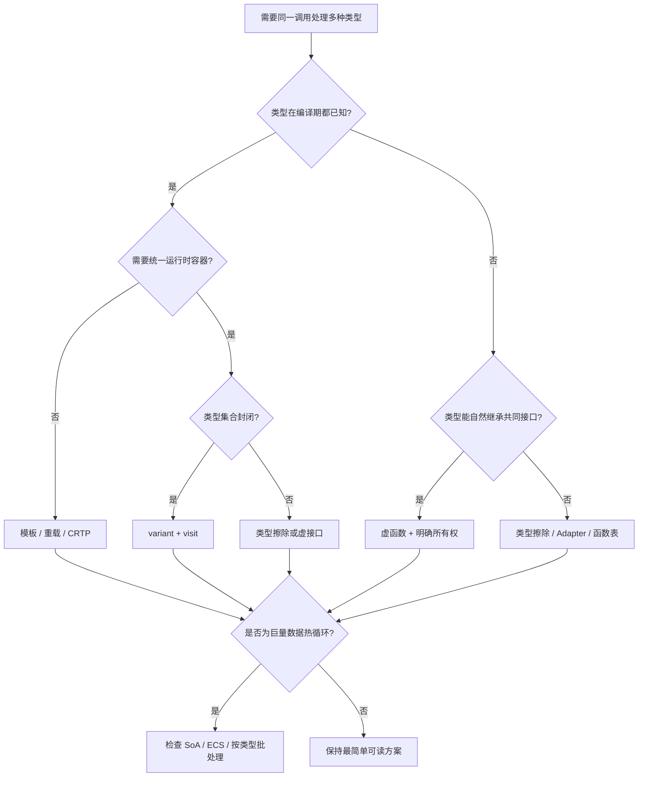

# 多态的工程权衡、性能与常见陷阱

## 1. 抽象不是免费午餐，也不是收费陷阱

多态的核心交易是：

```text
用一层稳定接口隔离变化
    换来
调用目标不再总是显而易见，以及相应的运行时或构建期成本
```

好的多态把复杂度关在边界后面；坏的多态只是把简单调用藏进五层工厂。判断标准不是"有没有虚函数"，而是：

- 接口是否对应真实且稳定的能力；
- 变化是否确实需要被隔离；
- 调用者是否因此减少了对具体类型的了解；
- 成本是否落在可接受的位置；
- 有没有更简单的值、函数或组合方案。

## 2. 多态的主要收益

### 2.1 降低调用者与实现的耦合

```cpp
void exportScene(SceneExporter& exporter, const Scene& scene) {
    exporter.write(scene);
}
```

调用者不需要包含 FBX、glTF、内部二进制格式的全部细节。格式实现可以独立演进。

### 2.2 建立清晰的扩展点

插件、编辑器工具、资源导入器、平台后端等类型集合开放的系统，可以在不修改核心调用流程的情况下增加实现。

### 2.3 复用算法与约束

模板让一份算法服务多种值类型；NVI 让基类固定流程并只开放少量步骤；Concepts 让静态接口要求可读。

### 2.4 改善测试替换能力

```cpp
struct Clock {
    virtual ~Clock() = default;
    virtual TimePoint now() const = 0;
};
```

业务代码依赖 `Clock`，测试可以提供 `FakeClock` 控制时间。不过，只为测试而把所有类都虚化并不划算；构造注入函数对象或普通值有时更简单。

### 2.5 让所有权和边界集中

`std::unique_ptr<Importer>` 能把不同实现放进统一容器，并明确每项都由容器独占。类型差异和生命周期策略因此在一个位置汇合。

## 3. 各种方案分别把成本放在哪里

| 方案 | 运行时成本 | 空间成本 | 构建/二进制成本 | 主要风险 |
|---|---|---|---|---|
| 虚函数 | 间接调用，可能阻碍内联 | 对象 vptr、类级虚表/RTTI | 通常适中 | 生命周期、ABI、缓存局部性 |
| 模板/CRTP | 常可直接调用和内联 | 对象通常无分派元数据 | 实例化、编译时间、代码膨胀 | 复杂诊断、头文件耦合 |
| 类型擦除 | 间接调用，可能动态分配 | 固定包装器或 SBO 缓冲 | 擦除实现较复杂 | 复制、对齐、异常安全 |
| `variant` | 读取索引并分支/查表 | 最大候选大小 + 索引 | visitor 为候选组合实例化 | 类型集合修改扩散 |
| `std::function` | 间接调用，可能动态分配 | 包装器 + 可选 SBO | 通常适中 | 捕获生命周期与隐藏分配 |
| 标签 + `switch` | 显式分支 | 可做得很紧凑 | 分派点重复时维护成本高 | 漏分支、中心逻辑膨胀 |

注意成本方向：

- 动态多态常把成本放到运行期和对象布局；
- 静态多态常把成本放到编译期和二进制；
- `variant` 用封闭集合换取值语义与穷尽检查；
- 类型擦除用实现复杂度换取非侵入式开放集合。

## 4. 虚调用到底慢在哪里

### 4.1 指令本身通常不多

未去虚化的调用大致是：

```text
load vptr
load function slot
indirect call
```

因此不能笼统说"虚函数很慢"。如果虚函数内部要提交 GPU 命令、解码图片或读取文件，这几条分派指令几乎可以忽略。

### 4.2 无法内联常比间接调用更重要

内联不只是省去 `call/ret`，还会打开后续优化：

- 常量传播；
- 删除无效分支；
- 循环展开；
- 自动向量化；
- 跨函数公共子表达式消除；
- 栈对象消除。

动态目标不可知时，这些机会减少。`final`、LTO 和 PGO 有时能帮助去虚化。

### 4.3 分支预测取决于类型分布

同一调用点连续处理相同类型：

```text
Circle Circle Circle Circle ...
```

间接分支目标稳定，预测通常容易。

随机交错：

```text
Circle Sprite Mesh Text Particle ...
```

目标频繁变化，预测更困难。按动态类型分组批处理，有时不用改接口就能改善性能。

### 4.4 缓存未命中常常才是大头

```cpp
std::vector<std::unique_ptr<Entity>> entities;
```

容器只连续保存指针，各对象可能散落在堆上。每次调用前先追一个随机指针，访问成员又可能碰到新的缓存行。相比之下，连续数组：

```cpp
std::vector<Transform> transforms;
std::vector<Velocity> velocities;
```

更适合预取、批处理和 SIMD。

很多被归咎于"虚函数慢"的案例，真正问题是**指针追逐和数据布局**。把虚函数改成函数指针但仍然随机访问对象，通常不会突然获得数据局部性。

## 5. 一个更完整的性能模型

评估某个多态调用点时，至少记录：

```text
总成本 =
    分派指令
  + 分支预测结果
  + 对象与虚表的数据缓存行为
  + 函数代码的指令缓存行为
  + 失去的内联与跨函数优化
  + 分配和所有权管理成本
  + 实际业务函数成本
```

还要回答：

1. 每帧调用几十次，还是几千万次？
2. 动态类型有几种，排列是否稳定？
3. 对象是否连续，还是每项单独分配？
4. 函数体只有两次加法，还是包含大量工作？
5. 编译器是否已去虚化？
6. 热点来自采样剖析，还是来自看到 `virtual` 后的直觉？

优化顺序应是：**测量、定位、建立基线、改变一个变量、再次测量**。

## 6. 游戏客户端中的典型选择

### 6.1 适合动态多态

- 渲染后端选择：Metal、Vulkan、D3D；
- 资源导入器和编辑器插件；
- UI 控件树，前提是控件数量相对有限且逻辑不极端热点；
- 平台服务：支付、登录、成就、文件系统；
- 工具链命令和撤销/重做操作；
- 网络传输或音频设备后端。

这些调用通常位于模块边界，变化与隔离价值高于一次间接调用。

### 6.2 适合静态多态

- 数学向量、矩阵、颜色格式；
- 容器、分配器、序列化算法；
- 固定渲染格式的内层循环；
- 编译期策略明确的低层基础设施；
- 小函数、高频调用、类型在编译期可知的代码。

### 6.3 适合数据导向设计

- 数十万粒子的积分；
- 大量实体的 Transform、Velocity、Visibility 更新；
- 碰撞 broad phase 数据；
- 动画采样和蒙皮批次；
- 需要 Job System 并行切块的组件。

常见混合架构：

```text
虚接口选择系统/后端
    -> 系统收集同类数据
    -> 连续数组或 ECS chunk
    -> 模板化批处理热循环
```

虚函数守住模块边界，数据导向代码负责吞吐。让每个粒子拥有一个 `virtual tick()` 通常不是粒子系统最期待的生日礼物。

## 7. 常见陷阱一：非虚析构

```cpp
struct Base {
    ~Base() = default;
};

Base* value = new Derived;
delete value;  // 未定义行为
```

修复：

```cpp
virtual ~Base() = default;
```

或者把非虚析构设为 `protected`，从接口上禁止经基类删除。

## 8. 常见陷阱二：对象切片

```cpp
void queueEvent(Event event);  // 按值接收基类

DamageEvent damage;
queueEvent(damage);  // 派生部分被切掉
```

修复取决于语义：

- 非拥有调用：`const Event&`；
- 转移所有权：`std::unique_ptr<Event>`；
- 需要多态值：`clone()` 或专用类型擦除；
- 类型集合封闭：`std::variant<DamageEvent, HealEvent, ...>`。

## 9. 常见陷阱三：签名没有真正重写

```cpp
struct Base {
    virtual void render() const;
};

struct Derived : Base {
    void render();  // 少了 const，是新函数，不是重写
};
```

始终写：

```cpp
void render() const override;
```

把相关编译警告当作错误，例如 Clang/GCC 的重写建议和隐藏虚函数警告。

## 10. 常见陷阱四：构造或析构时期待派生行为

```cpp
Base::Base() {
    configure();  // 只调用 Base 层实现
}
```

使用两阶段工厂、构造参数或非虚辅助函数。不要为了绕过规则保存函数指针强行调用尚未构造的派生对象。

## 11. 常见陷阱五：虚函数默认参数不同

```cpp
struct Base {
    virtual void run(int count = 1);
};

struct Derived : Base {
    void run(int count = 10) override;
};

Base& value = derived;
value.run();  // Derived::run(1)
```

默认参数按静态类型绑定。让默认值只出现在非虚包装函数，或者所有层保持一致。

## 12. 常见陷阱六：名称隐藏

```cpp
struct Base {
    virtual void set(int);
    void set(std::string_view);
};

struct Derived : Base {
    void set(int) override;
};
```

`Derived::set(int)` 会隐藏基类同名重载。需要时添加：

```cpp
using Base::set;
```

名称查找先于重载决议和虚分派，三者不能混成同一步理解。

## 13. 常见陷阱七：过度向下转型

```cpp
if (auto* fire = dynamic_cast<FireSpell*>(&spell)) { ... }
if (auto* ice = dynamic_cast<IceSpell*>(&spell)) { ... }
if (auto* wind = dynamic_cast<WindSpell*>(&spell)) { ... }
```

这往往说明：

- 基类缺少调用者真正需要的行为；
- 类型集合其实封闭，更适合 `variant`；
- 一个基类混入了多个不相关职责；
- 数据标签比对象层次更自然。

少量边界检查可以接受；整套业务依赖向下转型时，应重新审视模型。

## 14. 常见陷阱八：把继承当代码复用工具

```cpp
class SaveButton : public NetworkClient {
    // 只是想复用 send()，语义上却不是 "SaveButton 是一个 NetworkClient"
};
```

优先组合：

```cpp
class SaveButton {
    NetworkClient& client_;
};
```

公开继承表达可替换的"是一个"关系，不只是"我想借你几个函数"。纯实现复用可用私有成员、自由函数、策略或受控 mix-in。

## 15. 常见陷阱九：接口过胖

```cpp
struct GameObject {
    virtual void update() = 0;
    virtual void render() = 0;
    virtual void serialize() = 0;
    virtual void playAudio() = 0;
    virtual void replicate() = 0;
};
```

并非每个对象都需要所有能力，派生类会充满空实现和异常。按角色拆分窄接口：

```cpp
struct Updatable { virtual void update() = 0; };
struct Renderable { virtual void render() = 0; };
struct Replicated { virtual void replicate() = 0; };
```

再用组合、注册表或 ECS 查询组织能力。接口隔离能减少无意义依赖，但也要避免把每个单函数都变成单独堆对象。

## 16. 常见陷阱十：所有权不清

```cpp
std::vector<Enemy*> enemies;
```

这只表达"一组指针"，没有表达：

- 谁创建；
- 谁销毁；
- 指针能否为空；
- 对象是否可能先于容器销毁；
- 是否允许共享。

优先使用：

- `std::vector<std::unique_ptr<Enemy>>` 表达独占；
- `Enemy&` / `Enemy*` 表达非拥有观察，并记录生命周期约束；
- 稳定句柄或实体 ID 表达由外部池管理；
- `shared_ptr` 只用于真实共享所有权，不作为默认止痛片。

## 17. 常见陷阱十一：把对象内存直接序列化

多态对象可能含：

- vptr；
- 填充字节；
- 进程地址；
- 编译器和 ABI 相关布局；
- 非平凡成员。

因此不能：

```cpp
file.write(reinterpret_cast<const char*>(&object), sizeof(object));
```

正确做法是定义稳定格式：

```text
[schema version]
[stable type id]
[field ids / ordered fields]
[portable values]
```

读取后由注册工厂按类型 ID 创建对象，再逐字段恢复。vptr 由正常构造过程建立，永远不从文件复制。

## 18. 常见陷阱十二：发布后随意修改虚接口

对已编译插件，以下修改可能破坏 ABI：

- 在虚函数中间插入新函数；
- 改变基类大小或继承顺序；
- 修改参数、返回类型、调用约定；
- 更换编译器 ABI 或运行库；
- 跨模块错误配对 `new/delete`。

更稳妥的策略：

- 接口版本化，例如 `RendererApiV2`；
- 函数表带 `size` 和 `version`；
- 只追加 ABI 明确允许追加的字段或函数；
- 通过模块提供的 `create/destroy` 成对管理；
- 公共头文件不暴露 STL 容器和私有布局；
- 无法保证工具链一致时使用 C ABI。

## 19. 设计多态接口的实用规则

### 19.1 让接口围绕能力，而不是数据形状

较好：

```cpp
virtual ImportResult import(const ImportRequest&) = 0;
```

较差：

```cpp
virtual DecoderInternalState* mutableDecoderState() = 0;
```

后者泄漏实现细节，让调用者与内部结构重新耦合。

### 19.2 保持接口窄而完整

窄不是函数越少越好，而是只包含调用者完成职责所需的稳定操作。接口太窄会迫使调用者不断 `dynamic_cast`；太宽会迫使实现提供无意义方法。

### 19.3 分离身份和值

- 有稳定身份、生命周期、可变状态的对象适合句柄或指针多态；
- 可复制的小数据适合值、`variant` 或类型擦除值；
- 不要因为"以后可能有派生类"就让一个 `Color` 变成堆分配对象。

### 19.4 在边界多态，在内部具体

让模块入口接收抽象接口，进入模块后尽快转成具体批次或连续数据。抽象层越深入内层循环，优化器和读代码的人要穿过的门越多。

### 19.5 为失败语义建模

虚函数会失败时，用明确返回类型：

```cpp
virtual Expected<Asset, ImportError> import(const Request&) = 0;
```

不要让不同实现随意选择返回空指针、抛异常、写日志或静默失败。共同接口必须包含共同的错误合同。

## 20. 可测试性不等于"一切皆接口"

下面这种做法容易过度：

```text
IPosition
ITransform
IHealth
IInteger
```

测试真正需要替换的通常是：

- 时间；
- 随机数；
- 文件和网络；
- 平台服务；
- 昂贵外部系统；
- 非确定性调度。

纯计算和值对象直接测试即可。替换点越多，间接层和模拟对象维护成本越高。一个可以传入的 lambda 往往比三层 mock 基类更直接。

## 21. 基准测试应该怎样做

一个可信的分派基准至少控制：

1. 相同业务工作量；
2. 相同对象数据布局；
3. 相同类型排列；
4. 防止编译器把结果整个删掉；
5. 分别测试单一类型和随机多类型；
6. 分别开启/关闭 LTO；
7. 记录指令、分支失误、缓存未命中，而不只记录总时间；
8. 使用发布优化参数和目标平台编译器；
9. 把微基准结果放回真实帧或任务剖析中验证。

如果虚函数版本每项单独 `new`，模板版本却使用连续数组，那么测到的是分配和缓存布局的综合差异，不能只归因于分派机制。

## 22. 决策流程



流程图给的是起点，不是判决书。ABI、所有权、构建时间、团队经验和实际剖析都可能改变答案。

## 23. 代码审查检查表

### 23.1 动态多态

- [ ] 基类析构策略明确，能经基类删除时为虚析构。
- [ ] 所有重写都写了 `override`。
- [ ] 叶子类型是否适合写 `final` 已评估。
- [ ] 参数使用指针/引用或智能指针，没有意外对象切片。
- [ ] 接口满足可替换语义，不要求常态化向下转型。
- [ ] 构造和析构函数没有依赖派生重写。
- [ ] 虚函数默认参数没有在层次间变化。
- [ ] 所有权、空值和线程规则写在接口合同中。
- [ ] 跨动态库时已明确 ABI、版本和创建/销毁边界。

### 23.2 静态多态

- [ ] 模板约束清楚，错误信息能指向调用者。
- [ ] 与类型无关的大段实现没有复制到每个实例。
- [ ] CRTP 确实需要静态派生调用，而不是为了技巧本身。
- [ ] 策略组合数量可控。
- [ ] 构建时间和二进制尺寸有数据支持。
- [ ] 需要运行时统一存储时已有明确方案。

### 23.3 通用

- [ ] 已确认类型集合是开放还是封闭。
- [ ] 已确认更常增加类型还是增加操作。
- [ ] 已把所有权与分派机制分开考虑。
- [ ] 热点判断来自剖析。
- [ ] 值、函数、组合等更简单方案已经比较过。

## 24. 一段完整的面试回答

> 多态的本质是让同一接口对不同类型产生不同行为，关键区别在调用目标何时绑定。静态多态通过重载、模板、CRTP、Concepts 等在编译期完成分派，通常能直接调用和内联，但会增加模板实例化、构建时间和代码体积。动态多态通常通过基类指针或引用调用虚函数，运行时按对象动态类型选择最终重写。主流 ABI 一般让多态子对象保存 vptr，vptr 指向类共享的 vtable；调用点按静态类型确定 slot，读取函数入口，必要时通过 thunk 调整 `this`，再间接调用。
>
> 动态多态适合开放类型集合、插件和异构对象容器，但要处理虚析构、对象切片、构造期虚调用、对象所有权和 ABI 等问题。性能成本不只是一次间接调用，还包括内联受限、分支预测和对象分散造成的缓存问题。类型集合封闭时可以用 `std::variant`，不想要求继承时可用类型擦除，只替换一个行为时可用函数对象；海量数据热循环则应考虑按类型批处理或 ECS。最终选择应由变化方向、所有权、ABI 和剖析数据决定。

## 25. 最终结论

多态真正值得掌握的不是"虚表里有几个指针"，而是一套分层判断：

```text
先问语义：这些类型真的共享同一能力吗？
再问时机：调用目标能否在编译期确定？
再问集合：类型是开放还是封闭？
再问存储：需要身份、值语义还是连续批处理？
再问边界：是否跨动态库、线程或序列化？
最后问性能：剖析显示瓶颈在哪里？
```

用对了，多态让调用者面对稳定接口，让变化留在实现内部；用错了，它会让每次普通函数调用都像办理跨国签证。抽象的目标不是显得高级，而是让下一次变化发生在最少、最合理的位置。

[上一章：类型擦除与替代方案](./05-type-erasure-and-alternatives.md) | [返回专题总览](./README.md) | [返回 C++ 基础知识](../README.md)
