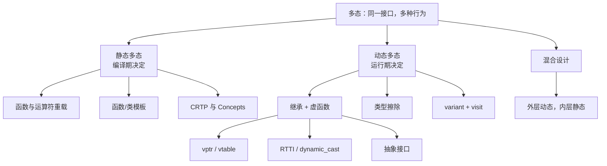

# C++ 多态：从统一接口到对象模型

## 1. 一句话理解多态

**多态（polymorphism）就是让同一段调用代码面对不同类型时表现出不同的行为。**

想象一家餐厅的前台只负责喊一声"上招牌菜"：

- 川菜师傅端来水煮鱼；
- 粤菜师傅端来白切鸡；
- 甜品师傅如果端来一锅毛血旺，说明接口设计可能需要开会。

前台说的是同一句话，真正执行什么由接单者决定。多态的价值不是少写几个 `if`，而是让**发出请求的一方依赖稳定接口，让变化留在各个实现内部**。

```cpp
void drawFrame(const std::vector<std::unique_ptr<Shape>>& shapes) {
    for (const auto& shape : shapes) {
        shape->draw();  // 调用形式相同，实际行为由对象类型决定
    }
}
```

## 2. 多态解决了什么问题

没有多态时，调用者经常同时知道所有具体类型：

```cpp
switch (enemy.type) {
case EnemyType::Slime:  updateSlime(enemy);  break;
case EnemyType::Dragon: updateDragon(enemy); break;
case EnemyType::Mage:   updateMage(enemy);   break;
}
```

每增加一种敌人，中心 `switch` 都要修改。类型少且集合固定时，这并不一定错；但在插件、UI 控件、资源导入器等开放系统里，它会让变化扩散到所有调用者。

多态把问题拆成三层：

1. **接口**：调用者能请求什么，例如 `draw()`。
2. **实现**：每个类型具体怎么做，例如 `Circle::draw()`。
3. **分派**：这次调用究竟选择哪个实现，以及何时做出选择。

第三层是本专题的主线。选择发生在编译期，就是静态多态；发生在运行期，就是动态多态。

## 3. 知识地图



## 4. 静态多态与动态多态速查

| 维度 | 静态多态 | 动态多态 |
|---|---|---|
| 决策时机 | 编译期 | 运行期 |
| 常见机制 | 重载、模板、CRTP、Concepts | 虚函数、类型擦除、`variant` 访问 |
| 类型集合 | 编译时必须可知 | 可以在运行时选择对象 |
| 接口约束 | 语法/Concept，常见为隐式接口 | 基类虚函数等显式接口 |
| 调用成本 | 通常可内联，无额外分派 | 常有一次间接调用或运行时分支 |
| 存储同类对象 | 不同实例化是不同类型 | 可经基类指针或擦除类型统一存储 |
| 代码体积 | 可能因模板实例化膨胀 | 实现通常只有一份，另有虚表等元数据 |
| 错误暴露 | 编译期，模板错误可能很长 | 接口错误多在编译期，类型选择在运行期 |
| 典型场景 | 数学库、容器、算法、热循环 | 插件、UI、工具链、异构对象集合 |

> "静态"不等于全局变量，"动态"也不等于一定在堆上。这里描述的是**绑定时机**，不是存储位置。

## 5. 阅读顺序

| 章节 | 主要问题 |
|---|---|
| [01. 基本概念与分类](./01-concepts-and-classification.md) | 多态究竟是什么，静态与动态如何区分？ |
| [02. 动态多态](./02-dynamic-polymorphism.md) | 继承、虚函数、抽象类、生命周期如何正确配合？ |
| [03. 对象布局与调用链](./03-object-layout-and-dispatch.md) | vptr、vtable、`this` 调整和虚调用在内存中怎样串起来？ |
| [04. 静态多态](./04-static-polymorphism.md) | 重载、模板、CRTP 和 Concepts 如何在编译期完成分派？ |
| [05. 类型擦除与替代方案](./05-type-erasure-and-alternatives.md) | 不想继承时，还有 `variant`、类型擦除和组合等哪些工具？ |
| [06. 工程权衡与陷阱](./06-tradeoffs-and-pitfalls.md) | 性能、ABI、缓存、可维护性与常见错误如何权衡？ |

配套的完整 C++17 程序见 [examples/cpp/polymorphism](../../../examples/cpp/polymorphism/README.md)。

## 6. 贯穿全文的两个例子

### 6.1 动态多态：运行时才知道角色

```cpp
struct Actor {
    virtual ~Actor() = default;
    virtual void update(float dt) = 0;
};

struct Player final : Actor {
    void update(float dt) override { /* 处理输入 */ }
};

struct Monster final : Actor {
    void update(float dt) override { /* 执行 AI */ }
};
```

服务器下发对象后，容器里这一项究竟是 `Player` 还是 `Monster` 才确定，因此使用运行时分派很自然。

### 6.2 静态多态：编译时已经知道角色

```cpp
template <typename T>
void updateOne(T& actor, float dt) {
    actor.update(dt);
}

Player player;
updateOne(player, 0.016f);  // 编译器直接生成 Player 版本
```

类型在编译时明确，编译器可以检查表达式、生成专用代码并尝试内联。

## 7. 必须先纠正的三个误解

1. **多态不等于虚函数。** 虚函数只是动态多态的一种实现；模板和重载同样属于多态。
2. **动态多态不等于慢。** 一次虚调用通常很小，真正的成本经常来自无法内联、分支难预测和对象分散导致的缓存未命中。
3. **C++ 标准没有规定必须存在 vtable。** 标准只规定可观察行为；vptr/vtable 是 Itanium C++ ABI、MSVC ABI 等主流实现采用的办法。本专题谈内存结构时会明确这一边界。

## 8. 面试用的 30 秒回答

> C++ 多态指同一调用接口对不同类型表现出不同行为。按绑定时机可分为静态多态和动态多态。静态多态通过重载、模板、CRTP 等在编译期选定实现，便于内联但可能增加编译时间和代码体积；动态多态常通过基类指针或引用调用虚函数，在运行期按对象实际类型分派。主流编译器通常让对象保存 vptr，调用时从 vtable 固定槽位取函数地址并间接跳转。动态多态适合开放类型集合与异构对象，代价主要是对象布局、间接调用、内联受限和 ABI 耦合。工程上还应根据类型集合是否封闭，考虑 `std::variant`、类型擦除或组合。

[返回 C++ 基础知识](../README.md) | [下一章：基本概念与分类](./01-concepts-and-classification.md)
