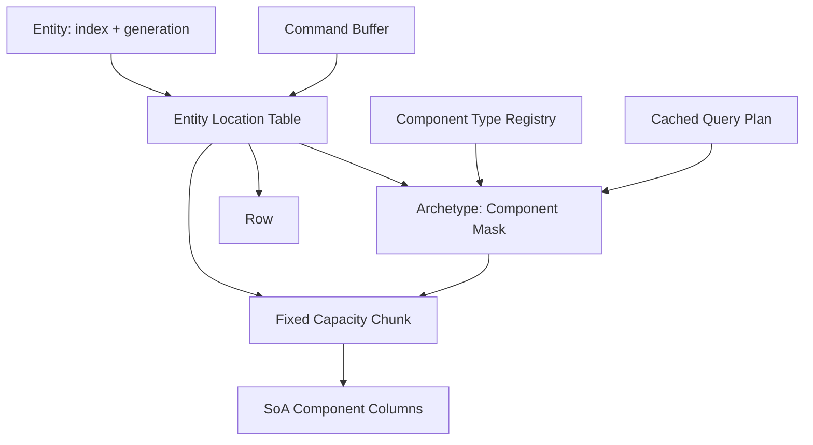
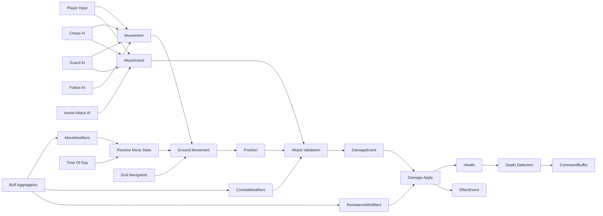
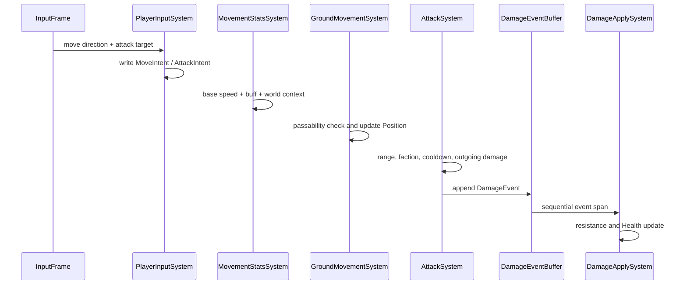
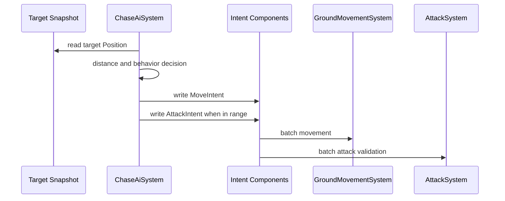

# C# 高扩展战斗 ECS 示例架构

## 1. 目标

本示例构建一个可运行的游戏逻辑层，包含：

- 玩家：由输入驱动移动和攻击。
- 追击型敌人：追击目标，进入范围后攻击。
- 守卫型敌人：只在警戒范围内追击，否则返回出生点。
- 队友：跟随玩家并协助攻击。
- 世界对象：作为不可通行障碍物。
- Buff、移动上下文、攻击定义、抗性、伤害和表现事件。

工程同时满足两个方向：

```text
性能方向：
Archetype + Chunk + SoA
-> 连续组件列
-> Query 按 Archetype 匹配
-> System 按 Chunk 批处理

扩展方向：
控制器只生成 Intent
-> 移动、攻击、伤害分别执行
-> 新行为通过组件 + System + 数据定义组合
```

## 2. 非目标

这是用于理解 ECS 思想的示范工程，不试图一次实现完整商业引擎。

本版暂不包含：

- 多线程 Job Scheduler。
- 完整物理引擎和 NavMesh。
- 网络同步和确定性回放。
- 编辑器、反射和序列化代码生成。
- 无 GC 的生产级 Command Buffer。
- 无限组件类型和动态程序集热重载。

这些能力预留了扩展边界，但不能把示例实现直接视为生产框架。

## 3. 核心设计判断

### 3.1 不为 Player、Enemy、Teammate 建立行为继承树

不采用：

```text
Character
├── Player
├── Enemy
│   ├── ChaserEnemy
│   ├── GuardEnemy
│   └── RangedEnemy
└── Teammate
```

否则后续容易出现：

- 移动逻辑散落在多个重写方法中。
- 攻击、Buff 和抗性同时侵入父类。
- Enemy 分类组合爆炸。
- 每个实体执行虚函数，难以批处理。
- 同一种能力无法自然复用于玩家和 AI。

采用组件组合：

```text
Player
= PlayerControlled
+ Position
+ MoveIntent
+ AttackIntent
+ GroundMover
+ Combat Components

Chaser Enemy
= EnemyTag
+ ChaseBehavior
+ Position
+ MoveIntent
+ AttackIntent
+ GroundMover
+ Combat Components

Guard Enemy
= EnemyTag
+ GuardBehavior
+ Position
+ MoveIntent
+ AttackIntent
+ GroundMover
+ Combat Components

Teammate
= TeammateTag
+ FollowBehavior
+ AssistAttackBehavior
+ Position
+ MoveIntent
+ AttackIntent
+ GroundMover
+ Combat Components

Object
= WorldObjectTag
+ Position
+ Obstacle
```

### 3.2 高层决策和低层执行分离

高层控制器负责回答“想做什么”：

```text
PlayerInputSystem -> MoveIntent / AttackIntent
ChaseAiSystem -> MoveIntent / AttackIntent
GuardAiSystem -> MoveIntent / AttackIntent
FollowAiSystem -> MoveIntent
AssistAttackAiSystem -> AttackIntent
```

低层执行系统负责回答“如何统一执行”：

```text
MovementStatsSystem -> ResolvedMoveSpeed
GroundMovementSystem -> Position
AttackSystem -> DamageEvent
DamageApplySystem -> Health / EffectEvent
DeathSystem -> DeadTag
```

这样新增 AI 分类不会复制移动和伤害代码；新增移动规则也不需要修改所有控制器。

### 3.3 复杂逻辑分阶段处理

移动拆成：

```text
输入/AI决策
-> Buff 聚合
-> 世界上下文修正
-> 最终移动属性
-> 可通行检查
-> 位移提交
```

攻击拆成：

```text
攻击意图
-> 攻击定义查找
-> 距离/阵营/冷却校验
-> 攻击方增益计算
-> DamageEvent
-> 防御方抗性计算
-> Health 修改
-> EffectEvent
-> 死亡结构变更
```

每一阶段都有明确输入和输出，便于扩展、测试、调度和性能分析。

## 4. ECS 核心结构



### 4.1 Entity

```csharp
Entity {
    int Index;
    uint Generation;
}
```

`Index` 定位槽位，`Generation` 防止已经销毁的旧句柄误访问复用槽位的新实体。

### 4.2 Archetype

每一种组件组合对应一个 Archetype：

```text
Archetype A = Position + Velocity
Archetype B = Position + Velocity + Health
Archetype C = Position + Obstacle
```

Query 在 Archetype 层匹配一次，不在每个实体上反复执行 `HasComponent`。

### 4.3 Chunk 与组件列

每个 Chunk 固定容量：

```text
Chunk
├── Entity[capacity]
├── Position[capacity]
├── MoveIntent[capacity]
├── Health[capacity]
└── ...
```

每种组件存放在独立连续数组中。System 获取组件列一次，然后顺序遍历。

### 4.4 Entity Location Table

```text
Entity.Index
-> { Generation, Archetype, Chunk, Row }
-> ComponentColumn[Row]
```

单实体随机访问用于目标查询和事件应用；大规模更新仍走 Query + Chunk 批处理。

### 4.5 Query Cache

Query 由 Required Mask 和 Excluded Mask 组成。只有新 Archetype 创建时才重新匹配，正常帧直接遍历缓存列表。

### 4.6 结构变更

添加或删除组件会迁移实体：

```text
源 Archetype
-> 目标 Archetype 分配一行
-> 复制共有组件
-> 初始化新增组件
-> 更新 Entity Location
-> 源 Chunk swap-remove
```

System 遍历期间不直接变更结构，而是写入 Command Buffer，帧末统一提交。

## 5. 逻辑层组件

### 5.1 身份与控制来源

```text
PlayerTag
EnemyTag
TeammateTag
WorldObjectTag
PlayerControlled
```

Tag 只表达分类，不携带业务行为。

### 5.2 空间与移动

```text
Position
MoveIntent
GroundMover
BaseMoveStats
MovementModifiers
ResolvedMoveSpeed
```

`MovementModifiers` 是 Buff、装备和状态的聚合结果；`ResolvedMoveSpeed` 是加入世界上下文后的最终执行数据。

### 5.3 AI 决策

```text
ChaseBehavior
GuardBehavior
FollowBehavior
AssistAttackBehavior
```

每种行为组件对应一个批处理 System。一个实体可以组合多个行为组件。

### 5.4 战斗

```text
Faction
Health
CombatStats
CombatModifiers
CombatLoadout
AttackCooldown
AttackIntent
Resistances
ResistanceModifiers
```

攻击定义放在只读 `AttackCatalog` 中，实体只保存稳定整数 ID，避免每个实体复制大型配置。

### 5.5 Buff

Buff 作为独立实体：

```text
BuffEffect {
    Owner;
    Kind;
    Magnitude;
    StackCount;
    RemainingSeconds;
}
```

`BuffAggregationSystem` 将 Buff 聚合到拥有者的移动、攻击和抗性修正组件。

优点：

- Buff 生命周期独立。
- 可以叠层和过期。
- 不需要为每种 Buff 改变角色 Archetype。

代价：

- 按 Owner 写入属于随机访问。
- Buff 类型分支可能降低批处理效率。

生产版本可按 Buff 类型拆分 Archetype/System，或先按 Owner 排序后聚合。

## 6. 实体组合

| 实体 | 决策组件 | 执行组件 |
|---|---|---|
| Player | `PlayerControlled` | 移动、战斗、生命、阵营 |
| Chaser Enemy | `ChaseBehavior` | 移动、战斗、生命、阵营 |
| Guard Enemy | `GuardBehavior` | 移动、战斗、生命、阵营 |
| Teammate | `FollowBehavior`、`AssistAttackBehavior` | 移动、战斗、生命、阵营 |
| Object | `Obstacle` | 位置和世界对象标记 |
| Buff | `BuffEffect` | 独立生命周期 |

“类型”只是组件组合，不对应必须继承的类。

## 7. 系统数据流



## 8. 单帧系统顺序

```text
1. BeginFrame：清空上一帧临时事件
2. CooldownSystem
3. PlayerInputSystem
4. ChaseAiSystem
5. GuardAiSystem
6. FollowAiSystem
7. AssistAttackAiSystem
8. BuffAggregationSystem
9. MovementStatsSystem
10. GroundMovementSystem
11. AttackSystem
12. DamageApplySystem
13. DeathSystem
14. CommandBuffer.Playback
```

示例使用显式顺序，便于理解。生产版可根据读写集合构建 DAG，并将无冲突 System 和 Chunk 分发到统一 Worker Pool。

## 9. 玩家单帧时序



## 10. AI 单帧时序



高层 AI 访问目标时可能出现随机读取。可以降低 AI Tick 频率、缓存目标快照或按目标/空间分区来优化，但不应把随机读取传播到所有低层执行 System。

## 11. 扩展方式

### 11.1 新增玩家行为

例如冲刺：

```text
新增 DashIntent
新增 DashState
新增 DashSystem
PlayerInputSystem 只负责产生 DashIntent
```

### 11.2 新增移动模式

例如飞行：

```text
新增 FlyingMover
新增 FlyingMovementSystem
复用 MoveIntent、MovementModifiers、ResolvedMoveSpeed
```

地面可通行检查只属于 `GroundMovementSystem`，不会污染飞行移动。

### 11.3 新增 Enemy 分类

例如远程风筝 AI：

```text
新增 KiteBehavior
新增 KiteAiSystem
输出同一 MoveIntent / AttackIntent
```

攻击和移动执行层无需修改。

### 11.4 新增攻击机制

例如火球：

```text
AttackCatalog 新增定义
DamageType = Fire
EffectId = FireBall
需要投射物时产生 SpawnProjectileEvent
```

持续伤害可增加 `DamageOverTimeEffect` 实体和对应 System，不应把所有机制塞进一个巨大 `switch`。

### 11.5 新增仇恨机制

将每条仇恨关系建模为独立数据：

```text
ThreatEntry {
    Owner;
    Candidate;
    Value;
    DecayPerSecond;
}
```

再由：

```text
ThreatAggregationSystem
-> 为每个 Owner 选择最高候选
-> 写入 AggroTarget
-> Chase/Kite/Guard AI 读取 AggroTarget
```

大量仇恨记录可按 Owner 排序或分桶，减少随机写。

### 11.6 新增 Buff

纯数值 Buff 可以进入聚合层；有独特生命周期或触发语义的 Buff 应增加独立组件和 System：

```text
Shield + ShieldSystem
PeriodicHeal + PeriodicHealSystem
ReflectDamage + ReflectDamageSystem
```

判断标准是数据访问模式，而不是策划名称。

### 11.7 新增世界上下文

`MovementStatsSystem` 可读取：

```text
TimeOfDayRules
WeatherRules
ZoneRules
SurfaceRules
```

推荐先把上下文聚合成小型只读资源，避免每个实体反复查询复杂世界对象。

## 12. 主要扩展接口

| 接口/边界 | 用途 |
|---|---|
| `ISimulationSystem` | 注册新系统 |
| unmanaged Component | 扩展实体数据和能力 |
| `QueryDescription` | 声明批处理所需组件 |
| `FrameEventBuffer<T>` | 阶段间传递瞬时事件 |
| `CommandBuffer` | 延迟结构变更 |
| `AttackCatalog` | 数据驱动攻击定义 |
| `GridNavigation` | 替换寻路/通行服务 |
| `DamagePipeline` | 扩展伤害计算阶段 |
| `SimulationPipeline` | 调整阶段顺序或升级 DAG |

## 13. 工程位置

[打开 C# 可运行示例](../../examples/ecs/csharp-extensible-combat-ecs/README.md)。

```text
examples/ecs/csharp-extensible-combat-ecs/
├── README.md
├── ExtensibleCombatEcs.sln
└── src/ExtensibleCombatEcs/
    ├── Ecs/
    ├── Game/
    ├── Systems/
    └── Program.cs
```

## 14. 风险与限制

| 风险 | 影响 | 当前策略 | 生产演进 |
|---|---|---|---|
| Archetype 组合爆炸 | Chunk 利用率下降 | Tag 保持少量 | 高频开关改 enabled mask/Sparse Set |
| 频繁增删组件 | 实体迁移成本 | Command Buffer 提交 | 按源/目标 Archetype 分组迁移 |
| AI 目标随机访问 | Cache Miss | 只在决策层发生 | 目标快照、空间分区、降低频率 |
| Buff 按 Owner 聚合 | 随机写和分支 | 作为清晰示例 | 按 Owner 排序或按类型拆 System |
| 组件 Mask 只有 64 位 | 组件数受限 | 示例足够 | 动态 BitSet 或代码生成 ID |
| Chunk 容量固定 | 未按字节精确布局 | 64 行便于理解 | 按组件大小计算 16-64 KiB Chunk |
| C# 数组不是单块 Chunk | 各列分别分配 | 列内仍连续 | Native Memory/Unsafe/Source Generator |
| Command 对象装箱 | 产生少量 GC | 结构变更低频 | 类型化命令流和预分配缓冲 |
| managed Query/Dictionary | 外层查找成本 | 不进入实体内循环 | Archetype 列索引和生成代码 |
| System 顺序人工维护 | 易漏依赖 | 清晰固定 Pipeline | 读写声明 + DAG Scheduler |
| 浮点非确定性 | 锁步结果漂移 | 不承诺确定性 | 定点数、稳定顺序、状态校验 |

## 15. 性能原则

1. 热组件必须是 `unmanaged struct`。
2. 实体内层循环不执行字符串和组件字典查询。
3. 每个 Chunk 只获取一次组件列。
4. Query 不逐实体判断组件是否存在。
5. 控制器中的复杂分支不进入统一移动/伤害热循环。
6. 大型配置、字符串和资源放在 Catalog/Resource，组件只保存 ID。
7. 瞬时事件使用连续 Frame Buffer，不为每个事件创建对象。
8. 结构变更推迟到稳定边界。

## 16. 验证结果

示例使用 .NET SDK 8.0.424 验证：

```text
dotnet format：通过
Release Build：0 warning，0 error
Self Tests：全部通过
完整模拟：Player、Chaser、Guard、Teammate、Object、Buff 和战斗事件运行正常
```

[上一章：哈希查询与分支预测](./09-hash-and-branch-performance.md) | [返回目录](./README.md)

