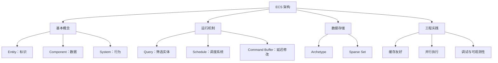

# ECS 系统说明

## 1. 文档范围

本文档中的 **ECS** 指 **Entity Component System（实体-组件-系统）**，它是一种以数据组合为核心的软件架构，常用于游戏、仿真、可视化和高性能实时系统。

> ECS 也可能指云计算中的 Elastic Compute Service。两者没有直接关系，本系列只讨论 Entity Component System。

## 2. 一句话理解

ECS 将一个对象拆成三部分：

- **Entity（实体）**：只负责标识“是谁”。
- **Component（组件）**：只保存“有什么数据”。
- **System（系统）**：负责“如何处理数据”。

例如，一个可移动角色可以表示为：

```text
Entity: 玩家 #1001
Components: Position、Velocity、Health、PlayerInput
Systems: InputSystem、MovementSystem、DamageSystem
```

ECS 不通过庞大的对象继承树描述角色，而是通过组件组合描述角色，并让系统批量处理具有特定组件的数据。

## 3. 文档导航

建议按以下顺序阅读：

1. [基本原理](./01-fundamentals.md)
   了解 ECS 解决的问题、设计思想及适用边界。
2. [核心结构](./02-core-model.md)
   理解 Entity、Component、System、World、Query 和存储模型。
3. [运行流程](./03-runtime-flow.md)
   理解一帧如何执行、系统如何排序，以及结构变更为何需要延迟。
4. [工程实践](./04-engineering-practices.md)
   了解性能设计、并行调度、常见误区和技术选型。
5. [最小示例](./05-minimal-example.md)
   通过一个移动系统串联 ECS 的完整工作方式。
6. [组件存储与查询实现](./06-component-query-implementation.md)
   通过 TypeScript 代码理解 Entity ID 如何关联组件，以及 `has`、`get` 和多组件 Query 如何实现。
7. [高性能存储设计](./07-high-performance-storage.md)
   讲解 Archetype Chunk、组件列、Query Cache、空间压缩和冷热组件混合存储。
8. [调度 DAG 方案分析](./08-scheduler-dag-analysis.md)
   分析输入驱动剪枝、串行 System 调度的局限，并给出静态 DAG、运行条件和全局任务池方案。
9. [哈希查询与分支预测](./09-hash-and-branch-performance.md)
   解释连续分配与连续访问的区别，以及哈希、Cache Miss、分支预测和 SIMD 的关系。
10. [C# 高扩展战斗 ECS 示例架构](./10-csharp-extensible-demo-architecture.md)
    设计 Player、多类 Enemy、Teammate、Object、Buff、移动和攻击的可扩展逻辑层。
11. [C# 可运行示例工程](../../code/ecs/csharp-extensible-combat-ecs/README.md)
    使用 Archetype、Chunk、SoA、Intent 和事件管线实现完整示范。

## 4. 知识结构



## 5. 阅读结论

理解 ECS 时应抓住三个重点：

1. **组合优于继承**：对象能力由组件组合决定。
2. **数据与行为分离**：组件存数据，系统处理数据。
3. **批量处理数据**：系统围绕查询结果顺序访问同类组件，从而提升可扩展性和性能。
