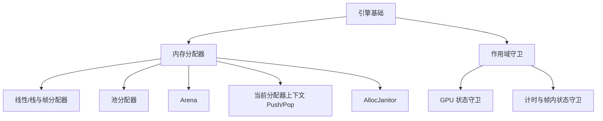

# 引擎基础 

## 1. 文档范围

本文档整理**引擎层面**的内存管理与资源管理约定，与语言层知识互补：

- 内存分配器：线性/栈、池、Arena、帧分配器与"当前分配器"上下文。
- 作用域守卫：把引擎全局状态的"切换/恢复"交给析构机制。

> 语言层的 new/delete、RAII、模板与 mix-in 见 [C++ 基础知识](../cpp/README.md)。

## 2. 阅读导航

| 顺序 | 文件 | 内容 |
|---|---|---|
| 1 | [01-memory-allocators](./01-memory-allocators.md) | 自定义分配器策略、分配器上下文、AllocJanitor |
| 2 | [02-scope-guards](./02-scope-guards.md) | 作用域守卫与帧内资源管理 |

## 3. 知识结构

## 4. 阅读结论

1. **按场景选策略**：帧内临时数据用线性/帧分配器，同类小对象用池，同生命周期批量对象用 Arena，通用兜底才用 malloc 封装。
2. **策略随作用域变化**："当前分配器 + Push/Pop"让调用方接口保持简单，嵌套范围自然表达层级关系。
3. **守卫类把切换变成自动配对**：引擎全局状态（分配器、GPU、计时）的进入/退出由析构保证，异常安全且零成本。
