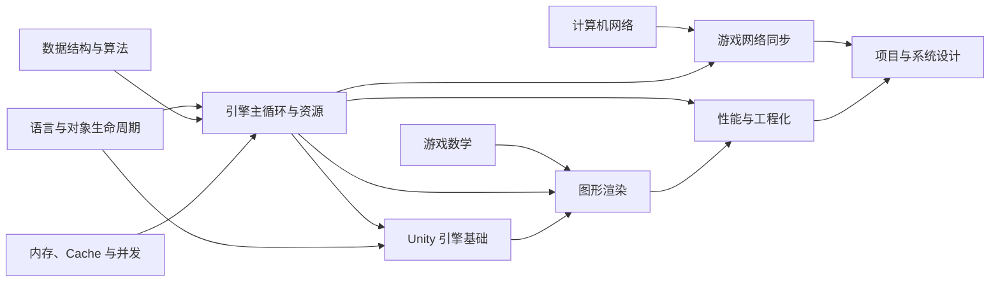

# 游戏客户端面试总知识地图

## 1. 地图用途

本页保留原“游戏客户端八股分类”的访问路径，作为重构后的总索引。详细内容已
按学习依赖拆入子模块，不再让一篇六百多行的文档同时扮演目录、教材和体能测试。

## 2. 优先级说明

| 级别 | 含义 |
|---|---|
| P0 | 几乎所有对应岗位都应掌握 |
| P1 | 常见追问，取决于项目和引擎 |
| P2 | 专项岗位或中高级岗位重点 |

“掌握”至少包含五件事：

```text
定义
-> 底层原理
-> 常见方案对比
-> 适用场景
-> 项目中的真实例子或验证方式
```

## 3. 十二类知识的新位置

| 原分类 | 主要内容 | 新位置 |
|---|---|---|
| 编程语言与运行时 | C++、C#、Lua、GC、对象生命周期 | [语言、运行时与数据结构](./foundations/01-language-runtime-and-data-structures.md) |
| 数据结构与算法 | 容器、图、寻路、空间结构 | [语言、运行时与数据结构](./foundations/01-language-runtime-and-data-structures.md) |
| 操作系统、内存与并发 | 虚拟内存、Cache、锁、任务系统 | [系统、网络与游戏数学](./foundations/02-systems-network-and-math.md) |
| 计算机网络 | TCP、UDP、协议、弱网 | [系统、网络与游戏数学](./foundations/02-systems-network-and-math.md) |
| 游戏数学 | 向量、矩阵、四元数、几何检测 | [系统、网络与游戏数学](./foundations/02-systems-network-and-math.md) |
| 游戏引擎与客户端架构 | 主循环、模块、资源与场景 | [引擎架构与运行时](./engine-client/01-engine-architecture-and-runtime.md) |
| 图形渲染 | 坐标、GPU 管线、Shader 与输出 | [图形渲染专项](./rendering/README.md) |
| 物理与动画 | 碰撞、刚体、骨骼、状态机 | [物理、动画、同步与平台](./engine-client/02-physics-animation-network-and-platforms.md) |
| 游戏网络同步 | 状态同步、帧同步、预测与校正 | [物理、动画、同步与平台](./engine-client/02-physics-animation-network-and-platforms.md) |
| 性能优化与工程化 | CPU/GPU、资源、稳定性 | [性能优化与工程化](./engineering/01-performance-and-production.md) |
| Unity、Unreal 与平台专项 | Unity 对象/生命周期/资源/渲染，Unreal 与跨平台 | [Unity 引擎基础](./unity-engine/README.md)；[Unreal 与平台提纲](./engine-client/02-physics-animation-network-and-platforms.md) |
| 项目经历与系统设计 | 项目复盘、架构题、表达方式 | [项目表达与复习策略](./engineering/02-project-design-and-study-strategy.md) |

## 4. 知识依赖关系



这张图表达的是学习依赖，不是部门组织。比如渲染开发依然需要数据结构和并发，
玩法开发也必须知道一个透明特效为什么可能把手机烤成暖手宝。

## 5. 不同岗位的复习重点

| 分类 | Unity 玩法 | Unreal 玩法 | 引擎/架构 | 渲染 |
|---|---:|---:|---:|---:|
| C++ | P1 | P0 | P0 | P0 |
| C# | P0 | P2 | P2 | P2 |
| 数据结构与算法 | P0 | P0 | P0 | P0 |
| 内存与并发 | P1 | P0 | P0 | P0 |
| 通用网络 | P0 | P0 | P1 | P2 |
| 游戏数学 | P0 | P0 | P0 | P0 |
| 引擎架构 | P0 | P0 | P0 | P1 |
| 图形渲染 | P1 | P1 | P1 | P0 |
| 物理与动画 | P1 | P1 | P1 | P1 |
| 网络同步 | P0 | P0 | P1 | P2 |
| 性能优化 | P0 | P0 | P0 | P0 |
| 项目与系统设计 | P0 | P0 | P0 | P0 |

## 6. 查漏补缺方法

不要按“看过”标记进度，按“能否输出”检查：

1. 能否在 30 秒内给出定义和结论。
2. 能否画出关键数据流或生命周期。
3. 能否说出至少一种替代方案及取舍。
4. 能否给出一个项目例子。
5. 能否说明用什么工具和指标验证。

其中任何一项只能回答“差不多知道”，通常就意味着还没有真正掌握。

[返回知识体系](./README.md) | [进入图形渲染专项](./rendering/README.md)
