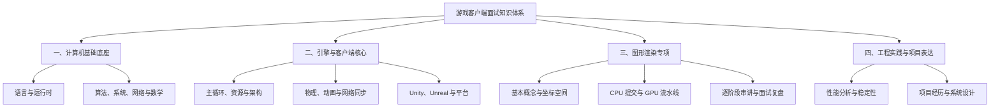

# 游戏客户端面试知识体系

## 1. 这套知识体系怎么用

这里不是一张要求从头背到尾的清单，而是一张游戏客户端岗位的学习地图。
内容按“先打地基，再理解客户端，再选择专项，最后用项目证明”的顺序划分。

适用方向包括：

- Unity、Unreal 玩法客户端。
- C++ 自研引擎客户端。
- 引擎、渲染与性能优化方向。
- 客户端架构、网络同步和工具链方向。

不同岗位不会平均考察所有内容。普通玩法岗位不必一上来手写 PBR，渲染岗位也
不能因为会写 Shader 就忘记 C++ 对象生命周期。面试官通常不会接受“这块不是我
的方向”作为所有问题的万能护盾。

## 2. 重新划分后的层级

原来的十二类知识不再平铺在一篇长文中，而是归入四个可以独立学习的子模块：



| 层级 | 解决的问题 | 对应子模块 |
|---|---|---|
| L0 基础底座 | 代码为何这样运行，数据为何这样存取 | [计算机基础底座](./foundations/README.md) |
| L1 客户端核心 | 一帧游戏如何更新，系统如何组织 | [引擎与客户端核心](./engine-client/README.md) |
| L2 方向专项 | 画面如何从数据变成像素 | [图形渲染专项](./rendering/README.md) |
| L3 工程与表达 | 如何定位问题，并把项目讲出证据 | [工程实践与项目表达](./engineering/README.md) |

完整分类和优先级仍可从[总知识地图](./01-knowledge-map.md)快速查找。

## 3. 推荐学习路线

### 3.1 Unity 或 Unreal 玩法客户端

```text
主语言
-> 数据结构、内存与并发
-> 引擎主循环与资源生命周期
-> 游戏数学与渲染流水线概览
-> 网络同步
-> 性能分析
-> 项目与系统设计
```

### 3.2 自研引擎客户端

```text
C++
-> 操作系统、CPU Cache 与多线程
-> 引擎架构和任务系统
-> 游戏数学
-> 完整渲染流水线
-> 资源管线与跨平台
-> 性能分析
```

### 3.3 渲染客户端

```text
C++ 与内存体系
-> 向量、矩阵和坐标空间
-> CPU 提交与 Draw Call
-> GPU 几何、光栅化、片元和输出阶段
-> Shader、光照与纹理
-> GPU Capture 和性能优化
```

## 4. 面试回答的五层深度

同一个名词可以问出完全不同的深度：

| 层次 | 面试问题 | 回答目标 |
|---|---|---|
| 定义 | 它是什么？ | 一句话说清边界 |
| 原理 | 为什么这样工作？ | 讲清数据和控制流 |
| 对比 | 与另一方案有何差异？ | 给出取舍依据 |
| 场景 | 什么时候选择它？ | 结合约束做决策 |
| 实证 | 你如何验证和优化？ | 给出工具、数据和结果 |

推荐回答结构：

```text
先给结论
-> 再走一遍关键流程
-> 说明适用条件与代价
-> 最后给项目例子或验证方法
```

只背定义像拿着餐厅菜单参加厨师面试：菜名都认识，锅一热还是容易露馅。

## 5. 综合练习

1. [总知识地图](./01-knowledge-map.md)
   快速查找十二类知识对应的新位置、优先级和岗位侧重点。
2. [操作系统、内存与并发综合模拟题](./02-os-memory-concurrency-mock-interview.md)
   用大规模战斗卡顿和并发故障场景完成一次贯穿式模拟面试。
3. [ECS 系统专题](../ecs/README.md)
   深入学习数据导向、组件存储、调度和缓存优化。
4. [游戏客户端真实面经](../../interviews/README.md)
   按公司、批次和岗位进行模拟作答与复盘。
