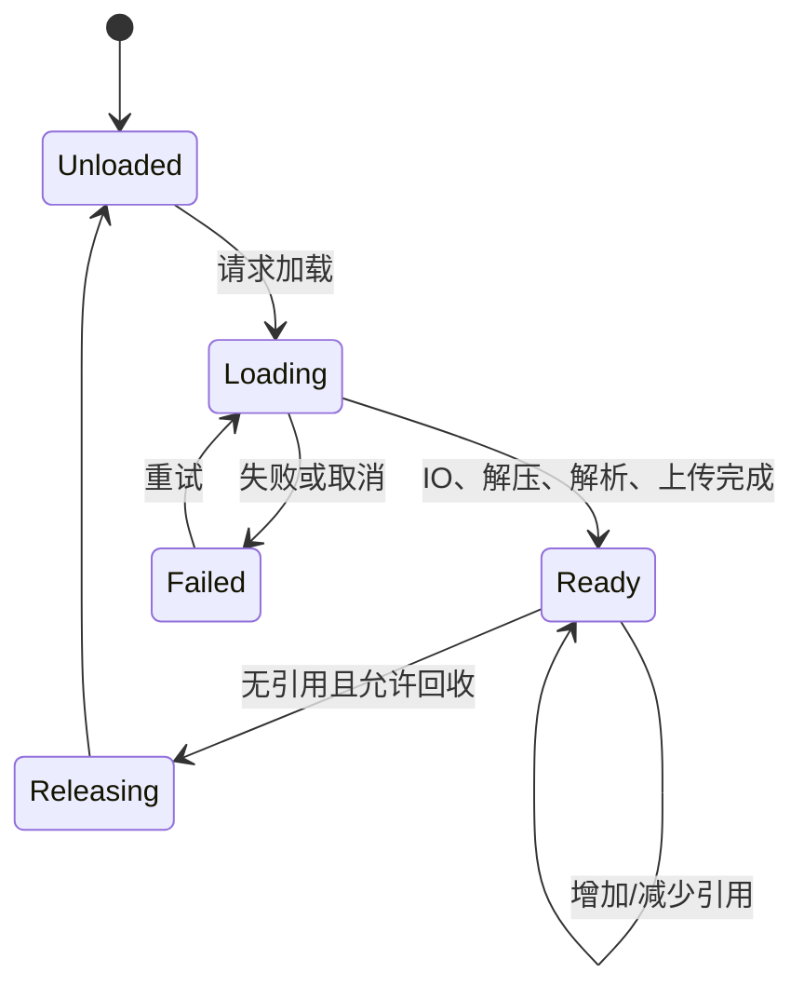

# 引擎架构与运行时

## 1. 主循环与时间

| 优先级 | 核心知识 |
|---|---|
| P0 | Game Loop、帧、Delta Time |
| P0 | Fixed Update 与 Variable Update |
| P1 | 插值、外推、时间缩放 |
| P1 | Game/Render/RHI 线程关系 |

简化主循环：

```text
while (running) {
    pollInput();
    receiveNetwork();
    runFixedSimulation();
    updateGameplay(deltaTime);
    updateAnimation();
    extractRenderData();
    submitRenderCommands();
    present();
}
```

这不是所有引擎的真实源码，而是一张责任地图。现代引擎会并行和流水化其中许多
步骤，但仍需保证依赖关系正确。

典型问题：

- 为什么物理通常使用固定时间步？
- 渲染帧率和逻辑 Tick 如何解耦？
- 卡顿时如何避免物理“追帧爆炸”？
- Render Thread 为什么可能消费上一帧的快照？

固定时间步让物理仿真的步长稳定；渲染则可以根据最新的两个仿真状态插值。
如果某帧卡顿后无限补算物理，补算本身又会让下一帧更慢，像迟到后决定用填写
更多迟到说明来追回时间。

## 2. 对象与模块组织

| 优先级 | 核心知识 |
|---|---|
| P0 | GameObject/Actor/Component |
| P0 | 组合与继承 |
| P1 | ECS 与数据导向设计 |
| P1 | 事件总线、消息队列、观察者模式 |
| P1 | 状态机、命令模式、对象池 |
| P2 | System 调度、依赖图、任务图 |

典型问题：

- 事件总线为什么容易造成依赖不透明？
- ECS 和传统组件模式有什么区别？
- 消息、事件和持久状态如何区分？
- 如何避免 Singleton 滥用？
- 对象池应提供哪些接口，归还时如何重置状态？
- MVC 和 MVVM 的职责边界有什么不同？
- 工厂模式如何避免变成巨型分支？

一个可维护的模块边界通常需要明确：

```text
谁拥有状态
谁可以修改状态
谁通过事件得知变化
谁负责创建和销毁
跨线程时如何传递
```

事件总线适合广播已经发生的事实，不适合把所有直接调用都藏起来。否则调用图会
从“清晰的道路”变成“所有人都往广场放飞纸飞机，然后期待正确的人捡到”。

ECS 的详细实现参见[ECS 系统专题](../../ecs/README.md)。

## 3. 资源生命周期

| 优先级 | 核心知识 |
|---|---|
| P0 | 资源加载、引用计数、生命周期 |
| P0 | 同步与异步加载 |
| P0 | 对象池和资源缓存 |
| P1 | 分包、依赖关系与资源版本 |
| P1 | 序列化、反射、配置系统 |
| P1 | Shader Variant 与资源预热 |
| P2 | Asset Pipeline、Cook、增量构建 |

资源系统的核心不是“把文件读进来”，而是管理状态：



典型问题：

- 如何避免资源重复加载？
- 异步加载完成时请求对象已经销毁怎么办？
- 引用计数为什么仍可能发生循环引用？
- Prefab 如何记录和追踪资源依赖？
- 同步和异步加载各会产生哪些内存峰值？

异步回调必须验证请求是否仍然有效。加载成功只说明快递到了，不说明下单的人
还住在这个地址。

## 4. 场景与世界流送

| 优先级 | 核心知识 |
|---|---|
| P0 | 场景切换、持久对象、加载界面 |
| P1 | 场景流式加载、分区和依赖 |
| P1 | 可见区域、预加载距离、卸载策略 |
| P2 | 大世界分层网格、异步实体生成 |

大世界场景流送通常围绕玩家或摄像机维护多个范围：

```text
最内层：必须激活并参与完整逻辑
中间层：已加载，可能使用简化逻辑或 LOD
外层：只预取资源和元数据
范围外：允许卸载
```

范围之间保留滞回区，可以避免对象在边界来回移动时反复加载与卸载。

## 5. 常见面试串讲

题目：玩家瞬移到新区域后，如何避免主线程卡顿和画面空白？

回答主线可以是：

1. 预测目标区域并提前请求资源。
2. 后台线程执行 IO、解压和可并行解析。
3. 主线程或渲染线程分帧完成必须串行的对象创建与 GPU 上传。
4. 使用占位资源、低精度 LOD 或过渡画面兜底。
5. 为请求设置优先级、取消令牌和内存预算。
6. 用加载耗时、帧时间、峰值内存和缺失资源率验证效果。

[返回引擎与客户端核心](./README.md) |
[下一章：物理、动画、同步与平台](./02-physics-animation-network-and-platforms.md)
