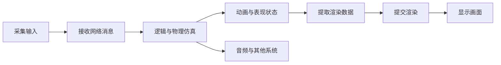

# 引擎与客户端核心

## 1. 模块定位

这一层把语言、系统和数学知识放进真正的游戏帧中，回答：

- 一帧逻辑如何推进，渲染与物理如何使用时间？
- 游戏对象、模块、事件和资源如何组织？
- 物理、动画和网络同步如何协作？
- Unity、Unreal 和自研引擎只是名字不同，还是运行模型也不同？

## 2. 一帧客户端的简化结构



真实引擎可能把这些工作拆到 Game Thread、Worker、Render Thread 和 RHI Thread，
但关键仍是数据何时产生、由谁消费、同步发生在哪里。

## 3. 阅读顺序

1. [引擎架构与运行时](./01-engine-architecture-and-runtime.md)
   学习主循环、时间、对象组织、消息、资源与场景。
2. [物理、动画、同步与平台](./02-physics-animation-network-and-platforms.md)
   学习物理动画管线、游戏网络同步，以及 Unreal/平台专项。
3. [Unity 引擎基础](../unity-engine/README.md)
   系统学习 GameObject、生命周期、资源、移动、物理、渲染和工程实践。
4. [ECS 系统专题](../../ecs/README.md)
   深入数据导向存储、系统调度、结构变更与缓存优化。
5. [图形渲染专项](../rendering/README.md)
   继续追踪渲染数据如何变成最终屏幕像素。

## 4. 学习边界

“用过某个引擎组件”与“理解引擎机制”是两回事。建议对每个系统都画出：

```text
输入数据
-> 更新时机
-> 所在线程
-> 产生的状态
-> 下游消费者
-> 销毁或回收时机
```

这张图通常比背十个 API 更接近客户端面试真正想确认的能力。
