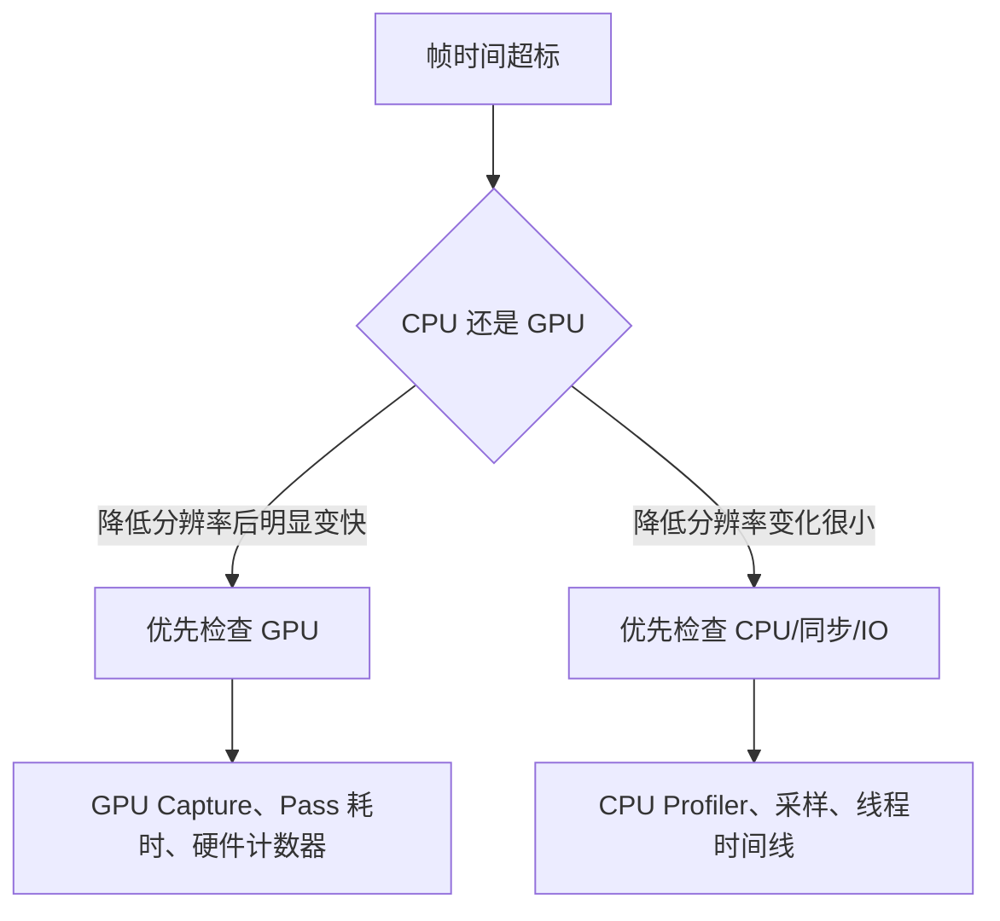

# 性能优化与工程化

## 1. 先判断瓶颈在哪里

性能优化的第一条规则不是“少用循环”，而是先测量。



这个方法只是快速线索，不是最终判决。VSync、帧率上限、CPU/GPU 同步和动态
分辨率都可能干扰观察，最终应使用 Profiler 和 Capture 证据确认。

## 2. CPU 与内存

| 优先级 | 核心知识 |
|---|---|
| P0 | 采样、埋点、主线程热点 |
| P0 | 分配、GC、锁竞争 |
| P0 | Cache Locality、批处理 |
| P1 | 多线程任务拆分、同步点 |
| P1 | 对象池、内存池、资源缓存 |
| P2 | SIMD、数据导向、无锁结构 |

典型问题：

- 平均帧率正常，为什么仍感觉卡？
- 如何定位 GC Spike？
- 多线程优化为什么可能变慢？
- 如何从 Profiler 热点定位到具体系统？
- BVH 或空间划分如何优化碰撞查询？

关注平均值之外的分布：

| 指标 | 能说明什么 |
|---|---|
| 平均帧时间 | 总体吞吐 |
| P95/P99 帧时间 | 大多数玩家遇到的尾部卡顿 |
| 最大帧时间 | 极端尖峰 |
| 主线程/GPU 时间 | 关键瓶颈归属 |
| 分配量与 GC 次数 | 托管内存压力 |
| 加载峰值内存 | 是否接近系统回收或崩溃边界 |

## 3. GPU

| 优先级 | 核心知识 |
|---|---|
| P0 | Draw Call、状态切换、Overdraw |
| P0 | 顶点量、像素填充、纹理带宽 |
| P1 | Shader 复杂度、分支、精度 |
| P1 | RenderTexture、后处理、阴影 |
| P2 | GPU Capture 与硬件计数器 |

GPU 性能问题可粗略分为：

```text
顶点受限：顶点数量、蒙皮、几何阶段过重
像素受限：高分辨率、Overdraw、复杂片元 Shader
带宽受限：大纹理、频繁 RenderTarget 读写、移动端外存访问
提交受限：Draw Call 和状态切换让 CPU/RHI 跟不上
同步受限：CPU 等 GPU 或 GPU 等资源
```

典型问题：

- 一百个相似角色如何选择合批或 GPU Instancing？
- CPU 预裁剪何时可能得不偿失？
- 低端手机发热降频时如何区分 CPU/GPU 和持续功耗问题？
- Early-Z、Overdraw 和透明物体如何影响填充成本？

完整管线原理参见[图形渲染专项](../rendering/README.md)。

## 4. 资源与稳定性

| 优先级 | 核心知识 |
|---|---|
| P0 | 内存峰值、泄漏、资源卸载 |
| P0 | 加载时间、预加载、异步加载 |
| P1 | 包体、补丁、资源版本 |
| P1 | Crash、ANR、日志、监控 |
| P1 | 移动端温度、功耗、降频 |
| P2 | 自动化测试、性能回归基线 |

资源泄漏排查不能只看“内存一直涨”。还要区分：

- 真正失去引用但未释放的内存。
- 仍被缓存策略合法持有的资源。
- 分配器保留但可复用的空闲页。
- 驱动、纹理或 RenderTarget 等 GPU 资源。
- 加载过程中的临时峰值。

## 5. 标准优化闭环

以“团战时 P99 帧时间从 16 ms 升到 45 ms”为例：

1. 固定设备、画质、场景和回放输入，建立可重复基线。
2. 用线程时间线确认主线程等待 Render Thread，而 GPU 片元阶段耗时很高。
3. GPU Capture 发现多个全屏透明特效反复覆盖屏幕。
4. 假设瓶颈来自 Overdraw 和片元 Shader，而不是角色逻辑。
5. 缩小粒子覆盖、降低低端机 Shader 分支并减少一层全屏 Pass。
6. 对比 P50/P95/P99、GPU 时间、画质和功耗。
7. 将固定回放加入性能回归，防止后续特效改动重新超标。

这类回答同时包含现象、证据、假设、改动、结果和预防，比“我把代码优化了一下”
更能证明工程能力。

[返回工程实践与项目表达](./README.md) |
[下一章：项目表达与复习策略](./02-project-design-and-study-strategy.md)
