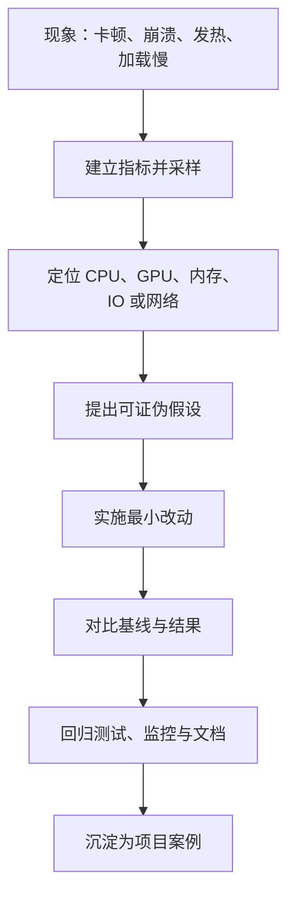

# 工程实践与项目表达

## 1. 模块定位

知识题确认“是否理解”，工程题确认“能否把系统做稳”，项目追问则确认“是否
真的做过”。这一层把前三个模块中的知识转化为可观测、可验证的工程决策。

## 2. 内容结构



## 3. 阅读顺序

1. [性能优化与工程化](./01-performance-and-production.md)
   学习 CPU/GPU 分析、资源稳定性、优化流程和常用指标。
2. [项目表达与复习策略](./02-project-design-and-study-strategy.md)
   学习项目追问、系统设计题、岗位优先级和模拟复盘方法。

## 4. 工程回答底线

“优化后感觉流畅多了”不算完整证据。至少应说明：

```text
测试场景与设备
-> 优化前基线
-> 定位工具和关键证据
-> 采取的改动
-> 优化后结果
-> 代价、边界和回归方式
```

没有基线的优化像给一辆不知道速度的车换了尾翼：可能有用，也可能只是更适合
拍照。
