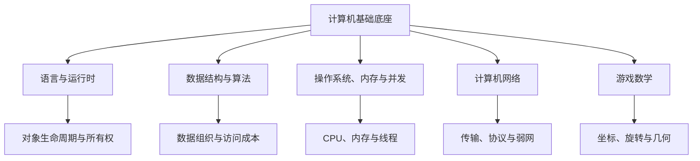

# 计算机基础底座

## 1. 模块定位

这一层回答三个最朴素的问题：

1. 代码如何表达对象、数据和行为？
2. 程序如何在 CPU、内存、线程和网络上运行？
3. 游戏中的空间、旋转和相交如何用数学描述？

引擎和图形 API 会不断变化，但对象生命周期、局部性、同步和线性代数不会突然
宣布退休。基础知识的价值就在这里。

## 2. 内容结构

## 3. 阅读顺序

1. [语言、运行时与数据结构](./01-language-runtime-and-data-structures.md)
   覆盖 C++、C#、Lua，以及通用和游戏相关数据结构。
2. [系统、网络与游戏数学](./02-systems-network-and-math.md)
   覆盖内存、并发、TCP/UDP、向量、矩阵、四元数与几何检测。
3. [操作系统、内存与并发综合模拟题](../02-os-memory-concurrency-mock-interview.md)
   把独立知识点放回大规模战斗卡顿场景中验证。

## 4. 学习标准

基础知识不要求把标准文档逐字背下来，但应能回答：

- 这个抽象解决什么问题？
- 数据实际存在哪里，谁拥有它？
- 一次访问或同步大致付出什么成本？
- 边界条件、失效条件和常见误用是什么？
- 在游戏客户端的一帧中，它会出现在哪里？

比如只会说“数组查询是 O(1)”还不够；还应知道连续数组为什么适合 CPU Cache，
以及一次随机内存访问如何把漂亮的复杂度分析变成耐心测试。
