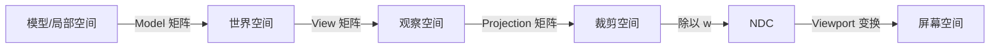

# 坐标空间与 CPU 准备

## 1. 为什么需要多个坐标空间

一个模型的顶点最初只知道“我在模型自己的哪里”。为了从摄像机看到它，需要
依次回答：

```text
顶点在模型中哪里？
-> 模型在世界中哪里？
-> 顶点相对摄像机在哪里？
-> 它投影到摄像机视锥中的哪里？
-> 最终落在屏幕哪个像素附近？
```

每个问题对应一个坐标空间。空间不是把顶点复制了很多份，而是使用不同参考系
描述同一个点。

## 2. 从模型空间到屏幕空间



### 2.1 模型空间

模型空间以模型自己的原点和坐标轴为参考。美术可以在原点附近制作一把剑，
场景中一百个角色通过不同 Model 矩阵复用同一份 Mesh。

Model 矩阵通常组合：

```text
缩放 -> 旋转 -> 平移
```

具体乘法书写顺序取决于行向量/列向量和矩阵约定。不要只背表达式顺序，应先说明
所用约定；不同 API 或数学库可能长得相反，几何意义却一致。

### 2.2 世界空间

世界空间把所有对象放到统一场景参考系中，便于计算对象关系、灯光位置和碰撞。

```text
worldPosition = Model * localPosition
```

### 2.3 观察空间

View 矩阵把世界变换到以摄像机为参考的空间。直觉上可以理解为：

> 与其把摄像机移动到场景中，不如把整个世界按相反变换搬到摄像机面前。

如果摄像机向右移动一米，观察空间中的世界就像向左移动一米。

### 2.4 裁剪空间

Projection 矩阵把观察空间中的视锥映射到便于裁剪的齐次空间。此时位置仍是
四维 `(x, y, z, w)`，还没有执行透视除法。

```text
clipPosition = Projection * View * Model * localPosition
```

常写成：

```text
clipPosition = MVP * localPosition
```

裁剪阶段使用齐次坐标判断图元是否位于可见范围内。不同图形 API 的 NDC 深度
范围和屏幕 Y 轴约定可能不同，不应把某一套具体数值误认为宇宙常数。

### 2.5 NDC

对裁剪坐标执行透视除法：

```text
ndc = clip.xyz / clip.w
```

透视投影下，远处物体的 `w` 通常更大，因此除法后更靠近中心，看起来更小。
“近大远小”不是顶点突然尊老爱幼，而是投影和除以 `w` 的结果。

### 2.6 屏幕空间

Viewport 变换把 NDC 映射到 Render Target 的像素范围和深度范围：

```text
NDC (-1..1 等规范范围)
-> 视口中的像素坐标
```

至此顶点得到了屏幕上的位置，但三角形内部覆盖哪些像素，要等光栅化阶段决定。

## 3. 透视与正交投影

### 3.1 透视投影

- 远处物体更小。
- 平行线可能在远方汇聚。
- 常用于 3D 世界和主摄像机。

### 3.2 正交投影

- 物体大小不随距离改变。
- 常用于 UI、工程视图、部分策略游戏或阴影计算。

两者都把可见空间映射到规范区域，只是保留深度关系的方式和视觉效果不同。

## 4. CPU 应用阶段做什么

GPU 流水线开始前，CPU 侧通常已经完成大量准备。

### 4.1 提取渲染数据

游戏逻辑对象往往不直接交给渲染线程。引擎会提取一份面向渲染的快照：

```text
Entity / Actor / GameObject
-> Transform、Mesh、Material、可见标记
-> Render Proxy / Render Data
```

这样渲染线程可以读取稳定数据，不必在 GPU 等命令时和玩法线程争抢同一对象。

### 4.2 可见性判断

常见方法：

| 方法 | 解决的问题 |
|---|---|
| Frustum Culling | 剔除摄像机视锥外对象 |
| Occlusion Culling | 剔除被大型遮挡物完全挡住的对象 |
| Portal/Room Culling | 利用房间和入口结构限制可见集合 |
| Distance Culling | 超出设定距离后不再渲染 |
| LOD | 根据屏幕占比选择不同复杂度 |

剔除不是越多越好。一次昂贵的遮挡查询如果只省下一个便宜三角形，像为了确认
一粒米掉没掉而暂停整条流水线做审计。

### 4.3 排序与批处理

CPU 会按渲染队列、材质、管线状态和深度等信息排序：

- 不透明物体常尽量从前向后，帮助深度测试尽早拒绝后方片元。
- 透明物体常从后向前，使 Alpha 混合得到较合理结果。
- 相同材质和状态尽量相邻，减少状态切换。
- 合批或 Instancing 可用更少命令绘制多个对象。

排序目标可能冲突。例如严格前后排序有利于减少 Overdraw，按材质排序有利于
减少状态切换。引擎会根据平台、Pass 和对象类型做折中。

### 4.4 构建渲染 Pass

现代一帧通常不止“画一次场景”：

```text
阴影 Pass
-> 深度预处理
-> 主不透明 Pass
-> 透明 Pass
-> 后处理
-> UI
```

每个 Pass 会指定输入资源、输出 Render Target、加载/清除方式和管线状态。
Render Graph 等系统进一步显式描述这些依赖，以便安排资源生命周期和执行顺序。

### 4.5 记录并提交命令

现代图形 API 常把命令记录到 Command Buffer/List：

```cpp
cmd.beginRenderPass(mainPass);
cmd.bindPipeline(litPipeline);
cmd.bindVertexBuffer(mesh.vertices);
cmd.bindIndexBuffer(mesh.indices);
cmd.bindResources(camera, lights, material);
cmd.drawIndexed(mesh.indexCount);
cmd.endRenderPass();
queue.submit(cmd);
```

驱动或 RHI 会把这些命令转换为 GPU 能执行的工作。显式 API 让引擎承担更多资源
状态和同步责任，也提供更直接的多线程记录与性能控制。

## 5. Draw Call 为什么昂贵

一次 Draw Call 可能涉及：

- CPU 遍历对象和准备常量。
- 绑定管线、Buffer、纹理和描述符。
- 驱动/RHI 验证并编码命令。
- 状态变化导致硬件工作切换。
- GPU 执行实际顶点和片元任务。

因此要同时看两个维度：

```text
提交成本：Draw Call 数量、状态切换、命令构建
执行成本：每次绘制包含的顶点、片元、采样和带宽
```

减少 Draw Call 不保证 GPU 更快。把所有对象合成一个巨大批次可能破坏剔除，
导致看不见的几何也被提交。优化目标是减少无效工作和关键路径时间，不是把某个
计数器哄到零。

## 6. CPU/GPU 并行与同步

CPU 通常允许同时准备多个在途帧，避免 GPU 空闲：

```text
时间 ---->
CPU  Frame 1 | Frame 2 | Frame 3 |
GPU          | Frame 1 | Frame 2 | Frame 3 |
Display              | Frame 1 | Frame 2 |
```

在途帧增加吞吐，但也可能增加输入到显示的延迟。资源不能在 GPU 使用完成前被
覆盖或释放，因此引擎会使用 Fence、Semaphore、环形 Buffer 或多份帧资源管理
生命周期。

最危险的情况之一是 CPU 立即读取 GPU 查询结果：

```text
CPU 提交 GPU 工作
-> CPU 马上请求结果
-> GPU 必须执行完前方命令
-> CPU 被迫等待
```

## 7. 本章检查

1. 为什么要经过模型、世界、观察、裁剪和屏幕空间？
2. 透视除法为什么必须在裁剪之后？
3. CPU 为什么要先进行可见性、排序和批处理？
4. 不透明与透明物体的常见排序方向为何不同？
5. 减少 Draw Call 为什么不一定提升性能？

[上一章：渲染基本概念](./01-rendering-fundamentals.md) |
[下一章：GPU 几何阶段](./03-gpu-geometry-stage.md)
