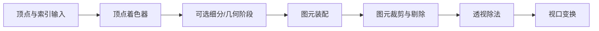

# GPU 几何阶段

## 1. 几何阶段的任务

CPU 提交绘制命令后，GPU 几何阶段处理“顶点和三角形在哪里”：



具体硬件和 API 可能调整裁剪、剔除的内部顺序，或融合部分工作，但从概念上掌握
这条数据流即可。

## 2. 输入装配

输入装配阶段根据顶点布局解释 Vertex Buffer，并使用 Index Buffer 组成图元。

顶点布局示例：

```text
每个顶点 52 字节
├── position  float3  offset 0
├── normal    float3  offset 12
├── uv        float2  offset 24
├── tangent   float4  offset 32
└── color     rgba8   offset 48
```

实际大小会受格式和对齐影响。引擎必须让 CPU 写入布局、管线声明和 Shader 输入
保持一致，否则 GPU 会非常认真地把法线当位置读，然后画出一件超现实主义作品。

### 2.1 为什么使用索引

一个立方体有 12 个三角形，即 36 个三角形顶点引用，但许多顶点可复用。
Index Buffer 保存“使用哪个顶点”，可以：

- 减少重复顶点数据。
- 提高顶点缓存命中。
- 让共享边的拓扑表达更直接。

不过顶点是否能共享取决于完整属性。立方体角点的位置相同，但每个面的法线和
UV 可能不同，因此在渲染顶点数据中仍需拆分。

### 2.2 VBO、IBO 与 VAO

在 OpenGL 语境中：

- VBO 保存顶点数据。
- IBO/EBO 保存索引。
- VAO 记录顶点属性布局和相关绑定状态。

VAO 不是另一份顶点数据，也不能替代索引。它更像一张“这批 Buffer 应该如何
解释”的配置单。

## 3. 顶点着色器

Vertex Shader 对每个输入顶点执行，至少需要输出裁剪空间位置。

简化 HLSL 风格代码：

```hlsl
struct VSInput
{
    float3 positionOS : POSITION;
    float3 normalOS   : NORMAL;
    float2 uv         : TEXCOORD0;
};

struct VSOutput
{
    float4 positionCS : SV_POSITION;
    float3 normalWS   : TEXCOORD0;
    float2 uv         : TEXCOORD1;
};

VSOutput VSMain(VSInput input)
{
    VSOutput output;
    float4 positionWS = mul(Model, float4(input.positionOS, 1.0));
    output.positionCS = mul(ViewProjection, positionWS);
    output.normalWS = normalize(mul(NormalMatrix, input.normalOS));
    output.uv = input.uv;
    return output;
}
```

它完成：

1. 把局部顶点变换到世界空间。
2. 把位置变换到裁剪空间。
3. 变换法线。
4. 把法线和 UV 等数据传给后续阶段。

矩阵的 `mul` 参数顺序随语言和项目约定变化，理解空间变换比死记参数位置重要。

### 3.1 为什么法线不能总用 Model 矩阵

如果模型只做旋转和统一缩放，直接变换法线通常看不出问题；存在非均匀缩放时，
法线需要使用 Model 矩阵线性部分的逆转置矩阵，才能继续垂直于表面。

直觉上，切线随表面一起拉伸后，法线必须重新调整，才能与拉伸后的切线保持垂直。

### 3.2 顶点着色器能修改拓扑吗

普通 Vertex Shader 一次只处理一个顶点，不能凭空知道完整三角形，也不能直接
新增或删除图元。需要改变拓扑时可使用细分、Geometry Shader、Mesh Shader、
Compute Shader 或由 CPU 重新生成数据，具体选择取决于平台和需求。

## 4. 可选的可编程几何阶段

### 4.1 Tessellation

细分阶段把较粗的 Patch 细分成更多小图元，可用于地形、曲面和位移细节。

优点：

- 根据视距动态调整几何细节。
- 减少基础网格数据。

代价：

- 增加生成和处理的顶点数量。
- 平台支持和性能特征不同。
- 细分过度会让后续阶段承担大量工作。

### 4.2 Geometry Shader

Geometry Shader 读取完整图元，并可输出零个或多个图元。它表达力直接，但在
很多现代 GPU 上吞吐并不理想，实际工程常考虑 Instancing、Compute 或 Mesh
Shader 等替代方案。

可选阶段不是流水线必须打卡的员工。未启用时，数据直接进入图元装配。

## 5. 图元装配

图元装配根据 Draw Call 指定的拓扑，把顶点组成点、线或三角形：

```text
Triangle List:
(v0, v1, v2), (v3, v4, v5), ...

Indexed Triangle List:
(index[0], index[1], index[2]), ...
```

三角形还具有绕序：

```text
逆时针 CCW 或顺时针 CW
```

引擎会约定哪种绕序代表正面。模型导入、坐标系翻转或负缩放都可能改变绕序。

## 6. 背面剔除

封闭模型朝内的背面通常不可见，可以在光栅化前剔除：

```text
正面三角形 -> 保留
背面三角形 -> 不生成片元
```

这能减少后续工作，但以下情况可能需要关闭或调整：

- 双面树叶、纸片和布料。
- 镜像或负缩放导致绕序翻转。
- 摄像机位于封闭模型内部。
- 特殊阴影或轮廓 Pass。

背面剔除与遮挡剔除不同。前者根据单个三角形朝向，后者判断整个对象是否被其他
物体挡住。

## 7. 视锥裁剪

三角形可能：

- 完全在视锥内：保留。
- 完全在视锥外：丢弃。
- 穿过裁剪面：切出位于视锥内的新图元。

```text
裁剪前：一个三角形跨过近裁剪面
        /\
-------/--\------ 近裁剪面
      /____\

裁剪后：只保留可见部分，并可能生成两个三角形
```

为什么不先透视除法再裁剪？因为齐次裁剪空间能正确处理跨越近裁剪面和摄像机
后方的几何；过早除以 `w` 会带来异常坐标和错误插值。

## 8. 透视除法与视口变换

裁剪完成后：

```text
clip.xyz / clip.w -> NDC
```

随后 Viewport 变换把 NDC 映射到屏幕像素范围。此时三角形的三个顶点已经有
屏幕位置，下一阶段要找出它覆盖哪些采样点。

## 9. 几何阶段常见瓶颈

| 问题 | 现象与方向 |
|---|---|
| 顶点数量过高 | 降低模型复杂度、LOD、剔除 |
| 蒙皮开销大 | 减少骨骼影响、优化顶点格式、GPU Skinning |
| 顶点属性过宽 | 压缩格式、移除无用属性，降低带宽 |
| 小三角形过多 | 可能增加装配和光栅化低效 |
| Tessellation 过度 | 限制细分因子，按屏幕误差调整 |
| 顶点缓存命中差 | 优化索引顺序和网格布局 |

顶点多不必然慢，最终仍要通过 GPU Capture 和硬件计数器判断。性能诊断不应把
“我觉得模型面数很多”升级成未经审判的最终结论。

## 10. 本章检查

1. Index Buffer 为什么不能简单被 VAO 取代？
2. Vertex Shader 至少必须输出什么？
3. 非均匀缩放为什么影响法线变换？
4. 背面剔除和视锥裁剪分别解决什么问题？
5. 为什么透视除法发生在裁剪之后？

[上一章：坐标空间与 CPU 准备](./02-coordinate-spaces-and-cpu-preparation.md) |
[下一章：光栅化与片元阶段](./04-rasterization-and-fragment-stage.md)
