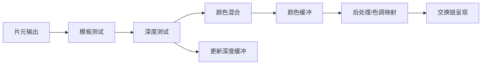

# 输出合并与画面呈现

## 1. 输出阶段解决什么问题

Fragment Shader 算出的只是候选结果。输出阶段还要决定：

```text
这个片元是否属于允许绘制的区域？
它是否被更近的物体挡住？
它与颜色缓冲中已有颜色如何合成？
结果写入哪个颜色和深度附件？
完成的图像何时交给显示器？
```

常见概念流程：



硬件可能提前、延后或融合测试，本图表达职责和数据关系，不要求物理电路逐格排队。

## 2. 深度测试与深度写入

Depth Buffer 为每个采样位置保存当前深度。绘制新片元时，将它的深度与已有值
比较：

```text
新片元更近 -> 通过，可能更新颜色和深度
新片元更远 -> 失败，通常丢弃
```

### 2.1 深度测试不等于深度写入

两者是独立状态：

| 深度测试 | 深度写入 | 常见用途 |
|---|---|---|
| 开 | 开 | 普通不透明物体 |
| 开 | 关 | 常见半透明物体 |
| 关 | 关 | 始终覆盖的部分 UI 或全屏处理 |
| 开 | 视情况 | 特殊效果、只读深度 Pass |

透明物体通常保留深度测试，以免画到不透明墙前面；但关闭深度写入，避免先画的
透明层完全挡住后画的透明层。

### 2.2 深度精度

透视投影的深度分布通常是非线性的，靠近近裁剪面的精度更高。近裁剪面设得过近、
远裁剪面过远，容易造成远处表面 Z-Fighting。

常见改进包括：

- 合理抬高近裁剪面。
- 缩短不必要的远裁剪距离。
- 使用更高精度深度格式。
- 在支持的管线中使用 Reversed-Z。

## 3. 模板测试

Stencil Buffer 通常为每个像素保存一个小整数。渲染可以先写标记，再限制后续
Pass 只在符合条件的区域执行。

常见用途：

- 镜面或传送门区域。
- 角色轮廓。
- UI 遮罩。
- 限制特定光照或后处理区域。

一个简化轮廓流程：

```text
Pass 1：正常绘制角色，同时在模板缓冲写入 1
Pass 2：绘制略放大的角色
        仅模板值不等于 1 的像素通过
        -> 只留下外圈
```

模板缓冲像一张像素级通行证表：它不负责算颜色，只负责回答“这里允许谁通过”。

## 4. 颜色混合

Blend 将当前片元颜色 `Source` 与颜色缓冲中的 `Destination` 合成。

常见 Alpha 混合：

```text
Result.rgb =
    Source.rgb * Source.alpha
    + Destination.rgb * (1 - Source.alpha)
```

例如半透明红色覆盖蓝色背景：

```text
Source      = red, alpha 0.25
Destination = blue
Result      = 25% red + 75% blue
```

### 4.1 为什么透明物体通常从后向前

普通 Alpha 混合通常不满足交换律：

```text
A 混到 B 上 != B 混到 A 上
```

因此需要先画远处透明层，再把近处透明层叠上来。对象级排序仍不能完美解决互相
穿插的透明三角形，这也是实时透明渲染长期比“把 alpha 调小”复杂得多的原因。

### 4.2 预乘 Alpha

预乘 Alpha 纹理提前保存：

```text
stored.rgb = original.rgb * alpha
```

对应混合可写为：

```text
Result.rgb =
    Source.rgb
    + Destination.rgb * (1 - Source.alpha)
```

它能更自然地处理部分边缘过滤和某些混合组合，但资源生成、Shader 输出与 Blend
状态必须使用同一约定。只改其中一项，边缘就可能出现黑边、白边或一种“谁也说不
清自己为何发光”的效果。

### 4.3 其他混合方式

- Additive：常用于火焰、光效，颜色相加。
- Multiply：常用于压暗或某些合成。
- Min/Max：保留分量最小值或最大值。

混合模式由视觉目标和数据语义决定，不是透明材质只有一个固定答案。

## 5. 抗锯齿

三角形边缘是连续几何，像素网格是离散采样，采样不足会产生锯齿。

### 5.1 SSAA

以更高分辨率完整渲染后缩小：

- 质量高，能改善几何、Shader 和纹理走样。
- 片元、带宽和 Render Target 内存成本都很高。

### 5.2 MSAA

每像素使用多个覆盖/深度采样，通常不对每个样本都完整执行一次 Fragment Shader：

- 主要改善几何边缘。
- 比同倍率 SSAA 便宜。
- 对 Shader 内部、透明和后处理产生的走样帮助有限。

### 5.3 FXAA

在最终图像上寻找高对比边缘并平滑：

- 成本低、接入简单。
- 可能使细节和文字略模糊。

### 5.4 TAA

结合历史帧和抖动采样积累结果：

- 能改善多类空间走样，并在现代渲染中常见。
- 需要运动矢量、历史有效性和抗重影处理。

面试比较抗锯齿时，应同时说清采样位置、处理阶段、质量、成本和常见伪影。

## 6. HDR、Tone Mapping 与颜色空间

光照计算可能产生超过显示器标准范围的高动态范围颜色。Tone Mapping 将 HDR
结果映射到显示范围，同时尽量保留亮暗层次。

简化流程：

```text
线性空间中的光照与合成
-> 曝光
-> Tone Mapping
-> 颜色分级
-> 转换到显示编码
-> 写入最终图像
```

光照通常应在线性空间计算。直接在 Gamma 编码值上相加会得到不符合物理直觉的
结果。纹理需要按其语义标记：基础颜色常是 sRGB，法线、粗糙度等数据纹理通常
按线性数据读取。

## 7. Framebuffer 与交换链

### 7.1 为什么需要多缓冲

如果显示器正在读取一张图，GPU 同时修改它，屏幕可能在一次扫描中读到上下两个
不同时间的画面，形成撕裂。

双缓冲使用：

```text
Front Buffer：显示器正在读取
Back Buffer：GPU 正在绘制
完成后交换角色
```

交换通常是交换引用或索引，不是把整张图逐像素搬家。双缓冲让同步呈现成为
可能，但若交换未与显示刷新协调，仍然可能撕裂。

### 7.2 VSync

VSync 让呈现与显示器刷新节奏同步，可减少撕裂，但可能：

- 在错过刷新窗口时等待。
- 增加输入到显示的延迟。
- 在部分模式下降到刷新率的整数分频。

### 7.3 三缓冲与在途帧

增加缓冲可让 GPU 在等待显示时继续工作，提高吞吐和稳定性；但队列过深会增加
输入延迟和显存占用。低延迟模式通常会限制在途帧数量。

吞吐和延迟不是同一个指标：

```text
吞吐：单位时间能完成多少帧
延迟：一次输入多久后出现在屏幕上
```

## 8. 一帧何时真正完成

从游戏代码调用 `Present` 到玩家看到画面，中间还可能经历：

```text
CPU 提交
-> GPU 执行剩余命令
-> 后处理与最终写入
-> 等待可用交换链图像
-> Present 排队
-> 显示器下一次扫描
-> 像素响应
```

所以“CPU 这一帧只花 5 ms”不代表点击后 5 ms 就能看到结果。分析输入延迟时要
观察整条链路。

## 9. 本章检查

1. 深度测试和深度写入有什么区别？
2. 透明物体为何通常开启深度测试但关闭深度写入？
3. 普通 Alpha 混合为什么依赖绘制顺序？
4. MSAA、SSAA、FXAA 和 TAA 的处理阶段有何不同？
5. 双缓冲如何减少撕裂，又可能引入什么代价？

[上一章：光栅化与片元阶段](./04-rasterization-and-fragment-stage.md) |
[下一章：完整流水线串讲与面试复盘](./06-pipeline-walkthrough-and-interview.md)
