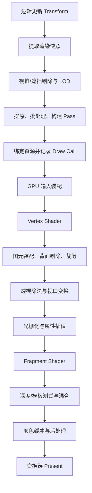

# 完整流水线串讲与面试复盘

## 1. 场景题

现在渲染这样一个简单场景：

```text
摄像机
  |
  v
[旋转的砖纹立方体]   [后方墙面]
        \
         \ [半透明烟雾]
```

立方体有 Mesh、砖纹 Material 和 Transform；墙面是不透明物体；烟雾使用透明
粒子。下面沿一帧时间顺序追踪它们。

## 2. 第一站：游戏逻辑更新

CPU 根据输入和 Delta Time 更新立方体旋转：

```cpp
cube.rotation *= rotationFromAxisAngle(
    upAxis,
    angularSpeed * deltaTime
);
```

此时只是 Transform 数据改变，屏幕像素还没有自动更新。引擎在合适阶段计算或
记录新的 Model 矩阵。

## 3. 第二站：提取渲染数据

引擎从游戏对象提取渲染快照：

```text
CubeRenderData
├── modelMatrix
├── meshHandle
├── materialHandle
├── boundingBox
└── renderFlags
```

快照使 Render Thread 可以稳定读取，不必与游戏逻辑同时修改同一对象。

## 4. 第三站：可见性与 LOD

CPU 判断：

1. 立方体包围盒是否与摄像机视锥相交。
2. 是否被确定完全遮挡。
3. 距离和屏幕占比对应哪个 LOD。
4. 当前渲染层和摄像机掩码是否允许绘制。

如果对象被剔除，后面的 Draw Call、顶点和片元工作都可以省下。越早安全拒绝
无效工作，通常越划算。

## 5. 第四站：建立 Pass 和绘制列表

场景可简化成：

```text
Opaque Pass
├── 立方体
└── 墙面

Transparent Pass
└── 烟雾

Post Process
└── Tone Mapping

UI Pass
```

不透明对象按材质和大致深度排序，透明烟雾放在后续队列并从后向前排序。

## 6. 第五站：准备资源与状态

首次使用前，Mesh 数据已上传为 Vertex/Index Buffer，纹理已上传到 GPU，并创建
相应资源视图。参数和资源绑定可按更新频率组织：

```text
FrameData：View、Projection、摄像机位置、时间
LightData：灯光方向、颜色、强度
ObjectData：Model、NormalMatrix
MaterialData：BaseColor、Roughness 等常量，以及纹理/采样器绑定
```

引擎还需保证资源处于正确状态，例如纹理正被 Shader 读取、颜色附件正被渲染
写入。显式 API 中，这些转换和同步通常需要引擎明确描述。

## 7. 第六站：提交 Draw Call

立方体的简化命令：

```cpp
cmd.bindPipeline(opaqueLitPipeline);
cmd.bindVertexBuffer(cubeMesh.vertexBuffer);
cmd.bindIndexBuffer(cubeMesh.indexBuffer);
cmd.bindResources(frameData, lightData, brickMaterial);
cmd.setObjectData(cubeModelMatrix);
cmd.drawIndexed(cubeMesh.indexCount);
```

CPU 记录的是命令。提交到 Graphics Queue 后，GPU 在前序依赖满足时执行。

## 8. 第七站：输入装配

GPU 根据顶点布局读取位置、法线、UV，并根据索引把它们组成三角形。

索引允许相邻三角形复用顶点数据；顶点缓存还可能避免同一索引对应的顶点被重复
执行 Vertex Shader。

## 9. 第八站：Vertex Shader

每个立方体顶点大致经历：

```text
positionOS
-> Model 变换
-> positionWS
-> View 变换
-> positionVS
-> Projection 变换
-> positionCS
```

Shader 同时输出世界法线和 UV，供光栅化器插值。

## 10. 第九站：装配、剔除与裁剪

GPU 把变换后的顶点重新组成三角形：

- 背向摄像机的三角形可被背面剔除。
- 完全位于视锥外的三角形被丢弃。
- 穿过近裁剪面或屏幕边界的三角形被裁出可见部分。

之后执行透视除法和 Viewport 变换，得到屏幕位置。

## 11. 第十站：光栅化

光栅化器找到每个可见三角形覆盖的采样点，为它们产生片元，并插值：

```text
UV
世界空间法线
世界空间位置或其他光照数据
```

同一个屏幕像素可能先后收到立方体、墙面和烟雾产生的多个片元。

## 12. 第十一站：Fragment Shader

立方体的每个可见片元：

1. 根据插值 UV 采样砖纹基础颜色。
2. 读取并归一化法线。
3. 计算法线与灯光方向关系。
4. 结合材质参数得到候选颜色。

如果立方体挡住后方墙面，墙面片元可能在 Early-Z 或后续深度测试中被拒绝，
从而减少无效着色或至少避免写入。

## 13. 第十二站：深度、模板与混合

### 13.1 立方体和墙面

它们是不透明物体：

```text
深度测试：开
深度写入：开
混合：关
```

更近片元通过并更新颜色与深度，更远片元失败。

### 13.2 烟雾

烟雾是半透明物体：

```text
深度测试：开
深度写入：通常关
Alpha 混合：开
```

它不会穿过立方体显示，但会与后方已有颜色混合。多个透明粒子层会产生 Overdraw。

## 14. 第十三站：后处理与呈现

主场景可能先写入 HDR Render Target，随后执行：

```text
曝光
-> Tone Mapping
-> 颜色分级
-> 抗锯齿
-> 写入交换链 Back Buffer
-> Present
```

显示系统在合适刷新时机扫描最终图像。至此，玩家终于看到那只已经在知识文档里
旅行了十三站的立方体。

## 15. 一张完整流程图



## 16. 30 秒面试回答

题目：请简述渲染流水线。

> 广义上先由 CPU 应用阶段从场景提取可见对象，完成剔除、排序、批处理和资源
> 绑定，再通过 Draw Call 或命令缓冲提交给 GPU。GPU 先在顶点阶段把模型顶点
> 变换到裁剪空间，完成图元装配、背面剔除、裁剪、透视除法和视口变换；之后
> 光栅化生成片元并插值属性，Fragment Shader 计算颜色；最后经过深度、模板和
> 混合写入 Render Target，后处理完成后通过交换链呈现。

这个版本先交付主干，面试官追问哪个阶段，再展开对应原理。

## 17. 两分钟展开框架

可以按“输入、处理、输出”组织：

```text
输入：
场景对象、Mesh、Material、摄像机、灯光

CPU：
渲染数据提取、可见性、LOD、排序、批处理、命令提交

GPU 几何：
顶点读取、Vertex Shader、图元装配、裁剪、透视除法

GPU 像素：
光栅化、属性插值、Fragment Shader、纹理和光照

输出：
深度、模板、混合、Render Target、后处理、Present

性能：
提交量、顶点量、Overdraw、Shader、带宽和同步点
```

## 18. 高频追问与回答抓手

### 18.1 Draw Call 为什么昂贵

抓手：CPU 命令构建、驱动/RHI、状态切换和 GPU 实际执行是不同成本。合批减少
提交，但可能破坏剔除，不能只追求数量最少。

### 18.2 深度测试和深度写入有何区别

抓手：测试决定片元能否通过，写入决定通过后是否更新 Depth Buffer。透明物体
常测试开启、写入关闭。

### 18.3 为什么透明物体后画并从后向前

抓手：普通 Alpha 混合依赖 Destination，通常不满足交换律；同时保留深度测试
以接受不透明遮挡。

### 18.4 Early-Z 什么时候可能失效

抓手：Shader 修改深度、`discard`、副作用和部分混合条件可能限制提前测试。
不同 GPU 会采用不同策略，不要绝对化。

### 18.5 VBO 之后为什么还要 IBO

抓手：VBO 存顶点属性，IBO 保存图元引用并复用顶点；VAO 主要描述如何解释这些
Buffer，不替代索引数据。

### 18.6 如何判断 CPU 还是 GPU 瓶颈

抓手：

1. 先看 CPU/GPU 帧时间和等待关系。
2. 降低分辨率或简化像素负载只作为线索。
3. CPU 使用采样和线程时间线，GPU 使用 Frame Debugger/Capture。
4. 检查 VSync、同步点和帧率上限是否干扰。

## 19. 常见错误表述

| 错误表述 | 更准确的说法 |
|---|---|
| Draw Call 会立刻把物体画完 | CPU 记录/提交命令，GPU 通常稍后异步执行 |
| Vertex Shader 处理三角形 | 普通 Vertex Shader 逐顶点执行，图元稍后装配 |
| 光栅化直接得到最终像素 | 它产生片元候选，之后还有 Shader、测试与混合 |
| 深度测试开了就一定写深度 | 测试和写入是独立状态 |
| 透明物体不需要深度测试 | 通常仍需测试，只是常关闭深度写入 |
| 减少 Draw Call 一定更快 | 还要看顶点、像素、带宽、剔除和同步 |
| GPU 并行所以分支没有成本 | 执行组内分歧可能降低利用率 |
| 双缓冲能让 GPU 计算翻倍 | 它主要解耦绘制与显示，也可能增加等待或延迟 |

## 20. 自测题

1. 从立方体局部顶点开始，完整说明它如何落到屏幕采样点。
2. 如果立方体在摄像机后方，在哪些阶段可以被拒绝？
3. 如果墙面先画、立方体后画，深度测试如何得到正确遮挡？
4. 烟雾粒子覆盖全屏时，为什么即使面数很少也可能很慢？
5. CPU 帧时间 4 ms、GPU 帧时间 24 ms 时，应先检查哪些方向？
6. 为什么读取刚提交的 GPU 查询结果可能让 CPU 卡住？
7. 如何向没有图形学背景的人解释 Material 与 Shader 的区别？

能够不用看图顺畅回答前四题，就已经把流水线主干讲通；后面的问题则开始进入
性能和工程实践。

[上一章：输出合并与画面呈现](./05-output-merger-and-presentation.md) |
[返回图形渲染专项](./README.md)
