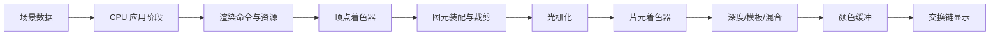

# 图形渲染专项

## 1. 模块目标

本模块先解决实时渲染最基础的问题：游戏世界中的模型、材质、灯光和摄像机，
究竟如何在一帧内变成屏幕上的像素。

读完后应能：

1. 区分 Mesh、Material、Shader、Texture、Render Target 和 Draw Call。
2. 解释顶点如何从模型空间变换到屏幕空间。
3. 从 CPU 准备开始，完整讲出 GPU 渲染流水线。
4. 解释裁剪、光栅化、深度测试、模板测试、混合和交换链。
5. 根据现象初步判断提交、顶点、像素、带宽或同步瓶颈。

## 2. 一帧画面的大地图



一句话版本：

> CPU 决定“画什么、用什么画”，GPU 并行计算“每个顶点和候选像素如何处理”，
> 最终把通过测试的颜色写入缓冲并送到屏幕。

可以把它想成一家出餐量极大的餐厅：

| 渲染概念 | 餐厅比喻 |
|---|---|
| CPU / 引擎 | 店长，整理订单并安排批次 |
| Draw Call | 一张交给后厨的订单 |
| GPU | 拥有大量工位的后厨 |
| Vertex Shader | 处理食材位置和形状的工位 |
| Rasterizer | 把三角形拆成覆盖到的像素候选 |
| Fragment Shader | 为每个候选像素调颜色和光照 |
| 深度、模板、混合 | 出餐前的遮挡、区域和合成规则 |
| Framebuffer | 等待上桌的一整份画面 |

这个比喻帮助记忆职责，但 GPU 不是一群缩小版 CPU 厨师；它更擅长对大量数据
执行相似工作，遇到频繁分歧和同步时也会“后厨堵车”。

## 3. 阅读顺序

1. [渲染基本概念](./01-rendering-fundamentals.md)
   认识一帧画面中的数据、对象和 CPU/GPU 分工。
2. [坐标空间与 CPU 准备](./02-coordinate-spaces-and-cpu-preparation.md)
   理解 MVP 变换、可见性、排序、批处理和 Draw Call 提交。
3. [GPU 几何阶段](./03-gpu-geometry-stage.md)
   跟踪顶点着色、图元装配、裁剪、透视除法与视口变换。
4. [光栅化与片元阶段](./04-rasterization-and-fragment-stage.md)
   理解三角形如何覆盖像素，以及纹理、插值、光照和 Overdraw。
5. [输出合并与画面呈现](./05-output-merger-and-presentation.md)
   理解深度、模板、混合、抗锯齿、Framebuffer、双缓冲和 VSync。
6. [完整流水线串讲与面试复盘](./06-pipeline-walkthrough-and-interview.md)
   用一个带纹理立方体串起整条流水线，并整理常见追问。

## 4. 学习边界

这一阶段先讲“所有现代实时渲染都绕不开的公共主干”，不急着展开 PBR、阴影、
全局光照、Forward/Deferred、Render Graph 或 GPU Driven Rendering。

原因很简单：如果还没说清片元什么时候产生，直接讨论延迟渲染的 G-Buffer，
就像还没认识锅铲先研究餐厅加盟，知识看似变多，地基却会发出可疑的声音。

后续可沿以下方向继续扩展：

```text
流水线主干
├── Shader 与材质：光照、PBR、BRDF、阴影
├── 渲染路径：Forward、Deferred、Forward+
├── 性能：批处理、Instancing、LOD、Overdraw、带宽
├── 移动端：TBDR、纹理压缩、功耗与热限制
└── 现代架构：Render Graph、Compute、GPU Driven
```

## 5. 后续专题地图

完成本轮流水线主干后，渲染模块将继续按以下层级扩展。这里先保留范围和高频
问题，避免基础篇被高级名词挤成早高峰。

### 5.1 渲染路径与现代架构

| 优先级 | 后续专题 |
|---|---|
| P1 | Forward、Deferred、Forward+ |
| P1 | 阴影 Pass、深度预处理、后处理链 |
| P2 | Render Graph、Compute Shader |
| P2 | GPU Driven Rendering、Indirect Draw、Mesh Shader |

高频问题：

- 延迟渲染为什么难处理透明物体？
- Forward 与 Deferred 在光源数量、带宽和材质灵活性上如何取舍？
- Render Graph 如何根据资源读写关系安排 Pass 与临时资源？

### 5.2 批处理与可见性

| 优先级 | 后续专题 |
|---|---|
| P0 | 静态/动态批处理、GPU Instancing |
| P0 | Frustum Culling、Occlusion Culling |
| P1 | LOD、材质状态切换、合批边界 |
| P2 | Cluster Culling、Indirect Draw |

高频问题：

- 静态/动态合批和 GPU Instancing 的适用条件分别是什么？
- 一百个相似角色应如何选择合批、Instancing 或 GPU Driven 方案？
- CPU 预裁剪什么时候可能比省下的 Draw Call 更贵？

### 5.3 Shader、光照与材质

| 优先级 | 后续专题 |
|---|---|
| P0 | 法线、切线空间、纹理采样 |
| P1 | Blinn-Phong、PBR、BRDF |
| P1 | Shadow Map、PCF、级联阴影 |
| P1 | Gamma、Linear、HDR、Tone Mapping |
| P2 | 光照探针、烘焙与实时 GI |

高频问题：

- Phong 和 Blinn-Phong 有什么区别？
- BRDF 在 PBR 中描述什么，金属度和粗糙度如何影响材质？
- Shadow Map 和 Light Map 的原理及适用场景有何不同？
- 法线贴图为什么通常呈蓝紫色，如何从切线空间变换到目标空间？

### 5.4 纹理与移动端

| 优先级 | 后续专题 |
|---|---|
| P0 | Mipmap、过滤、纹理压缩 |
| P1 | 图集、Sampler、各向异性过滤 |
| P1 | 移动端 TBDR、带宽和 Overdraw |
| P2 | ASTC/ETC、RenderTexture 带宽 |

高频问题：

- Mipmap 为什么增加存储，却可能减少闪烁和采样带宽？
- ASTC 的块尺寸如何在质量、包体和运行时内存间取舍？
- 移动端 TBDR 为什么特别在意 Render Target 切换和片外带宽？
