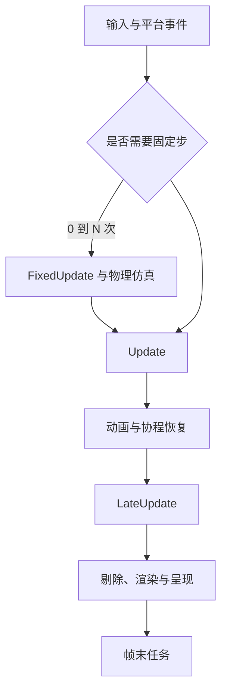

# MonoBehaviour 生命周期与主循环

## 1. `Update` 是谁调用的

Unity 项目里通常没有自己手写的：

```csharp
while (gameRunning)
{
    UpdateEverything();
    Render();
}
```

引擎原生层维护 PlayerLoop，在不同阶段调用脚本、物理、动画、渲染和异步系统。
`MonoBehaviour.Update` 是 Unity 识别并在对应阶段调用的消息方法，不是 C# 虚函数
重写，也不是神秘后台线程。



实际 PlayerLoop 更复杂，并且不同版本、渲染管线和包会插入自己的阶段。面试时
应讲清主线，不必把内部所有子系统背成火车时刻表。

## 2. MonoBehaviour 是什么

`MonoBehaviour` 是 Unity 自定义行为脚本最常见的基类。它让脚本可以：

- 挂在 GameObject 上成为 Component。
- 接收 Unity 生命周期函数。
- 在 Inspector 中序列化字段。
- 启动和停止协程。
- 使用 `enabled` 控制部分回调。

```csharp
public sealed class Door : MonoBehaviour
{
    [SerializeField] private float openSpeed = 2f;

    private void Update()
    {
        // Unity 在 PlayerLoop 的脚本更新阶段调用。
    }
}
```

不要依赖 MonoBehaviour 构造函数执行玩法初始化。对象可能由 Scene 反序列化、
Prefab 实例化或编辑器创建，Unity 生命周期函数才是稳定的接入点。

## 3. 初始化主线

一个启用对象的常见主线：

```text
加载 Scene / Instantiate
        |
        v
      Awake       一次性建立自身内部状态
        |
        v
     OnEnable     每次启用时注册和恢复
        |
        v
      Start       第一次启用后、首次 Update 前执行一次
        |
        v
  FixedUpdate / Update / LateUpdate
```

### 3.1 `Awake`

适合：

- 缓存同一 GameObject 上的组件。
- 初始化本组件内部字段。
- 建立不依赖外部初始化顺序的状态。

```csharp
private Rigidbody body;

private void Awake()
{
    body = GetComponent<Rigidbody>();
}
```

`Awake` 对每个脚本实例只执行一次，但不同 GameObject 之间的 `Awake` 顺序通常
不应依赖。Scene 中处于非激活层级的对象，相关回调时机还会受激活状态影响。

### 3.2 `OnEnable`

每次 Component 和 GameObject 从不可用变为可用时调用，适合：

- 订阅事件。
- 注册到更新管理器。
- 重置本次激活需要的临时状态。

```csharp
private void OnEnable()
{
    health.Died += HandleDied;
}

private void OnDisable()
{
    health.Died -= HandleDied;
}
```

订阅和解绑成对放置，可以避免重复订阅和已销毁对象仍被事件持有。

### 3.3 `Start`

在脚本第一次启用后、第一次 `Update` 前调用一次。它适合使用依赖对象已经在
`Awake` 中建立的状态。

```csharp
private void Start()
{
    ui.ShowMaxHealth(health.Max);
}
```

“所有对象的 Awake 一定先于所有对象的 Start”适合描述常规 Scene 初始化主线，
但运行中动态实例化会插入现有帧流程，不能把它理解成应用启动后永远只有一次
全球统一大阅兵。

## 4. 每帧更新阶段

### 4.1 `FixedUpdate`

`FixedUpdate` 按固定时间步调度，主要用于物理相关输入：

```csharp
private void FixedUpdate()
{
    body.AddForce(moveDirection * acceleration);
}
```

渲染帧和固定步不是一一对应：

```text
流畅帧：可能 0 或 1 次 FixedUpdate
卡顿帧：可能连续补多次 FixedUpdate
```

物理仿真通常在固定步阶段推进。`Time.fixedDeltaTime` 是目标固定步长，不代表
每帧真实耗时。

### 4.2 `Update`

每个渲染帧通常调用一次，适合：

- 采集输入。
- 非物理玩法状态。
- 普通计时器。
- UI 状态更新。

```csharp
private void Update()
{
    float dt = Time.deltaTime;
    cooldown = Mathf.Max(0f, cooldown - dt);
}
```

`Time.deltaTime` 表示上一帧到当前帧的时间跨度。使用它可以让速度按秒定义，而
不是按“每台机器的一帧”定义。

### 4.3 `LateUpdate`

在普通 `Update` 之后执行，常用于：

- 摄像机跟随已经移动完的角色。
- 最终姿态修正。
- 依赖当帧其他对象更新结果的表现逻辑。

```csharp
private void LateUpdate()
{
    transform.position = target.position + offset;
}
```

它不是“绝对最后一个系统”。动画、渲染准备、协程恢复和各类包仍可能在其他
PlayerLoop 阶段工作。

## 5. 一个角色控制的阶段拆分

```csharp
using UnityEngine;

[RequireComponent(typeof(Rigidbody))]
public sealed class SimplePhysicsPlayer : MonoBehaviour
{
    [SerializeField] private float speed = 6f;
    [SerializeField] private Transform cameraTarget;

    private Rigidbody body;
    private Vector2 moveInput;

    private void Awake()
    {
        body = GetComponent<Rigidbody>();
    }

    private void Update()
    {
        // 示例使用旧输入 API；新 Input System 也应在合适阶段缓存输入意图。
        moveInput = new Vector2(
            Input.GetAxisRaw("Horizontal"),
            Input.GetAxisRaw("Vertical")
        ).normalized;
    }

    private void FixedUpdate()
    {
        Vector3 velocity = body.linearVelocity;
        velocity.x = moveInput.x * speed;
        velocity.z = moveInput.y * speed;
        body.linearVelocity = velocity;
    }

    private void LateUpdate()
    {
        cameraTarget.position = transform.position;
    }
}
```

部分 Unity LTS 版本的 Rigidbody 属性名是 `velocity`，较新版本可能提供
`linearVelocity`。真正重要的结构是：

```text
Update 采集输入意图
-> FixedUpdate 影响物理状态
-> LateUpdate 跟随最终位置
```

## 6. 脚本之间的执行顺序

Unity 保证阶段级顺序，例如所有正常 `Update` 都属于 Update 阶段；但默认不应
依赖两个同阶段脚本在不同 GameObject 上的具体先后。

不稳妥的设计：

```text
Player.Update 修改位置
Enemy.Update 假设 Player 一定已经更新
```

更稳妥的方法：

- 用明确的系统入口按顺序调用纯 C# 模块。
- 用事件表达“某事实已经发生”。
- 使用数据快照或状态机。
- 少量全局阶段需求可使用 Script Execution Order。
- 类级别可使用 `[DefaultExecutionOrder]`。

```csharp
[DefaultExecutionOrder(-100)]
public sealed class InputCollector : MonoBehaviour
{
}
```

执行顺序配置适合少量基础设施，不适合给几十个脚本编号排座位。编号一多，项目
会获得一份不在代码调用图里的隐藏课程表。

## 7. 激活、启用与回调

两个开关不同：

```text
gameObject.SetActive(false)
    -> 整个对象层级可能变为 inactive
    -> 其 Behaviour 通常不再接收 Update

component.enabled = false
    -> 只禁用这个 Behaviour 或 Renderer 等组件
    -> GameObject 仍然存在并保持 active
```

相关属性：

- `activeSelf`：对象自己设置的状态。
- `activeInHierarchy`：考虑所有父节点后的实际状态。
- `enabled`：Behaviour 自己的开关。
- `isActiveAndEnabled`：综合状态。

对象反复启停时：

```text
第一次启用：Awake -> OnEnable -> Start
禁用：OnDisable
再次启用：OnEnable
```

`Awake` 和 `Start` 不会每次启用都重跑。

## 8. 销毁阶段

### 8.1 `OnDisable`

对象禁用、脚本禁用、Scene 卸载或销毁前通常会进入 `OnDisable`。适合：

- 取消事件订阅。
- 从管理器注销。
- 停止属于本次启用周期的外部任务。

### 8.2 `OnDestroy`

对象真正销毁前调用，适合最终清理本实例拥有的资源。不要依赖它保存关键玩家
数据；移动平台崩溃、强杀或进程异常不会礼貌地等待每个对象写完遗书。

### 8.3 应用事件

常见回调：

- `OnApplicationFocus`。
- `OnApplicationPause`。
- `OnApplicationQuit`。

移动端前后台切换比“退出应用”更常见，存档和网络恢复应围绕平台生命周期设计。

## 9. 时间系统

| API | 含义 |
|---|---|
| `Time.deltaTime` | 受时间缩放影响的帧间隔 |
| `Time.unscaledDeltaTime` | 不受 `timeScale` 影响的帧间隔 |
| `Time.fixedDeltaTime` | 固定物理步长目标值 |
| `Time.timeScale` | 缩放游戏时间 |
| `Time.realtimeSinceStartup` | 启动后的真实时间 |

暂停菜单常把 `Time.timeScale` 设为 0。此时：

- 基于 `deltaTime` 的运动和 `WaitForSeconds` 会停住。
- UI 动画若仍需播放，应使用 unscaled time。
- 网络、音频和部分自定义系统是否暂停，需要单独定义。

暂停不是把世界拔电源，而是改变哪些时钟继续走。

## 10. PlayerLoop 与自定义更新

`Update` 数量非常多时，项目可能使用集中更新器：

```text
Unity Update
-> GameplayUpdateManager.Tick
   -> Movement.Tick
   -> Combat.Tick
   -> Buff.Tick
```

收益：

- 显式排序。
- 可批量跳过无效对象。
- 更容易采样和统计。

代价：

- 注册/注销生命周期更复杂。
- 管理器可能变成巨型中心。
- 仍需避免每帧遍历所有休眠对象。

更高级的系统可以修改 PlayerLoop，但这属于基础设施能力，必须有清楚的安装、
卸载、Editor 重载和版本兼容策略。

## 11. 编辑器 Play Mode 的额外变量

进入 Play Mode 时，项目可配置是否重载 Domain 和 Scene。关闭 Domain Reload
能缩短进入时间，但静态字段和静态事件可能保留：

```csharp
private static readonly List<Enemy> Enemies = new();
```

如果没有明确重置，第二次 Play 可能继承第一次留下的状态。编辑器里“重启游戏”
不一定真的等于新进程启动，调试时要确认 Play Mode 设置。

## 12. 高频误区

| 误区 | 更准确的理解 |
|---|---|
| `Start` 是构造函数 | 它是首次启用后的生命周期回调 |
| `FixedUpdate` 每帧一次 | 它每帧可能执行 0 到多次 |
| `Update` 越多一定越慢 | 空回调也有调度成本，但应先测量真实热点 |
| `LateUpdate` 是一帧最后一步 | 后面仍有动画、渲染和帧末阶段 |
| 禁用脚本等于禁用 GameObject | `enabled` 与 `SetActive` 影响范围不同 |
| 配置 Script Execution Order 能解决架构问题 | 它只能安排顺序，不能消除隐藏依赖 |

## 13. 本章检查

1. `Update` 为什么不是自己创建的线程？
2. `Awake`、`OnEnable`、`Start` 的职责如何区分？
3. 为什么输入通常在 `Update` 采集，物理操作在 `FixedUpdate` 执行？
4. 一个渲染帧为什么可能执行多次 `FixedUpdate`？
5. `enabled = false` 和 `SetActive(false)` 有何差异？
6. 如何避免依赖两个 GameObject 的默认 Update 顺序？
7. 关闭 Domain Reload 后为什么静态状态需要主动重置？

[上一章：编辑器、Scene 与对象模型](./01-editor-scene-gameobject-and-components.md) |
[返回 Unity 引擎基础](./README.md) |
[下一章：协程、异步与时间](./03-coroutines-async-and-time.md)
