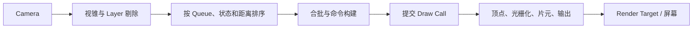

# 渲染管线、层级与 Shader

## 1. Unity 物体如何被画出来

一个最小 3D 可渲染对象通常需要：

```text
GameObject
├── Transform
├── MeshFilter    提供 Mesh
└── MeshRenderer  提供 Material 和渲染设置
```

摄像机看到它后：



Unity 帮你封装了图形 API，但封装不等于流水线消失。Frame Debugger 里突然出现
两千个 Draw Call 时，GPU 不会因为 Inspector 界面很友好就少加班。

## 2. Mesh、Renderer、Material 与 Shader

| 对象 | 职责 |
|---|---|
| Mesh | 顶点、法线、UV、切线、索引等几何数据 |
| MeshFilter | 让 GameObject 引用一个 Mesh |
| Renderer | 决定对象如何进入渲染，保存 Material、阴影、排序等信息 |
| Material | Shader + 参数 + 纹理 + 关键字/队列设置 |
| Shader | GPU 各阶段执行的程序与渲染 Pass/状态定义 |

类比：

```text
Mesh      = 菜的形状和原料切法
Shader    = 烹饪算法
Material  = 本次使用的调料、火候参数和食材
Renderer  = 把订单交给后厨并安排出餐
```

同一 Mesh 可以使用不同 Material，同一 Shader 也能被许多 Material 复用。

## 3. `material` 与 `sharedMaterial`

```csharp
Renderer renderer = GetComponent<Renderer>();

Material shared = renderer.sharedMaterial;
Material instance = renderer.material;
```

概念区别：

- `sharedMaterial` 指向共享资源，修改可能影响其他使用者和编辑器资源。
- `material` 通常会为当前 Renderer 取得或创建独立实例，便于单对象修改。

如果每个敌人都在运行时访问 `renderer.material` 并改颜色，可能创建大量材质
实例，破坏批处理并增加内存。

只改少量逐对象参数时，考虑 `MaterialPropertyBlock`：

```csharp
private static readonly int BaseColorId =
    Shader.PropertyToID("_BaseColor");

private readonly MaterialPropertyBlock properties = new();

public void SetColor(Renderer target, Color color)
{
    target.GetPropertyBlock(properties);
    properties.SetColor(BaseColorId, color);
    target.SetPropertyBlock(properties);
}
```

具体属性名和批处理效果取决于 Shader 与渲染管线。PropertyBlock 不是所有性能
问题的免检通行证，但比无意复制一百份相同材质更可控。

## 4. Unity 三类渲染管线

### 4.1 Built-in Render Pipeline

- 传统内置管线。
- Forward/Deferred 路径。
- 大量旧项目和 Asset Store 内容仍使用。
- 自定义扩展方式与 SRP 不同。

### 4.2 URP

- 基于 Scriptable Render Pipeline。
- 面向多平台、移动端和可扩展项目。
- 使用 Renderer Feature、Render Pass、Volume 等体系。
- Shader 需使用 URP 兼容实现或 Shader Graph。

### 4.3 HDRP

- 面向高端 PC/主机和高保真画面。
- 更复杂的光照、材质和后处理能力。
- 对硬件、内容规范和性能预算要求更高。

选择时看：

| 约束 | 问题 |
|---|---|
| 目标平台 | 低端移动、VR、PC 还是主机？ |
| 画质目标 | 卡通、写实、电影级还是工具可视化？ |
| 团队能力 | 是否能维护自定义 Pass 和 Shader？ |
| 资产生态 | 第三方 Shader 是否兼容目标管线？ |
| 项目阶段 | 中途迁移成本能否接受？ |

URP 不是 Built-in 的“画质升级按钮”，HDRP 也不是勾上后自动生成 3A 美术团队。

## 5. SRP 是什么

Scriptable Render Pipeline 把一部分渲染流程组织能力开放给 C#：

```text
Camera
-> Culling
-> 建立 Renderer List
-> 设置 Render Target
-> 执行阴影/深度/不透明/透明 Pass
-> 后处理
-> 提交 Context
```

Shader 仍运行在 GPU，C# 主要描述哪些 Pass、资源和命令以何种顺序执行。

URP/HDRP 都建立在 SRP 上，但使用各自的资源、Pass、Shader 库和约定。一个
Built-in Shader 不能仅靠改文件名就保证在 URP 正常工作。

## 6. GameObject Layer

每个 GameObject 有一个 Layer，可用于：

- Camera Culling Mask。
- Physics Layer Collision Matrix。
- Raycast LayerMask。
- 部分灯光或渲染过滤。

摄像机只渲染指定 Layer：

```csharp
camera.cullingMask =
    LayerMask.GetMask("Default", "Characters", "Environment");
```

Layer 是“对象属于哪个过滤集合”，不是通用的前后绘制顺序。

## 7. Render Queue

Material/Shader 的 Render Queue 决定大类绘制先后。常见值：

| 队列 | 常见值 | 用途 |
|---|---:|---|
| Background | 1000 | 背景 |
| Geometry | 2000 | 不透明几何 |
| AlphaTest | 2450 | Alpha Clip/Cutout |
| Transparent | 3000 | Alpha Blend 透明 |
| Overlay | 4000 | 最后覆盖类效果 |

低值通常先画，高值后画。常见顺序：

```text
不透明
-> Skybox
-> 透明
-> Overlay
```

不透明对象常前向后排序以利用深度拒绝；透明对象通常后向前排序以获得较合理的
Alpha 混合。

不要通过给每个物体手写不同 Queue 解决所有穿插。队列过度碎片化会增加状态切换，
透明相交本身也不是对象级排序能够完全解决的问题。

## 8. Sorting Layer 与 Order in Layer

主要用于 SpriteRenderer、TilemapRenderer 等 2D Renderer：

```text
Sorting Layer
-> Order in Layer
-> Material Render Queue
-> Camera distance / sort mode
-> 其他排序条件
```

示例：

```text
Background  Order 0
Characters  Order 0
Effects     Order 10
UIWorld     Order 20
```

Sorting Layer 与 GameObject Layer 不是一回事：

| 名称 | 主要职责 |
|---|---|
| GameObject Layer | 摄像机、物理、查询过滤 |
| Sorting Layer | 2D Renderer 绘制优先级 |
| Render Queue | Material/Shader 渲染大类顺序 |

三个都叫 Layer/Order 相关概念，像一家公司有三位都叫“小王”的同事。交流时必须
带上全名。

## 9. Camera 与 Canvas 层级

Canvas 常见 Render Mode：

### Screen Space - Overlay

- 直接覆盖屏幕。
- 通常不依赖场景 Camera。
- Canvas 的排序和层级决定 UI 顺序。

### Screen Space - Camera

- 由指定 Camera 渲染。
- 可与 Camera Stack、距离和后处理协作。

### World Space

- Canvas 作为世界中的对象。
- 受 Transform、Camera 和遮挡关系影响。

大量 UI 元素变化可能触发 Canvas 重建。常把频繁变化和静态 UI 拆到不同 Canvas，
但 Canvas 也不是拆得越碎越好，需要用 UI Profiler 和 Frame Debugger 验证。

## 10. Unity 中的一帧渲染

以常见主 Camera 为例：

```text
收集 Camera
-> 视锥剔除与 Layer 过滤
-> 阴影 Pass
-> 可选深度/法线 Pass
-> 不透明物体
-> Skybox
-> 透明物体
-> 后处理
-> UI
-> Present
```

具体顺序随 Built-in/URP/HDRP、Renderer 配置和自定义 Feature 变化。

更底层的顶点、光栅化、片元、深度和混合流程见
[图形渲染专项](../rendering/README.md)。

## 11. ShaderLab 与 HLSL

Unity Shader 文件通常包含两层：

```text
ShaderLab
├── Properties
├── SubShader
│   ├── Tags
│   └── Pass
│       └── HLSL/CG 程序
└── Fallback 等配置
```

- ShaderLab 描述属性、Pass、Tag 和渲染状态。
- HLSL 描述 Vertex/Fragment 等 GPU 计算。

## 12. 一个最小 Unlit Shader

以下示例使用 Built-in 风格辅助函数，目的是讲结构，不保证直接兼容 URP/HDRP：

```hlsl
Shader "Knowledge/SimpleTint"
{
    Properties
    {
        _BaseMap ("Base Map", 2D) = "white" {}
        _BaseColor ("Base Color", Color) = (1, 1, 1, 1)
    }

    SubShader
    {
        Tags
        {
            "RenderType" = "Opaque"
            "Queue" = "Geometry"
        }

        Pass
        {
            HLSLPROGRAM
            #pragma vertex Vert
            #pragma fragment Frag

            #include "UnityCG.cginc"

            struct Attributes
            {
                float4 positionOS : POSITION;
                float2 uv : TEXCOORD0;
            };

            struct Varyings
            {
                float4 positionCS : SV_POSITION;
                float2 uv : TEXCOORD0;
            };

            sampler2D _BaseMap;
            float4 _BaseMap_ST;
            float4 _BaseColor;

            Varyings Vert(Attributes input)
            {
                Varyings output;
                output.positionCS =
                    UnityObjectToClipPos(input.positionOS);
                output.uv =
                    TRANSFORM_TEX(input.uv, _BaseMap);
                return output;
            }

            half4 Frag(Varyings input) : SV_Target
            {
                half4 textureColor =
                    tex2D(_BaseMap, input.uv);
                return textureColor * _BaseColor;
            }
            ENDHLSL
        }
    }
}
```

流程：

```text
Mesh 顶点
-> Vert 变换到裁剪空间并传 UV
-> 光栅化插值 UV
-> Frag 采样纹理并乘颜色
-> 深度测试后写入颜色缓冲
```

URP 需要使用对应 Shader Library、Pass Tag 和 SRP Batcher 约定；初学时可先用
Shader Graph 观察节点如何映射到属性和计算，再阅读生成与手写代码。

## 13. 常见渲染状态

```text
Cull Back
ZWrite On
ZTest LEqual
Blend Off
```

含义：

| 状态 | 作用 |
|---|---|
| Cull | 是否剔除背面/正面 |
| ZWrite | 是否写入深度 |
| ZTest | 如何比较当前深度 |
| Blend | 新颜色与旧颜色如何混合 |
| ColorMask | 写哪些颜色通道 |

普通透明材质常见：

```text
Queue Transparent
ZWrite Off
Blend SrcAlpha OneMinusSrcAlpha
```

但这只是常见方案。头发、玻璃、粒子和水面可能需要 Alpha Clip、深度预处理、
预乘 Alpha 或多 Pass。

## 14. 光照与阴影最低限度

Lit Shader 通常考虑：

- 法线和光线方向。
- 观察方向。
- Base Color。
- Metallic / Roughness 或 Specular 工作流。
- 阴影衰减。
- 环境光和反射探针。
- 曝光和 Tone Mapping。

实时阴影常把光源视角深度写入 Shadow Map，主 Pass 再判断当前点是否被遮挡。
阴影分辨率、距离、级联和软阴影质量都会影响性能与稳定性。

## 15. 渲染性能常见抓手

### 15.1 CPU 提交

- Draw Call。
- SetPass / 状态切换。
- Renderer 数量。
- Culling 和命令构建。

常见方法：

- Static Batching。
- Dynamic Batching，受管线和条件限制。
- GPU Instancing。
- SRP Batcher。
- 合理材质复用。

这些技术解决的问题并不完全相同。SRP Batcher 优化兼容 Shader 的状态和常量
提交，不等于把所有对象合成一个 Draw Call。

### 15.2 GPU 执行

- 顶点量和蒙皮。
- Overdraw。
- Fragment Shader 复杂度。
- 纹理带宽。
- 阴影和后处理。
- Render Target 数量与分辨率。

### 15.3 工具

- Frame Debugger：逐 Draw 查看一帧如何组成。
- Profiler Rendering Module：批次、三角形、SetPass 等。
- Rendering Debugger：SRP 调试视图。
- GPU Profiler / 平台 Capture：查看真实 GPU Pass 成本。

## 16. Shader Variant

关键字会生成不同 Shader 变体：

```text
_NORMALMAP on/off
_ALPHATEST on/off
_MAIN_LIGHT_SHADOWS on/off
```

多个独立关键字可能组合膨胀：

```text
2 x 2 x 2 x ... = 很多 variants
```

后果：

- 构建时间增长。
- 包体增大。
- 运行时首次使用卡顿。
- 预热和剥离更复杂。

应限制无意义组合，配置 Variant Stripping，并在目标平台验证需要的变体没有被
误删。

## 17. 高频误区

| 误区 | 更准确的理解 |
|---|---|
| Layer 决定所有绘制前后 | 还要区分 GameObject Layer、Sorting Layer 和 Queue |
| 透明物体只要 Queue 大就正确 | 对象级排序无法解决所有三角形穿插 |
| `renderer.material` 只是取引用 | 它可能创建独立材质实例 |
| SRP Batcher 等于 GPU Instancing | 两者优化的提交模式不同 |
| Shader 只负责颜色 | 还可处理顶点、深度、多 Pass 和渲染状态 |
| URP 一定比 Built-in 快 | 性能取决于配置、内容、平台和自定义 Pass |

## 18. 本章检查

1. MeshFilter、Renderer、Material、Shader 各负责什么？
2. `material` 与 `sharedMaterial` 有何风险差异？
3. Built-in、URP、HDRP 如何选择？
4. GameObject Layer、Sorting Layer、Render Queue 有何区别？
5. 不透明和透明物体为何使用不同排序策略？
6. ShaderLab 与 HLSL 分别描述什么？
7. `ZWrite`、`ZTest` 和 `Blend` 各控制什么？
8. SRP Batcher、GPU Instancing 和普通合批为何不能画等号？

参考：
[Unity Render Queue 与排序](https://docs.unity3d.com/Manual/built-in-rendering-order.html) |
[完整图形渲染流水线](../rendering/README.md)

[上一章：物理引擎与物理材质](./06-physics-and-physics-materials.md) |
[返回 Unity 引擎基础](./README.md) |
[下一章：常用系统、性能与面试复盘](./08-common-systems-performance-and-interview.md)
