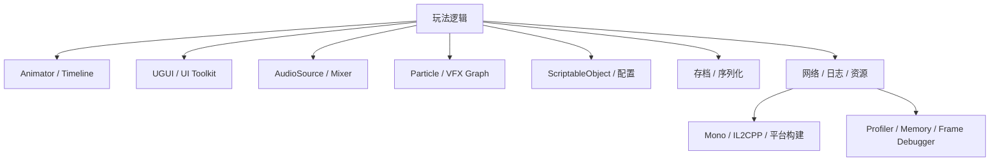

# 常用系统、性能与面试复盘

## 1. Unity 客户端不只有 GameObject 和 Update

一个常见项目还会使用：



这些系统各自有生命周期和成本。把它们全部塞进一个 `GameManager.Update`，虽然
文件数量会显得很节约，但维护者的精神内存不会。

## 2. Animator 与动画状态机

Animator 常由以下部分组成：

- Avatar 或骨骼绑定。
- AnimationClip。
- Animator Controller。
- State、Transition、Blend Tree。
- Layer 和 Avatar Mask。
- Parameter。

```text
Speed = 0       -> Idle
Speed > 0       -> Locomotion Blend Tree
IsGrounded = 0  -> Fall
Attack Trigger  -> Attack
```

### 2.1 参数驱动

```csharp
public sealed class CharacterAnimation : MonoBehaviour
{
    private static readonly int SpeedId =
        Animator.StringToHash("Speed");
    private static readonly int GroundedId =
        Animator.StringToHash("IsGrounded");

    [SerializeField] private Animator animator;

    public void Apply(float speed, bool grounded)
    {
        animator.SetFloat(SpeedId, speed);
        animator.SetBool(GroundedId, grounded);
    }
}
```

缓存 Hash 可避免高频字符串查找。更重要的是，Animator 消费移动状态，不要自己
读取键盘。

### 2.2 Blend Tree

用一个或多个参数在多个动画间混合：

```text
Speed 0.0 -> Idle
Speed 0.5 -> Walk
Speed 1.0 -> Run
```

它适合连续状态，不适合把每种技能逻辑都塞成动画分支。

### 2.3 Animation Event

可在动画时间点调用事件，例如脚步声或攻击窗口。优点是与画面同步；风险是：

- 字符串/方法绑定不透明。
- 动画资源变化可能改变逻辑时机。
- 网络和权威战斗不应只依赖本地动画事件。

关键伤害判定通常由玩法状态和数据驱动，Animation Event 用于表现或通知。

## 3. Timeline 与 Cinemachine

Timeline 适合编排：

- 过场动画。
- 镜头。
- 音频。
- Animator Track。
- Signal 与玩法事件。

Cinemachine 提供虚拟摄像机、跟随、构图、混合和噪声等能力。它们能减少自研
镜头代码，但仍需定义：

- 谁拥有当前镜头控制权。
- 过场被跳过时如何收尾。
- Scene 卸载时 Track 引用如何处理。
- 网络或战斗暂停时用哪套时钟。

工具能编排轨道，不会自动替你处理所有异常出口。

## 4. UGUI 基础

UGUI 常见结构：

```text
Canvas
├── Panel
│   ├── Image
│   └── Text / TextMeshProUGUI
└── Button

EventSystem
└── Input Module
```

### 4.1 RectTransform

UI 使用 RectTransform，包含：

- Anchor。
- Pivot。
- Anchored Position。
- Size Delta。

Anchor 决定参考父矩形的位置/范围，Pivot 是自身旋转和缩放中心。只靠写死像素
坐标适配所有屏幕，通常会让超宽屏和刘海屏轮流提交 Bug。

### 4.2 Canvas Rebuild

UI 变化可能触发布局、几何和批次重建。常见优化：

- 静态和高频动态 UI 适度拆 Canvas。
- 避免每帧修改大型层级的 Layout。
- 列表使用复用而不是一次创建所有元素。
- 不需要交互的 Graphic 关闭 Raycast Target。
- 减少透明全屏层导致的 Overdraw。
- 使用 Profiler 和 Frame Debugger 验证。

### 4.3 UI 生命周期

页面通常需要：

```text
Create
-> Bind Data
-> Show
-> Update by events
-> Hide
-> Unbind
-> Dispose / Pool
```

不要让 View 持有所有业务真相。UI 可以显示“金币 100”，权威金币状态应在模型或
服务中；否则关闭页面时，经济系统可能一起下班。

## 5. ScriptableObject

ScriptableObject 是可保存为 Asset 的 Unity 对象，适合：

- 静态配置。
- 角色/技能定义。
- 共享曲线和参数。
- 编辑器工具数据。
- 事件通道或运行集合，但要谨慎管理运行状态。

```csharp
using UnityEngine;

[CreateAssetMenu(menuName = "Game/Weapon Definition")]
public sealed class WeaponDefinition : ScriptableObject
{
    public string displayName;
    public int damage;
    public float cooldown;
    public GameObject projectilePrefab;
}
```

组件引用：

```csharp
public sealed class Weapon : MonoBehaviour
{
    [SerializeField] private WeaponDefinition definition;
}
```

优点：

- 数据与 Prefab 行为分离。
- 多个对象共享同一配置。
- Inspector 可编辑并参与资源引用。

风险：

- Asset 是共享对象，运行时修改可能影响所有引用者。
- 编辑器 Play Mode 下的修改可能造成调试混淆。
- 它不是数据库，也不自动提供版本迁移、远端更新和安全校验。

推荐把静态定义与运行状态分开：

```text
WeaponDefinition Asset：damage、cooldown
WeaponRuntime State：当前弹药、剩余冷却
```

## 6. Unity 序列化

Unity 序列化主要面向 Scene、Prefab、Asset 和 Inspector，不等于 .NET 任意对象
都能自动保存。

常见可序列化内容：

- public 字段。
- 带 `[SerializeField]` 的私有字段。
- Unity 支持的基础类型、结构和容器。
- `UnityEngine.Object` 引用。
- 标记 `[Serializable]` 的嵌套数据。

默认不直接序列化普通属性：

```csharp
[field: SerializeField]
public int Health { get; private set; }
```

可使用字段目标特性让自动属性的后备字段参与序列化，但团队需统一风格。

注意：

- 字段重命名可能丢数据，可使用版本对应的迁移特性。
- 字典和多态对象需要特殊处理或 `[SerializeReference]`。
- Scene/Prefab 序列化不是玩家存档格式的天然最佳选择。
- 运行时存档要考虑版本、校验、迁移和原子写入。

## 7. Audio

常用组件：

- AudioClip：音频资源。
- AudioSource：播放实例。
- AudioListener：监听点，通常一个。
- AudioMixer：分组、效果和音量控制。

```text
SFX Source -> SFX Mixer Group ----\
Music Source -> Music Group -------+-> Master -> Output
Voice Source -> Voice Group -------/
```

常见实践：

- 短音效使用池。
- 音乐切换做淡入淡出。
- 使用 Mixer 控制分类音量。
- 处理应用失焦和音频焦点。
- 压缩格式按时长、平台和是否流式播放选择。

## 8. Particle System 与 VFX

Particle System 适合常规粒子；VFX Graph 更偏向大量 GPU 粒子和高端效果。

性能关注：

- 最大粒子数。
- 屏幕覆盖和 Overdraw。
- 透明 Shader 复杂度。
- 碰撞模块。
- Trails。
- 每帧创建/销毁。
- Bounds 是否过大导致无法剔除。

粒子只有两个三角形不代表便宜。如果它覆盖整块屏幕并叠了二十层，GPU 仍要为
每层候选像素认真上色。

## 9. 代码架构：MonoBehaviour 不必承包一切

可以把引擎适配和纯逻辑分开：

```text
MonoBehaviour Adapter
├── 读取 Unity 输入
├── 接收生命周期
├── 操作 Transform/Animator
└── 调用纯 C# Domain

Pure C# Domain
├── 状态机
├── 数值计算
├── 规则验证
└── 可单元测试逻辑
```

示例：

```csharp
public sealed class Cooldown
{
    public float Remaining { get; private set; }
    public bool Ready => Remaining <= 0f;

    public void Start(float duration)
    {
        Remaining = duration;
    }

    public void Tick(float deltaTime)
    {
        Remaining = Mathf.Max(0f, Remaining - deltaTime);
    }
}
```

严格的纯 C# 层甚至可以不依赖 `Mathf`，便于独立测试。MonoBehaviour 负责把
`Time.deltaTime` 传给它。

## 10. CPU 与 GC 性能

常见 GC Alloc 来源：

- 每帧创建 List、数组和临时对象。
- 字符串拼接与格式化。
- LINQ。
- 闭包和捕获 Lambda。
- 装箱。
- 返回新集合的 API。
- 频繁实例化 MonoBehaviour/Prefab。

常见优化：

- 复用集合并 `Clear`。
- 预分配合理容量。
- 高频对象使用池。
- 缓存组件引用和 Shader Property ID。
- 避免每帧全场 Find。
- 把日志和字符串构建移出发布热路径。
- 使用 Profiler 的 GC Alloc 列定位证据。

不要为了“零 GC”把所有代码改成自研内存系统。目标是消除会造成帧尖峰的无意义
分配，并保持代码可维护。

## 11. Unity GC

GC 管理托管对象，不管理所有原生资源。一次内存问题可能来自：

```text
Managed Heap
Native Unity Objects
Textures / Meshes
Audio
GPU resources
AssetBundle / Addressables references
```

工具：

- Profiler Memory Module。
- Memory Profiler Package。
- GC Alloc 标记。
- Snapshot 对比。
- 原生和托管引用链。

“内存涨了”不是结论。可能是泄漏、缓存、分配器保留、资源未释放或正常峰值。

## 12. Jobs、Burst 与 Native Collections

适合大量数据并行计算：

```text
Managed gameplay data
-> 准备 NativeArray
-> Schedule Jobs
-> Worker threads + Burst
-> Complete / 依赖
-> 应用结果
```

优势：

- 多线程。
- Burst 优化数值代码。
- 安全系统检测部分数据竞争。

限制：

- 不能随意访问 GameObject 和大多数托管对象。
- 数据搬运和同步也有成本。
- Job 太小会被调度成本吞掉。
- `Complete` 太早会让主线程原地等待。

它适合海量实体、动画采样、碰撞预处理等数据并行工作，不适合把一个普通按钮
点击事件包装成 Job 以显示技术含量。

## 13. Mono 与 IL2CPP

### 13.1 Mono

- 运行 IL 的托管运行时。
- 编辑器和部分平台常使用。
- 迭代和调试方便。

### 13.2 IL2CPP

概念流程：

```text
C# -> IL -> C++ -> 平台原生编译器 -> 可执行文件
```

关注点：

- AOT 限制。
- 泛型实例。
- 反射和代码裁剪。
- 构建时间。
- 原生符号和崩溃堆栈。
- 平台 ABI。

反射或仅通过字符串访问的类型可能被裁剪，需要使用 Preserve、link.xml 或版本
对应配置。编辑器能运行不代表 IL2CPP 真机一定拥有相同代码路径。

## 14. Assembly Definition

`.asmdef` 将脚本划分为独立程序集：

```text
Game.Core
Game.Combat -> Game.Core
Game.UI -> Game.Core
Game.Editor -> Game.Core
Game.Tests -> Game.Core
```

收益：

- 缩小脚本重编译范围。
- 明确依赖。
- 隔离 Editor、Runtime 和 Test。
- 控制平台与 define。

如果所有程序集互相引用，asmdef 只会把一团代码切成很多互相牵手的小团，依赖
并没有真正改善。

## 15. Profiler 的标准使用流程

```text
固定设备与复现场景
-> 记录 CPU/GPU/Memory 数据
-> 找到帧尖峰或持续热点
-> 展开 Timeline 和调用栈
-> 建立一个可证伪假设
-> 做最小改动
-> 对比同场景前后数据
-> 加入回归基线
```

常用工具：

| 工具 | 用途 |
|---|---|
| CPU Profiler / Timeline | 主线程、Job、等待、脚本热点 |
| GPU Profiler | GPU Pass 时间 |
| Frame Debugger | Draw Call、Pass、Render Target |
| Memory Profiler | 快照、引用、资源占用 |
| Physics Profiler | 物理对象和模拟成本 |
| Profile Analyzer | 多帧、多次采样对比 |

在 Development Build 的目标设备上测量。编辑器附加了 Inspector、Scene View、
Domain 和调试开销，不代表玩家设备。

## 16. 移动端与平台重点

- 应用暂停、恢复和音频焦点。
- 刘海、安全区和多分辨率。
- 触控与输入设备切换。
- 权限。
- 热量、功耗和降频。
- 内存上限与后台回收。
- 文件系统和包内资源只读限制。
- Shader 精度、纹理压缩和 GPU 架构。
- IL2CPP、签名和平台构建流程。

移动端平均 60 FPS 不代表稳定。设备发热五分钟后降频，P99 帧时间和功耗可能比
开场录像更接近真实体验。

## 17. 面试 30 秒回答：Unity 核心模型

> Unity 使用 Scene 组织一组 GameObject，GameObject 主要提供身份、层级和组件
> 容器，实际能力由 Transform、Renderer、Collider、Rigidbody、MonoBehaviour
> 等 Component 组合。MonoBehaviour 通过 Awake、OnEnable、Start、FixedUpdate、
> Update、LateUpdate 等回调接入 PlayerLoop；Prefab 提供可复用对象模板，资源
> 和 Scene 可通过 Resources、AssetBundle 或 Addressables 等方式加载。渲染、
> 物理和脚本更新分别有自己的阶段与生命周期，工程重点是避免隐藏依赖、主线程
> 尖峰、GC 和资源泄漏。

## 18. 高频面试问题

### 对象与生命周期

- GameObject 和 Component 有什么区别？
- `Awake`、`OnEnable`、`Start` 如何选择？
- `Destroy` 后对象为什么可能判断为 null？
- Prefab 和 Scene Instance 的关系是什么？
- `SetActive(false)` 与 `enabled = false` 有什么区别？

### 主循环与异步

- `Update`、`FixedUpdate`、`LateUpdate` 各自适合什么？
- Unity 协程为什么不是线程？
- `WaitForSeconds` 是否受暂停影响？
- Addressables 为什么需要 Release？
- 异步加载为何仍可能在实例化时卡顿？

### 物理与移动

- CharacterController 与 Rigidbody 如何选择？
- Trigger 与 Collision 有何差异？
- 物理材质和渲染材质有什么区别？
- 高速物体为什么穿透？
- 摄像机跟随为什么容易抖动？

### 渲染

- Mesh、Material、Shader 和 Renderer 的关系是什么？
- Sorting Layer、GameObject Layer、Render Queue 有何区别？
- Built-in、URP、HDRP 如何选择？
- `renderer.material` 为什么可能破坏批处理？
- 透明物体为何通常后画？

### 工程

- 常见 GC Alloc 来源有哪些？
- Mono 与 IL2CPP 有何差异？
- 如何定位一帧卡顿是脚本、物理还是 GPU？
- asmdef 解决什么问题？
- 如何设计可测试的 Unity 玩法代码？

## 19. 最终自测：生成一个可运行角色

尝试独立完成：

1. 创建一个 Scene。
2. 创建 Player GameObject。
3. 添加 CharacterController、Animator 和自定义脚本。
4. 把 Player 保存成 Prefab。
5. 从 Resources 或 Addressables 异步加载 Prefab。
6. `Instantiate` 到当前 Active Scene。
7. 使用输入驱动移动和跳跃。
8. 用 Trigger 实现拾取物。
9. 给地面设置低摩擦/高摩擦 Physics Material 对比。
10. 给角色使用 URP Lit Material。
11. 在 Frame Debugger 中找到它的 Draw。
12. 在 Profiler 中确认移动没有持续 GC Alloc。
13. 切换 Scene 并正确销毁实例、释放资源句柄。

这条练习把对象模型、生命周期、资源、移动、物理、渲染和性能串在一起。能说明
每一步由谁拥有、在哪个阶段执行、何时释放，就不只是“会拖组件”，而是开始理解
Unity 引擎如何运转。

[上一章：渲染管线、层级与 Shader](./07-rendering-order-pipelines-and-shaders.md) |
[返回 Unity 引擎基础](./README.md)
