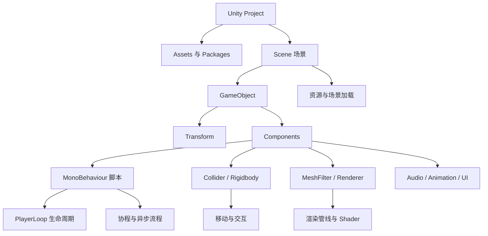

# Unity 引擎基础

## 1. 模块目标

本模块从“打开 Unity 后看见一堆窗口”开始，逐步解释一个 GameObject 如何进入
Scene、如何被脚本更新、如何参与物理和渲染，最后如何随场景一起加载与卸载。

读完后应能：

1. 说明 Scene、GameObject、Component、MonoBehaviour 和 Prefab 的关系。
2. 讲清 `Awake`、`OnEnable`、`Start`、`FixedUpdate`、`Update`、`LateUpdate`
   到销毁阶段的主线。
3. 解释 Unity 协程为何不是线程，以及它如何跨帧恢复。
4. 使用同步或异步方式加载场景和资源，并正确管理资源生命周期。
5. 根据玩法选择 Transform、CharacterController、Rigidbody、NavMeshAgent 或
   Root Motion 移动。
6. 理解 Collider、Rigidbody、Trigger 和物理材质的职责。
7. 说明 Unity 中 Mesh、Renderer、Material、Shader、渲染队列和 SRP 的关系。
8. 使用 Profiler、Frame Debugger 和合理的对象/资源管理方法定位常见问题。

## 2. 一张总览图



一句话理解：

> Scene 是舞台，GameObject 是舞台上的空道具架，Component 决定它能做什么，
> MonoBehaviour 让自定义 C# 逻辑接入 Unity 的更新节奏，Prefab 则是可以反复
> 复印的道具设计稿。

GameObject 本身不会因为名字叫 `Player` 就突然学会走路。名字只是名字，能力来自
挂载的组件。把空对象改名为 `FinalBoss` 不会增加攻击力，只会增加团队误会。

## 3. 内容层级

| 顺序 | 章节 | 核心问题 |
|---:|---|---|
| 1 | [编辑器、Scene 与对象模型](./01-editor-scene-gameobject-and-components.md) | Scene、GameObject、Component、Prefab 到底是什么？ |
| 2 | [MonoBehaviour 生命周期与主循环](./02-monobehaviour-lifecycle-and-playerloop.md) | Unity 什么时候调用脚本，`Update` 从哪里来？ |
| 3 | [协程、异步与时间](./03-coroutines-async-and-time.md) | `yield` 如何跨帧，协程为什么不是线程？ |
| 4 | [场景、资源与异步加载](./04-scenes-assets-and-async-loading.md) | 场景和 Prefab 如何异步加载、实例化与释放？ |
| 5 | [输入、角色移动与摄像机](./05-input-character-movement-and-camera.md) | 五种移动方式如何选择，怎样避免抖动和穿模？ |
| 6 | [物理引擎与物理材质](./06-physics-and-physics-materials.md) | Collider、Rigidbody、Trigger、摩擦和弹性如何工作？ |
| 7 | [渲染管线、层级与 Shader](./07-rendering-order-pipelines-and-shaders.md) | Unity 怎样把组件变成 Draw Call，物体按什么顺序画？ |
| 8 | [常用系统、性能与面试复盘](./08-common-systems-performance-and-interview.md) | 动画、UI、音频、数据配置、GC 和构建还有哪些重点？ |

## 4. 推荐学习路线

### 4.1 第一次系统学习 Unity

```text
Scene 与 GameObject
-> Component 与 Prefab
-> MonoBehaviour 生命周期
-> 输入和角色移动
-> 物理与碰撞
-> 资源和场景加载
-> 渲染与性能
```

每读完一章，建议在一个空项目中做最小实验。Unity 知识只看不运行，很容易形成
一种“Inspector 里见过，所以我应该会”的温和错觉。

### 4.2 准备客户端面试

```text
对象模型与原生/托管边界
-> PlayerLoop、FixedUpdate 与 Update
-> 协程状态机
-> 资源依赖与异步生命周期
-> CharacterController / Rigidbody 取舍
-> 物理查询与碰撞矩阵
-> Render Queue、SRP、Shader
-> GC、Profiler、IL2CPP
```

## 5. 版本边界

本模块讨论 Unity 2021 LTS 至 Unity 6 仍然通用的概念。不同版本可能在以下方面
存在差异：

- 菜单位置、包版本和默认项目模板。
- Built-in、URP、HDRP 的功能与 Shader 写法。
- 新旧 Input System、Addressables 和异步 API。
- 3D 物理材质的显示名称与具体类型命名。
- Enter Play Mode、增量 GC、构建后端和平台支持。

遇到差异时，优先确认项目的 Editor 版本、Render Pipeline Asset、Packages
清单和目标平台，而不是把搜索结果中最响亮的答案直接粘进工程。
