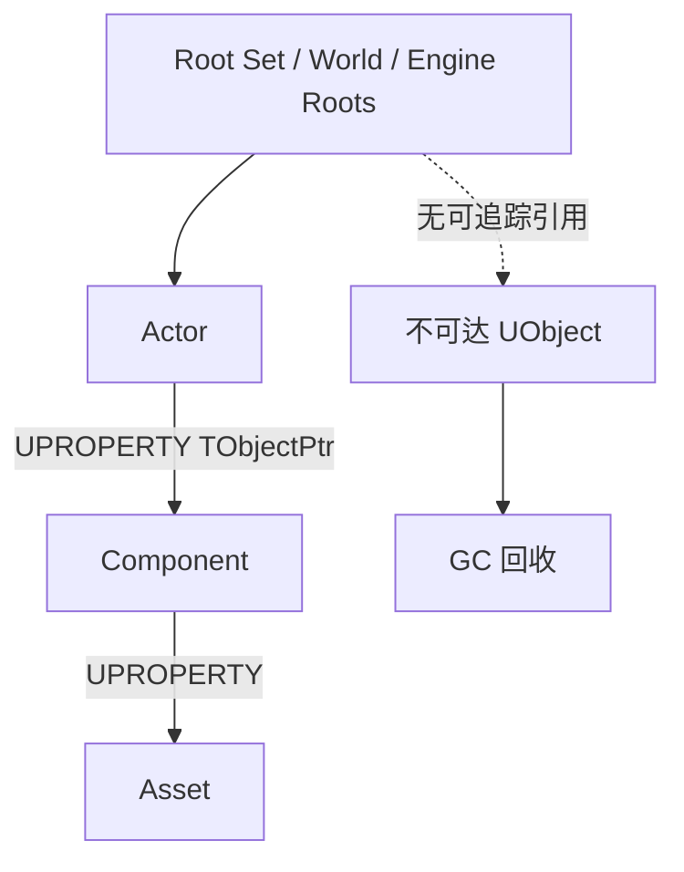

# UObject、反射、GC 与生命周期

## 1. UObject 体系解决什么

普通 C++ 对象只服从 C++ 语言规则；UObject 体系额外接入：

- 运行时类型信息和反射。
- 编辑器属性展示。
- Blueprint 暴露。
- 序列化和资源引用。
- 垃圾回收。
- 网络复制元数据。
- 默认对象和对象命名。

```text
标准 C++ class
    -> 构造、析构、模板、RAII

UObject class
    -> 标准 C++ 能力
    + UHT 元数据
    + 引擎对象身份
    + GC/序列化/编辑器/蓝图集成
```

UObject 不是“更高级的 shared_ptr”。它是一整套引擎对象协议。

## 2. 反射宏

最小 UObject 类：

```cpp
UCLASS(BlueprintType)
class MYGAME_API UWeaponDefinition : public UDataAsset
{
    GENERATED_BODY()

public:
    UPROPERTY(EditDefaultsOnly, BlueprintReadOnly, Category="Weapon")
    float Damage = 10.0f;

    UFUNCTION(BlueprintCallable, Category="Weapon")
    float CalculateDamage(float Multiplier) const;
};
```

常见宏：

| 宏 | 作用 |
|---|---|
| `UCLASS` | 声明反射类 |
| `USTRUCT` | 声明反射结构 |
| `UENUM` | 声明反射枚举 |
| `UPROPERTY` | 为字段附加编辑器、蓝图、序列化、复制等元数据 |
| `UFUNCTION` | 为函数附加蓝图、RPC、事件等元数据 |
| `GENERATED_BODY` | 插入 UHT 生成的类型支持代码 |

这些宏不是让 C++ 编译器突然理解编辑器。Unreal Header Tool（UHT）先扫描受支持
声明并生成代码，之后再由 C++ 编译器编译。

`*.generated.h` 通常应是头文件最后一个 include。若宏附近出现一页难读的模板
错误，先检查 UHT 规则、include 顺序和宏语法，不必立刻怀疑整个 C++ 标准。

## 3. `UPROPERTY` 说明什么

常见 Specifier：

```cpp
UPROPERTY(EditAnywhere, BlueprintReadWrite, Category="Combat")
float MaxHealth = 100.0f;

UPROPERTY(VisibleAnywhere, BlueprintReadOnly, Category="Combat")
TObjectPtr<UHealthComponent> HealthComponent;

UPROPERTY(ReplicatedUsing=OnRep_Health)
float CurrentHealth = 100.0f;
```

它可以影响：

- 是否在 Class Defaults 或 Instance Details 编辑。
- 蓝图是否可读/可写。
- 是否序列化。
- GC 是否能追踪 UObject 引用。
- 是否参与 Replication。
- 显示名称、范围、条件等元数据。

不要把 `EditAnywhere` 当成默认。稳定配置常用：

- `EditDefaultsOnly`：只改类默认值。
- `EditInstanceOnly`：只改关卡实例。
- `VisibleAnywhere`：只看不直接替换。

API 表面越宽，越容易出现实例值和类默认值互相覆盖的配置事故。

## 4. `UFUNCTION` 常见用法

```cpp
UFUNCTION(BlueprintCallable)
void ApplyDamage(float Amount);

UFUNCTION(BlueprintPure)
float GetHealthPercent() const;

UFUNCTION(BlueprintImplementableEvent)
void PlayHitReaction();

UFUNCTION(BlueprintNativeEvent)
bool CanActivateAbility() const;
```

区别：

- `BlueprintCallable`：蓝图可调用。
- `BlueprintPure`：无执行引脚，应该没有可观察副作用。
- `BlueprintImplementableEvent`：C++ 声明，蓝图实现。
- `BlueprintNativeEvent`：C++ 提供 `_Implementation` 默认实现，蓝图可覆盖。

Pure 节点可能在图执行时被重复求值，不适合偷偷做昂贵查询。把“扫描全场敌人”
包装成一个绿色节点，并不会让扫描变成光合作用。

## 5. UObject 身份：Class、Name 与 Outer

每个 UObject 通常有：

- `UClass` 类型信息。
- 对象名。
- Outer。
- Flags。
- 唯一路径语义。

Outer 表达对象所属的命名/生命周期上下文，但不是 C++ 所有权的万能替代。

```text
Package
└── Blueprint Asset
    └── Generated Class
        └── Class Default Object
```

创建 UObject 时需要合适 Outer：

```cpp
UInventoryItem* Item = NewObject<UInventoryItem>(OwnerObject);
```

没有明确 Outer、引用和生命周期规则的 UObject，后续加载、保存和 GC 行为会变得
难以推断。

## 6. CDO 是什么

每个 UClass 有一个 Class Default Object（CDO），保存类默认属性。概念流程：

```text
C++ 构造函数
-> 建立 C++ 类默认组件和默认值
-> Blueprint Class 在父类默认值上保存覆盖
-> Spawn / NewObject 时复制类默认属性到实例
```

构造函数会用于 CDO 和实例初始化，因此不适合：

- 读取当前玩家。
- 访问还不存在的 World。
- 发网络请求。
- 执行只应运行一次的玩法逻辑。

构造函数更像“定义这类对象出厂时长什么样”，`BeginPlay` 才是“这个实例现在正式
进入游戏”。

## 7. 三种常见创建方式

### 7.1 普通 C++ 对象

```cpp
TUniquePtr<FCombatSolver> Solver =
    MakeUnique<FCombatSolver>();
```

适合不需要反射、GC、编辑器或 Blueprint 的纯逻辑。

### 7.2 UObject

```cpp
UInventoryItem* Item =
    NewObject<UInventoryItem>(Owner);
```

不要直接 `new UObjectType`。

### 7.3 Actor

```cpp
AEnemy* Enemy = GetWorld()->SpawnActor<AEnemy>(
    EnemyClass,
    Transform
);
```

不要用 `NewObject<AActor>` 代替 Spawn。Actor 必须进入 World 和 Actor 生命周期。

## 8. GC 的核心：可达性

UE GC 不是引用计数。它从根和引擎已知引用出发，标记可达 UObject：



若 UObject 只被一个 GC 不知道的裸指针保存，它可能被视为不可达：

```cpp
// 作为 UObject 成员时通常应暴露给 GC。
UPROPERTY()
TObjectPtr<UObject> TrackedObject;
```

容器也应被追踪：

```cpp
UPROPERTY()
TArray<TObjectPtr<UItemDefinition>> Items;
```

## 9. UObject 指针怎么选

| 类型 | 常见用途 |
|---|---|
| `TObjectPtr<T>` | UObject 类字段中的强引用，常配合 UPROPERTY |
| `TWeakObjectPtr<T>` | 不阻止 GC 的弱引用，使用前检查 |
| `TSoftObjectPtr<T>` | 按路径引用 Asset，可未加载 |
| `TSoftClassPtr<T>` | 按路径引用 Class，可未加载 |
| 原始 `T*` | 临时参数、局部访问或受引擎规则保护的场景 |
| `TSharedPtr<T>` | 非 UObject C++ 对象的共享所有权 |
| `TUniquePtr<T>` | 非 UObject C++ 对象的独占所有权 |

不要用 `TSharedPtr<UObject>` 管 UObject。GC 和 shared_ptr 是两套所有权系统，
把同一对象同时交给两位各拿一把回收钥匙的管理员，不会得到双倍安全。

弱引用：

```cpp
if (AActor* Target = WeakTarget.Get())
{
    Target->DoSomething();
}
```

软引用在资源章节详细展开。

## 10. `IsValid` 与 Pending Kill

```cpp
if (IsValid(Target))
{
    // Target 非空且没有进入销毁无效状态。
}
```

只判断 `Target != nullptr` 不一定能覆盖已标记销毁的 UObject 状态。网络回调、
异步加载和 Timer 中尤其要重新验证对象。

## 11. Actor 生命周期主线

具体路径会因“从磁盘加载、编辑器放置、普通 Spawn、Deferred Spawn、PIE”而变化。
面试时先讲常见运行时主线：

```text
C++ Constructor / CDO defaults
-> Spawn / Load
-> PostInitializeComponents
-> BeginPlay
-> Tick / Timers / Events
-> EndPlay
-> Destroy / GC
```

更完整的常见回调包括：

- `PostInitProperties`。
- `PostLoad`。
- `PostActorCreated`。
- `OnConstruction`。
- `PreInitializeComponents`。
- Component Initialize。
- `PostInitializeComponents`。
- `BeginPlay`。
- `EndPlay`。
- `Destroyed`。

不要把一条路径的精确回调顺序套到所有编辑器和加载场景。

## 12. Component 生命周期

常见组件阶段：

```text
CreateDefaultSubobject / Add Component
-> RegisterComponent
-> InitializeComponent（若启用）
-> BeginPlay
-> TickComponent
-> EndPlay
-> UnregisterComponent
-> DestroyComponent
```

`RegisterComponent` 让组件进入 World 的相关系统，例如渲染或物理。仅创建一个
SceneComponent 并不保证它已经注册、附着并可见。

## 13. Tick 与 Tick Group

Actor/Component Tick 默认并非都必须开启：

```cpp
PrimaryActorTick.bCanEverTick = true;
PrimaryActorTick.TickInterval = 0.2f;
```

常见 Tick Group 概念：

- Pre Physics。
- During Physics。
- Post Physics。
- Post Update Work。

依赖物理结果的摄像机或表现逻辑应放在合适阶段，或建立 Tick Prerequisite。

优化方向：

- 没有每帧需求就关闭 Tick。
- 用事件、Timer 或状态变化驱动。
- 降低远处对象更新频率。
- 集中批处理同类数据。

一万个空 Tick 不会因为每个函数只有一行就自动合并成一行。

## 14. Timer 与异步回调

```cpp
FTimerHandle Handle;

GetWorldTimerManager().SetTimer(
    Handle,
    this,
    &AMyActor::ScanNearbyTargets,
    0.2f,
    true
);
```

Timer 适合低频、基于 World 时间的任务。对象 EndPlay 时清理或依赖引擎的对象绑定
失效规则，并在回调里验证外部对象。

异步任务和资源加载完成时：

```text
请求发出时对象有效
-> 等待若干帧
-> World 可能已经切换
-> 回调前重新验证 Weak Pointer / Handle / World
```

## 15. Delegate

常见种类：

- 单播 Delegate。
- 多播 Delegate。
- Dynamic Delegate，可参与反射/蓝图但成本和限制更多。

```cpp
DECLARE_MULTICAST_DELEGATE_OneParam(FOnHealthChanged, float);
FOnHealthChanged OnHealthChanged;
```

蓝图可绑定的动态多播：

```cpp
DECLARE_DYNAMIC_MULTICAST_DELEGATE_OneParam(
    FOnHealthChangedDynamic,
    float,
    NewHealth
);

UPROPERTY(BlueprintAssignable)
FOnHealthChangedDynamic OnHealthChanged;
```

事件发布者不应长期持有已经失效的普通 C++ 回调目标。选择 Delegate 类型时考虑
是否需要蓝图、序列化、反射和弱绑定，不要所有事件都默认 Dynamic。

## 16. 本章检查

1. UObject 相比普通 C++ 对象多接入了哪些引擎系统？
2. UHT 和 C++ 编译器分别做什么？
3. UPROPERTY 为什么同时影响编辑器、序列化和 GC？
4. CDO 与运行时实例有何区别？
5. `NewObject`、`SpawnActor` 和 `MakeUnique` 如何选择？
6. GC 为什么不是引用计数？
7. `TObjectPtr`、`TWeakObjectPtr`、`TSoftObjectPtr` 有何区别？
8. 为什么 UObject 不应放进 `TSharedPtr`？
9. Construction、BeginPlay、EndPlay 的职责如何区分？
10. 空 Tick 数量过多为什么仍可能有成本？

[上一章：编辑器、Level、Actor 与 Component](./01-editor-level-actor-and-components.md) |
[返回 UE 引擎基础](./README.md) |
[下一章：Gameplay Framework 与主循环](./03-gameplay-framework-and-game-loop.md)
