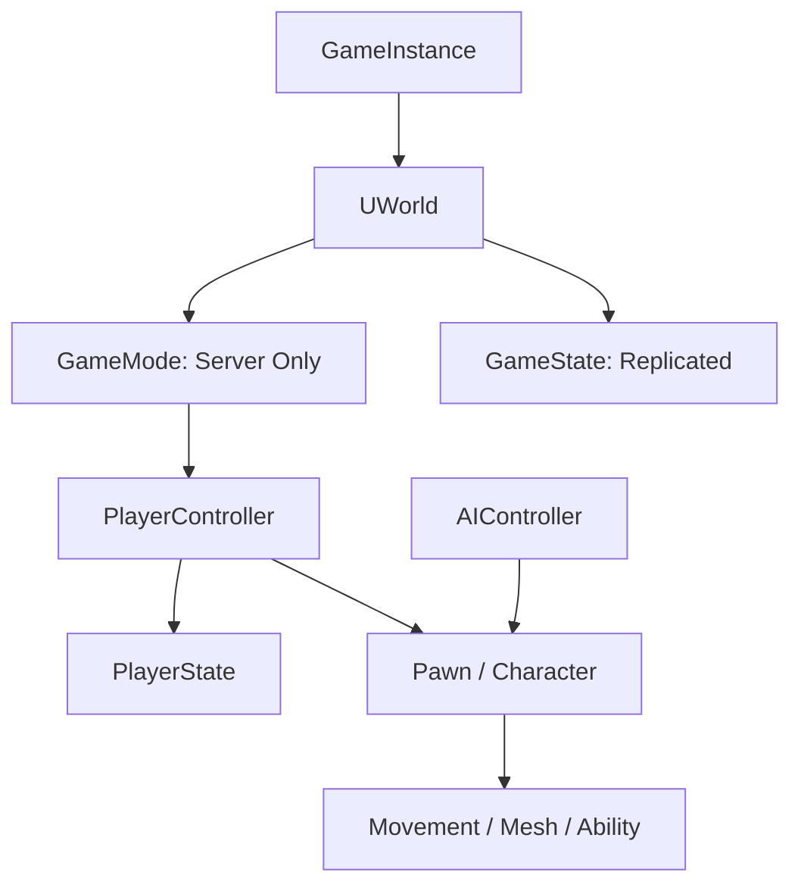

# Gameplay Framework 与主循环

## 1. 为什么需要 Gameplay Framework

一个联网游戏至少要回答：

- 规则由谁决定？
- 全局比赛状态放哪里？
- 每个玩家的长期比赛数据放哪里？
- 输入由谁接收？
- 谁控制角色？
- AI 和玩家控制有何共同抽象？
- 切换 Pawn 时哪些数据保留？

Gameplay Framework 提供一组默认职责，而不是要求所有游戏逻辑都塞进 GameMode。

## 2. 核心类型关系



## 3. 职责与网络位置

| 类型 | 主要职责 | 常见存在位置 |
|---|---|---|
| GameInstance | 进程级会话、跨普通地图数据、服务入口 | 每个进程一份，不自动复制 |
| GameMode | 游戏规则、登录、生成、胜负 | 服务器 |
| GameState | 可让客户端知道的全局比赛状态 | 服务器和客户端复制 |
| PlayerController | 玩家输入、控制、拥有连接相关 RPC | 服务器和所属客户端 |
| PlayerState | 玩家名、分数、队伍等共享玩家状态 | 服务器并复制给相关客户端 |
| Pawn | 可被 Controller 控制的世界实体 | 按复制规则存在 |
| Character | 带 Capsule、Mesh、CharacterMovement 的 Pawn | 按复制规则存在 |
| AIController | AI 决策与 Pawn 控制 | 通常服务器 |
| HUD / Widget | 本地显示与交互 | 通常客户端 |

“常见存在位置”是网络设计主线，具体复制范围还受 Ownership、Relevancy 和项目
实现影响。

## 4. GameInstance

`UGameInstance` 在游戏进程运行期间存在，并跨普通 Map Load 保留。适合：

- 登录会话。
- 全局服务注册。
- 跨关卡选择。
- Matchmaking/Online Subsystem 协调。
- 加载流程。

不适合：

- 每局会重置的比分。
- 某个 World 专属 Actor 引用。
- 自动复制给其他机器的数据。

GameInstance 像酒店前台，管理整个住宿会话；Level 中的 Actor 像房间家具。换房
时前台还在，但不应该把上一间房的沙发指针永久保存下来。

## 5. GameMode 与 GameState

### 5.1 GameMode

GameMode 负责服务器权威规则：

- 默认 Pawn、Controller、PlayerState 类。
- 玩家登录和退出。
- Pawn Spawn/Restart。
- 胜负和比赛阶段。
- 是否允许加入。

客户端通常没有权威 GameMode。把客户端 UI 需要读取的倒计时只放在 GameMode，
客户端会得到一种“规则很明确，但我完全看不见”的体验。

### 5.2 GameState

GameState 保存可复制的全局比赛状态：

- 比赛阶段。
- 剩余时间。
- 队伍分数。
- PlayerState 列表。

常见流向：

```text
GameMode 在服务器修改规则状态
-> GameState 保存应共享的数据
-> Replication 发送到客户端
-> UI 观察 GameState
```

## 6. PlayerController 与 PlayerState

### 6.1 PlayerController

负责：

- 接收本地玩家输入。
- Possess/UnPossess Pawn。
- 与所属连接交互。
- Client/Server RPC 入口。
- 创建本地 HUD/UI 的协调。

PlayerController 不应保存“所有人都要看到”的比分，因为其他客户端通常没有你的
PlayerController 实例。

### 6.2 PlayerState

适合：

- Player Name。
- Score。
- Team。
- Ping/连接展示数据。
- 跨 Pawn 生命周期的比赛状态。

玩家死亡后 Pawn 可以销毁并重生，PlayerState 仍能保留本局分数。

```text
PlayerController + PlayerState
        |
        +-- Possess Character A
        |
        +-- Character A dies
        |
        +-- Possess Character B
```

## 7. Pawn、Character 与 Controller

### Pawn

能被 Controller Possess 的 Actor。Pawn 本身不要求一定有 CharacterMovement。

### Character

提供常见人形角色组合：

- CapsuleComponent。
- SkeletalMeshComponent。
- CharacterMovementComponent。

### Controller

控制 Pawn，但自己通常没有可见身体：

```text
PlayerController -> 玩家输入/网络连接
AIController     -> AI 决策
        |
        v
      Possess
        |
        v
      Pawn
```

把“控制者”和“身体”分开后，可以实现死亡观战、驾驶载具、附身和 AI 接管。

## 8. Possess 流程

服务器上：

```cpp
Controller->Possess(NewPawn);
```

概念流程：

```text
旧 Pawn UnPossessed
-> Controller 更新 Pawn
-> 新 Pawn PossessedBy
-> PlayerState/Controller 关系更新
-> 复制到所属客户端
-> 客户端 OnRep_Controller / Pawn 回调
```

不要假设服务器 `Possess` 同一调用栈内，客户端已经拥有所有复制状态。网络是跨帧
和跨机器的，初始化逻辑要允许数据按复制时序到达。

## 9. 玩家加入与重生

常见服务器流程：

```text
PreLogin
-> Login
-> PostLogin
-> 创建 PlayerController / PlayerState
-> ChoosePlayerStart
-> SpawnDefaultPawn
-> Possess
-> BeginPlay / 玩家进入比赛
```

重生：

```text
Pawn 死亡
-> GameMode 记录/判定
-> Destroy 或 UnPossess
-> RestartPlayer
-> Spawn 新 Pawn
-> Possess
```

不同项目会覆盖流程。核心是 GameMode 负责服务器规则，PlayerState 保存跨 Pawn
比赛状态。

## 10. 自定义 GameMode 示例

```cpp
UCLASS()
class MYGAME_API AMyGameMode : public AGameModeBase
{
    GENERATED_BODY()

public:
    virtual void PostLogin(APlayerController* NewPlayer) override;
    virtual void Logout(AController* Exiting) override;

    UFUNCTION(BlueprintCallable)
    void RestartEliminatedPlayer(AController* Controller);
};
```

```cpp
void AMyGameMode::PostLogin(APlayerController* NewPlayer)
{
    Super::PostLogin(NewPlayer);
    UE_LOG(LogTemp, Log, TEXT("Player joined: %s"), *GetNameSafe(NewPlayer));
}

void AMyGameMode::RestartEliminatedPlayer(AController* Controller)
{
    if (IsValid(Controller))
    {
        RestartPlayer(Controller);
    }
}
```

生产项目应使用自定义 Log Category，不要让 `LogTemp` 成为永久档案馆。

## 11. Subsystem

Subsystem 提供按生命周期自动创建的服务：

| 类型 | 生命周期 |
|---|---|
| EngineSubsystem | Engine |
| EditorSubsystem | Editor |
| GameInstanceSubsystem | GameInstance |
| WorldSubsystem | World |
| LocalPlayerSubsystem | LocalPlayer |

示例：

```cpp
UCLASS()
class MYGAME_API UQuestSubsystem : public UGameInstanceSubsystem
{
    GENERATED_BODY()

public:
    virtual void Initialize(FSubsystemCollectionBase& Collection) override;
    virtual void Deinitialize() override;
};
```

Subsystem 比手写全局 Singleton 更清楚地表达生命周期，但不代表所有代码都应
变成 Subsystem。对象自身行为仍应留在对象或领域系统中。

## 12. LocalPlayer

一个进程可能有多个本地玩家。LocalPlayer 相关系统适合：

- 本地输入映射。
- 分屏玩家。
- 本地 UI 上下文。
- 玩家设备配置。

“客户端只有一个玩家”在大多数联网 PC 游戏里常成立，但引擎抽象不应被误解成
永远只有一个 LocalPlayer。

## 13. UE 主循环的线程视角

简化理解：

```text
Game Thread
-> 输入、Actor Tick、Gameplay、动画状态准备
-> 向渲染系统提交场景更新

Render Thread
-> 构建/执行渲染命令与 Pass

RHI Thread（视平台和配置）
-> 更接近图形 API 命令提交

Task Graph / Worker
-> 并行任务、动画、物理等工作
```

线程是否独立、哪些任务并行，取决于平台和配置。大多数 UObject/Actor Gameplay
API 默认仍要求 Game Thread。

## 14. Tick、Timer、事件和 Task 怎么选

| 需求 | 常见选择 |
|---|---|
| 每帧连续控制 | Tick |
| 每 0.5 秒扫描 | Timer |
| 状态改变才响应 | Delegate/Event |
| 大量可并行计算 | Task System |
| 线性等待流程 | Blueprint Latent Node / Ability Task / Async Action |

高频误区：

```text
每个 Actor Tick
-> 每帧 GetAllActorsOfClass
-> 每帧 Cast
-> 没变化也重算
```

更合理：

```text
Spawn/Destroy 时注册
-> 状态变化发事件
-> 低频 Timer
-> 只对活跃对象 Tick
```

## 15. Gameplay Framework 常见反模式

### GameMode 万能化

把背包、任务、UI、音频、存档全放 GameMode。问题：客户端没有权威 GameMode，
职责和生命周期也不匹配。

### GameInstance 万能化

所有 Manager 都常驻，跨 World 保存大量 Actor 引用，导致关卡卸载后悬空关系。

### Level Blueprint 承载核心玩法

Level Blueprint 适合关卡专属编排；复用系统和核心规则应进入 Blueprint Class、
Component、Subsystem 或 C++ 模块。

### Pawn 保存玩家全部数据

Pawn 重生就丢失分数、队伍和会话状态。应区分 Pawn、PlayerState 和持久服务。

## 16. 一次输入到画面的流程

```text
Enhanced Input 产生 Move Action
-> PlayerController / Pawn 接收
-> CharacterMovement 更新移动
-> 服务器权威与客户端预测
-> Actor Transform / Movement State
-> Animation Blueprint 读取速度
-> Skeletal Mesh Pose
-> Render Thread 提交
-> GPU 显示
```

这条链把 Gameplay Framework、移动、网络、动画和渲染连接起来。任何一段都可能
让“按 W 没反应”，所以排查时先确定信号在哪一段消失。

## 17. 本章检查

1. GameInstance 与 GameMode 的生命周期有何区别？
2. GameMode 为什么不适合直接给客户端 UI 读取？
3. GameState 与 PlayerState 分别保存什么？
4. PlayerController 为什么不是所有客户端都拥有完整副本？
5. Pawn 与 Controller 分离带来什么能力？
6. Character 相比 Pawn 默认多了什么？
7. 玩家重生后哪些数据应留在 PlayerState？
8. WorldSubsystem 和 GameInstanceSubsystem 如何选择？
9. Gameplay API 为什么通常应在 Game Thread 调用？
10. Level Blueprint 为什么不适合承载可复用核心系统？

[上一章：UObject、反射、GC 与生命周期](./02-uobject-reflection-gc-and-lifecycle.md) |
[返回 UE 引擎基础](./README.md) |
[下一章：蓝图系统与 C++ 协作](./04-blueprints-and-cpp-collaboration.md)
