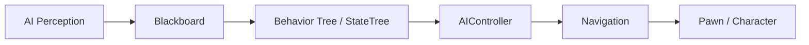

# 输入、角色移动、动画与 AI

## 1. 输入只是意图

推荐数据流：

```text
Keyboard / Gamepad / Touch
-> Enhanced Input Action
-> PlayerController / Pawn
-> Move / Look / Ability Intent
-> CharacterMovement / Gameplay System
-> Animation State
```

输入层不应直接承担伤害结算、资源扣除和服务器权威。它只说明“本地玩家想做什么”。

## 2. Enhanced Input 核心对象

| 对象 | 作用 |
|---|---|
| Input Action（IA） | Move、Jump、Fire 等语义动作 |
| Input Mapping Context（IMC） | 一组设备按键到 Action 的映射 |
| Trigger | Hold、Tap、Pressed、Chord 等触发条件 |
| Modifier | Dead Zone、Negate、Swizzle、Scale 等输入变换 |
| Local Player Subsystem | 为本地玩家添加/移除 Mapping Context |

```text
IA_Move
├── Keyboard WASD
├── Gamepad Left Stick
└── Touch Virtual Stick
```

切换 Gameplay/UI/Vehicle 时可以改变 Context 和优先级，而不是让每个 Actor 自己
猜当前按键应该开枪还是关闭背包。

## 3. 添加 Mapping Context

```cpp
void AMyCharacter::PawnClientRestart()
{
    Super::PawnClientRestart();

    APlayerController* PC =
        Cast<APlayerController>(GetController());
    if (!PC)
    {
        return;
    }

    ULocalPlayer* LocalPlayer = PC->GetLocalPlayer();
    if (!LocalPlayer)
    {
        return;
    }

    UEnhancedInputLocalPlayerSubsystem* Subsystem =
        ULocalPlayer::GetSubsystem<
            UEnhancedInputLocalPlayerSubsystem>(LocalPlayer);

    if (Subsystem && DefaultMappingContext)
    {
        Subsystem->RemoveMappingContext(DefaultMappingContext);
        Subsystem->AddMappingContext(DefaultMappingContext, 0);
    }
}
```

`PawnClientRestart` 会在本地 Pawn 重新开始控制时运行，能覆盖重生和重新 Possess
场景。部分架构也会由 PlayerController 或 LocalPlayerSubsystem 统一管理 Context。
无论放在哪里，都只应为本地玩家添加；Dedicated Server 没有本地键盘，也不需要
努力理解手柄摇杆。

## 4. 绑定 Input Action

```cpp
void AMyCharacter::SetupPlayerInputComponent(
    UInputComponent* PlayerInputComponent)
{
    Super::SetupPlayerInputComponent(PlayerInputComponent);

    UEnhancedInputComponent* Input =
        CastChecked<UEnhancedInputComponent>(PlayerInputComponent);

    Input->BindAction(
        MoveAction,
        ETriggerEvent::Triggered,
        this,
        &AMyCharacter::Move
    );

    Input->BindAction(
        JumpAction,
        ETriggerEvent::Started,
        this,
        &ACharacter::Jump
    );

    Input->BindAction(
        JumpAction,
        ETriggerEvent::Completed,
        this,
        &ACharacter::StopJumping
    );
}
```

版本和项目模板可能封装不同，核心是 Action 语义和 Trigger Event。

## 5. Pawn 与 Character 移动

### 5.1 `AddMovementInput`

```cpp
void AMyCharacter::Move(
    const FInputActionValue& Value)
{
    const FVector2D Axis = Value.Get<FVector2D>();
    const FRotator ControlRotation = GetControlRotation();
    const FRotator YawRotation(
        0.0f,
        ControlRotation.Yaw,
        0.0f
    );

    const FVector Forward =
        FRotationMatrix(YawRotation).GetUnitAxis(EAxis::X);
    const FVector Right =
        FRotationMatrix(YawRotation).GetUnitAxis(EAxis::Y);

    AddMovementInput(Forward, Axis.Y);
    AddMovementInput(Right, Axis.X);
}
```

CharacterMovementComponent 消费输入向量并根据 Movement Mode、加速度、摩擦和
网络预测更新。

### 5.2 直接 SetActorLocation

适合非物理简单对象、传送或明确的 Kinematic 逻辑。对 Character 每帧强行设置：

- 可能绕过移动组件预测。
- 影响碰撞滑动。
- 导致网络校正。
- 让动画速度与实际移动脱节。

有 CharacterMovement 时优先通过它扩展。

## 6. CharacterMovementComponent

常见 Movement Mode：

- Walking。
- NavWalking。
- Falling。
- Swimming。
- Flying。
- Custom。

它处理：

- 地面检测和坡度。
- 台阶。
- 加速度和制动。
- 跳跃与 Falling。
- 网络客户端预测和服务器校正。
- Root Motion 集成。

自定义滑墙、攀爬、冲刺可使用 Custom Movement Mode 或扩展组件。不要把所有特殊
移动都堆在 Character Tick 中不断覆盖 Velocity。

## 7. Character 网络预测直觉

```text
Client 输入
-> 本地立即预测移动
-> 发送 Move 数据到 Server
-> Server 权威模拟
-> 发现差异则校正
-> Client 重放尚未确认输入
```

这让输入响应不必等待一个 RTT。自定义移动需要：

- 序列化必要状态。
- 保证客户端/服务器模拟一致。
- 实现保存和组合 Move。
- 处理校正与表现平滑。

仅在客户端改速度变量而不让服务器知道，校正时角色会被拉回，像引擎对擅自改卷
的考生进行现场复核。

## 8. Camera 与 Spring Arm

常见第三人称层级：

```text
Character Capsule
└── SpringArmComponent
    └── CameraComponent
```

Spring Arm 提供：

- Target Arm Length。
- Camera Lag。
- Rotation Lag。
- 碰撞探测和镜头缩短。
- 继承 Controller Rotation。

常见设置：

```text
Character: bUseControllerRotationYaw = false
CharacterMovement: bOrientRotationToMovement = true
SpringArm: bUsePawnControlRotation = true
Camera: bUsePawnControlRotation = false
```

具体取决于锁定、射击或自由视角设计。

## 9. PlayerCameraManager

PlayerController 通过 PlayerCameraManager 计算最终视图。适合：

- Camera Shake。
- FOV。
- View Target Blend。
- 多种 Camera Mode。
- 后处理混合。

复杂项目可让 Camera Mode 系统输出目标参数，由 Manager 统一混合，而不是每个
技能直接抢 CameraComponent。

## 10. Skeletal Animation 数据链

```text
Skeleton
-> Skeletal Mesh
-> Animation Sequence
-> Blend Space / Montage
-> Animation Blueprint
-> Final Pose
-> SkeletalMeshComponent
-> Skinning / Rendering
```

### Skeleton

骨骼层级与动画兼容基础。

### Animation Sequence

一段骨骼动画。

### Blend Space

根据 Speed/Direction 等连续参数混合：

```text
Speed 0 -> Idle
Speed 200 -> Walk
Speed 600 -> Run
```

### Montage

适合攻击、技能、受击等可分 Section、Slot 和通知的动画流程。

## 11. Animation Blueprint

主要部分：

- Event Graph：更新速度、是否在空中等参数。
- Anim Graph：计算 Pose。
- State Machine：Idle/Run/Jump 状态转换。
- Layer/Linked Anim Graph。
- Slots。

常见参数：

```text
GroundSpeed
Direction
IsFalling
Acceleration
AimPitch / AimYaw
```

AnimBP 应读取 Character/Movement 状态，不要把伤害权威逻辑塞进动画状态机。

## 12. Animation Notify

用途：

- 脚步声。
- 刀光和粒子。
- 攻击窗口通知。
- Montage Section 事件。

关键伤害判定不应只相信客户端本地 Notify。联网项目通常：

```text
Server Ability/Combat State 决定攻击有效
-> Montage/Notify 协调表现和窗口
-> Hit Result 在权威侧验证
```

## 13. Root Motion

动画根骨骼提供位移：

- 近战突进。
- 翻滚。
- 处决。

优点是动作与距离一致；代价：

- 碰撞和坡面处理。
- 网络预测。
- Motion Warping。
- 动画资产规范。

普通跑动可由 CharacterMovement 驱动，特定 Montage 使用 Root Motion。

## 14. IK、Control Rig 与 Motion Warping

### IK

- 脚贴地。
- 手握武器。
- 瞄准修正。

### Control Rig

在引擎内创建和运行 Rig 逻辑，可用于动画制作和运行时控制。

### Motion Warping

调整 Root Motion，使动画落到目标位置/方向，适合翻越、处决和交互。

这些系统修正表现，但目标点和玩法合法性仍应由 Gameplay 决定。

## 15. AI 基础链路



### AIController

控制 AI Pawn。

### Blackboard

保存 TargetActor、PatrolPoint、HasLineOfSight 等决策数据。

### Behavior Tree

Selector、Sequence、Task、Decorator、Service 组织决策。

### StateTree

适合分层状态和选择逻辑，项目可根据版本与需求选择。

### EQS

生成并评分候选位置，例如寻找有掩体且能看见目标的位置。

### AI Perception

视觉、听觉等感知更新 Blackboard/状态。

## 16. Behavior Tree 常见误区

- Service 每帧做昂贵全场查询。
- Task 启动异步行为却不正确 Finish。
- Blackboard Key 命名和类型不统一。
- 玩法逻辑、动画、导航全部塞进一个 Task。
- 忘记网络中 AI 通常只在服务器决策。

Behavior Tree 负责“选什么行为”，Movement/Ability 负责“如何执行行为”。

## 17. Navigation

常见流程：

```text
NavMesh Bounds Volume
-> 构建 Recast NavMesh
-> AI MoveTo
-> Path Following
-> CharacterMovement
```

动态障碍、Nav Link、Runtime Generation 和大量 AI 重规划都会影响性能。

优化：

- 目标移动超过阈值再重新寻路。
- 错开 AI 更新。
- 对远处 AI 降频。
- 使用 Navigation Invoker 控制大世界生成范围。
- 用 Visual Logger 和 Navmesh Debug 排查。

## 18. 一个角色链路示例

```text
IA_Attack Triggered
-> PlayerController 请求 Ability/Attack
-> Server 验证
-> Character 播 Montage
-> Anim Notify 开启攻击窗口
-> Server Sweep 检测目标
-> 应用伤害
-> Replication / Gameplay Cue
-> 客户端播放 Hit VFX 和 UI
```

单机可简化，联网必须明确权威和预测边界。

## 19. 本章检查

1. Input Action、Mapping Context、Trigger、Modifier 各负责什么？
2. Mapping Context 为什么属于 LocalPlayer 上下文？
3. `AddMovementInput` 和 `SetActorLocation` 有何差异？
4. CharacterMovement 为什么适合联网角色？
5. CameraComponent 与 PlayerCameraManager 如何分工？
6. Blend Space、Montage、AnimBP 各适合什么？
7. Animation Notify 为什么不应独自决定联网伤害？
8. Root Motion 的优势和网络代价是什么？
9. Behavior Tree 与 Blackboard 分别负责什么？
10. EQS、AI Perception 和 Navigation 如何协作？

[上一章：资源、异步加载与大世界](./05-assets-async-loading-and-world-partition.md) |
[返回 UE 引擎基础](./README.md) |
[下一章：Chaos 物理、碰撞与网络同步](./07-physics-collision-and-networking.md)
