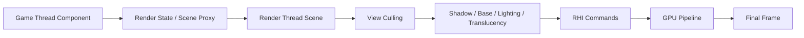

# 渲染管线、材质与 UE5 图形能力

## 1. Actor 怎样变成屏幕像素

以 StaticMeshActor 为例：

```text
Actor
└── StaticMeshComponent
    ├── StaticMesh Asset
    ├── Materials
    ├── Transform
    ├── Visibility / Shadow
    └── Collision
```

概念数据流：



Gameplay Component 不是直接在 GPU 上画。引擎把渲染相关状态同步到 Render Thread，
后者组织 Pass 和命令。

## 2. Game、Render 与 RHI Thread

### Game Thread

- Actor、Component 和 Gameplay。
- 修改 Transform、Material 参数和可见性。
- 创建/销毁渲染状态请求。

### Render Thread

- 维护渲染场景代理。
- 可见性和渲染命令。
- Render Dependency Graph（RDG）Pass。

### RHI Thread

- 更接近 D3D/Vulkan/Metal 等 API 提交。
- 是否独立取决于平台和配置。

跨线程更新通常是排队的。Game Thread 调 `SetVisibility` 返回时，不代表 GPU 已经
画完新状态。

## 3. Mesh Component

### StaticMeshComponent

静态几何、道具、建筑。

### SkeletalMeshComponent

骨骼、动画、蒙皮、Morph。

### InstancedStaticMesh / HierarchicalISM

大量相同 Mesh 实例：

- 植被。
- 重复道具。
- 建筑模块。

减少 Component/Draw 提交，但每实例数据、剔除、碰撞和动态修改仍有成本。

## 4. UE 常见桌面渲染主线

默认桌面 Deferred 路径可概念化为：

```text
View 初始化与剔除
-> Shadow / Virtual Shadow Maps
-> Depth Prepass（按配置）
-> Base Pass 写 GBuffer
-> Deferred Lighting
-> Sky / Fog / Atmosphere
-> Translucency
-> Post Processing
-> UI / Present
```

Nanite、Lumen、VSM、Decal 和自定义 Pass 会插入或改变流程。图是主干，不是每个
版本的精确 GPU Capture 清单。

## 5. Forward 与 Deferred

### Deferred

先把材质表面信息写入 GBuffer，再计算光照：

- 多动态光源较灵活。
- GBuffer 带宽和内存成本。
- 透明仍走其他路径。

### Forward

绘制物体时直接计算光照：

- 可适合 VR/MSAA 和特定平台。
- 材质/光源组合成本模型不同。
- 需要针对 Forward 功能支持设计。

移动端还有独立 Mobile Renderer 特征。不能用桌面 Deferred 的结论直接推断所有
移动 GPU。

## 6. Material 是什么

UE Material 是编译为 Shader 的节点图，描述表面和渲染行为。

常见 PBR 输入：

| 输入 | 直觉 |
|---|---|
| Base Color | 表面基础颜色 |
| Metallic | 是否接近金属 |
| Roughness | 高光宽窄和表面粗糙 |
| Normal | 微表面法线 |
| Emissive Color | 自发光 |
| Opacity / Mask | 透明或裁剪 |
| Ambient Occlusion | 局部环境遮蔽 |
| World Position Offset | 顶点位置偏移 |

材质节点最终生成多个 Shader 阶段/Pass 需要的代码，不只是“Fragment Shader
涂颜色”。

## 7. Material Domain、Blend Mode 与 Shading Model

### Material Domain

- Surface。
- Post Process。
- Decal。
- User Interface。
- Light Function 等。

### Blend Mode

- Opaque。
- Masked。
- Translucent。
- Additive 等。

### Shading Model

- Default Lit。
- Unlit。
- Subsurface。
- Clear Coat。
- Two Sided Foliage 等。

先选对语义再优化。把所有材质设成 Translucent 以便“以后可能调透明”，会提前
支付排序、深度和 Overdraw 学费。

## 8. Material Instance

Master Material 定义结构，Material Instance 调参数：

```text
M_Character_Master
├── MI_Hero_Red
├── MI_Hero_Blue
└── MI_Enemy_Boss
```

### Static Parameter

可能改变 Shader Permutation，需要编译变体。

### Scalar/Vector/Texture Parameter

运行时可改，通常不改变整体 Shader 结构。

动态实例：

```cpp
UMaterialInstanceDynamic* MID =
    MeshComponent->CreateDynamicMaterialInstance(0);

if (MID)
{
    MID->SetScalarParameterValue(TEXT("DamageFlash"), 1.0f);
}
```

不要每 Tick 创建新的 MID。创建一次、保存引用、按需改参数。

## 9. Parameter Collection 与 Per-Instance Data

### Material Parameter Collection

全局参数：

- 时间。
- 全局风。
- 天气。
- 全局颜色。

一次修改影响所有引用材质。

### Per Instance Custom Data

Instanced Mesh 可为每实例传少量数据，让同一材质表现不同颜色或状态。

选择关键是作用域：

```text
全世界共享 -> Parameter Collection
一个 Renderer -> MID
大量实例各自少量参数 -> Per Instance Custom Data
```

## 10. Shader 编译与 Permutation

材质静态开关、平台、质量、光照和渲染路径会产生 Shader Permutation：

```text
UseNormalMap x UseDetail x Quality x Platform x Pass
-> 大量 Shader
```

问题：

- Editor 编译等待。
- Cook 时间。
- Derived Data Cache。
- 包体。
- 运行时 PSO Hitch。

优化：

- 限制 Static Switch 组合。
- 共享 Master Material 但避免“万能材质”拥有几百开关。
- 配置 Shader/PSO 收集与预热。
- 使用 Stable Keys/项目版本对应方案。
- 在目标 RHI 验证。

万能材质的名字通常从“方便复用”开始，最后变成“改一个开关，全公司等编译”。

## 11. Render Order

### Opaque

引擎按状态、材质、深度等优化，不提供“Actor A 永远比 Actor B 先画”的普通
Gameplay 保证。正确遮挡依赖 Depth。

### Translucency

按距离和 Translucency Sort Priority 等规则排序。Priority 可解决局部明确需求，
但过度使用会破坏其他视角和批次。

### Custom Depth / Stencil

可用于：

- 轮廓。
- 遮挡高亮。
- 特定后处理 Mask。

它是额外 Pass/Buffer，不是免费标签。

### UMG

Widget 层级、Panel Slot ZOrder、Viewport ZOrder 等控制 UI 前后，与 3D Opaque
排序不是同一体系。

## 12. Decal 与 Post Process

### Decal

投射污渍、弹孔和局部材质变化。关注：

- 体积覆盖。
- DBuffer/渲染路径。
- 重叠数量。
- 法线和材质通道。

### Post Process

- Exposure。
- Bloom。
- Tone Mapping。
- Depth of Field。
- Motion Blur。
- Color Grading。

Post Process Volume 可设 Unbound 作为全局体积，再由局部 Volume 混合。

全屏 Pass 的成本随分辨率和算法增长。一个 Checkbox 背后可能是每像素执行的完整
Shader，不是 UI 上的一次布尔判断。

## 13. Nanite

Nanite 是虚拟化几何系统，目标是高几何细节和自动化 Cluster 流送/剔除：

- 大量高精度静态几何。
- 细粒度可见性。
- 减少手工 LOD 负担。

但需要考虑：

- Material 和变形特性支持。
- Skeletal/动画支持随版本演进。
- Masked/Translucency 等路径限制。
- 小物体、大量 Actor、阴影和像素成本仍存在。
- 目标平台支持。

Nanite 解决几何管线的一大类问题，不会消除 Overdraw、复杂材质和 Actor Tick。

## 14. Lumen

Lumen 提供动态全局光照和反射方案，可使用软件/硬件追踪路径，具体取决于平台和
配置。

关注：

- Scene 表示。
- 更新速度。
- 反射质量。
- 室内漏光/噪声。
- GPU 预算。
- Nanite、VSM 和目标平台组合。

Lumen 让动态光照更方便，但不是“无限灯光、无限反弹、无限免费”。

## 15. Virtual Shadow Maps

VSM 面向高分辨率动态阴影和 Nanite 场景，使用虚拟页按需分配。

性能风险：

- 大量动态变化导致页失效。
- 阴影投射对象过多。
- 光源范围过大。
- 几何/材质导致高成本。

优化应看 Shadow Pass、Cache 和 Invalidations，而不是只降低一个全局分辨率。

## 16. TSR 与分辨率

Temporal Super Resolution 使用时间信息从较低内部渲染分辨率重建高分辨率：

```text
Low/Medium Internal Resolution
-> Motion Vectors + History
-> TSR
-> Display Resolution
```

可能出现：

- Ghosting。
- Disocclusion。
- 细线/粒子不稳定。
- 运动矢量错误。

动态分辨率、TSR 质量和 GPU 预算应一起调试。

## 17. Render Dependency Graph

RDG 描述 Pass、资源读写和生命周期：

```text
Pass A writes Texture X
-> Pass B reads X and writes Y
-> Pass C reads Y
```

引擎可据此：

- 安排 Barrier。
- 管理临时资源。
- 验证依赖。
- 进行资源别名和调试。

自定义渲染扩展应遵循当前版本 RDG/RHI 接口，不要从旧教程复制直接操作资源的
代码后期待线程和生命周期自动正确。

## 18. Niagara

Niagara 是 UE 的 VFX 系统，包含：

- System。
- Emitter。
- Module。
- Parameter。
- CPU/GPU Simulation。

性能关注：

- 粒子数量。
- 透明 Overdraw。
- Bounds。
- Collision。
- Ribbon。
- GPU Simulation。
- 每帧 Spawn/Destroy System。

VFX 粒子面数低不代表像素成本低。全屏烟雾叠十层，GPU 仍会逐层欣赏。

## 19. 渲染性能工具

### 快速命令

- `stat unit`：Game/Draw/GPU 帧时间。
- `stat gpu`：GPU 事件概览。
- `profilegpu`：GPU Profile。
- `stat scenerendering`：场景渲染统计。
- `stat rhi`：RHI 统计。

### 工具

- Unreal Insights。
- GPU Visualizer。
- RenderDoc/平台 GPU Capture。
- Shader Complexity。
- Quad Overdraw。
- Nanite/Lumen/VSM Visualization。
- Memory Insights。

先判断 CPU、Render Thread 还是 GPU，再进入对应工具。

## 20. 常见瓶颈分类

| 瓶颈 | 线索 |
|---|---|
| Game Thread | Actor Tick、Blueprint、Gameplay、同步加载 |
| Render Thread | Scene Proxy、Draw 命令、对象/状态过多 |
| GPU Vertex/Geometry | 非 Nanite 几何、蒙皮、阴影 |
| GPU Pixel | 分辨率、Overdraw、复杂材质、后处理 |
| Bandwidth/Memory | 大纹理、Render Target、GBuffer |
| Shader/PSO Hitch | 首次变体、PSO 未准备 |

## 21. 一个材质优化例子

现象：战斗特效出现时 GPU 从 11 ms 升到 24 ms。

```text
stat unit 确认 GPU 受限
-> profilegpu 定位 Translucency
-> Shader Complexity 发现全屏高复杂烟雾
-> 减少粒子覆盖和层数
-> 简化材质采样
-> 降低低端质量分支
-> 对比 P95 GPU 时间和视觉结果
```

“把 Nanite 打开”无法解决透明烟雾 Fragment Shader，因为问题不在几何主干。

## 22. 本章检查

1. Game Thread Component 如何把状态交给 Render Thread？
2. Deferred Base Pass 与 Lighting Pass 分别做什么？
3. Material 与 Material Instance 有何区别？
4. Static Switch 为什么会增加 Permutation？
5. Opaque、Translucent、UMG 的排序体系为何不同？
6. Custom Depth/Stencil 适合什么？
7. Nanite 解决什么，又不解决什么？
8. Lumen 和 VSM 的性能风险分别在哪里？
9. TSR 为什么依赖 Motion Vector 和 History？
10. `stat unit` 如何帮助先判断线程/GPU瓶颈？

[上一章：Chaos 物理、碰撞与网络同步](./07-physics-collision-and-networking.md) |
[返回 UE 引擎基础](./README.md) |
[下一章：常用系统、性能、构建与面试复盘](./09-common-systems-performance-build-and-interview.md)
