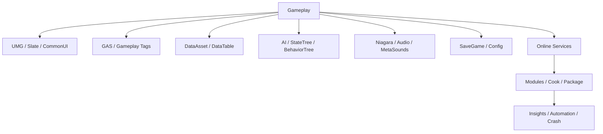

# 常用系统、性能、构建与面试复盘

## 1. UE 项目的常用系统地图



这些系统的共同问题仍然是：

```text
谁拥有状态
-> 在哪个 World/机器运行
-> 如何加载
-> 如何通知变化
-> 何时释放
```

## 2. UMG、Slate 与 CommonUI

### UMG

Widget Blueprint 面向游戏 UI：

- Designer。
- Widget Tree。
- Animation。
- Event Graph。
- Data Binding/事件更新。

### Slate

C++ UI Framework，编辑器和底层 Widget 基于 Slate。适合：

- 自定义编辑器。
- 高度定制运行时 Widget。
- 需要更直接 C++ 控制的 UI。

### CommonUI

适合多平台菜单、输入路由、激活栈和统一交互，通常作为插件启用。

## 3. Widget 生命周期

常见 UUserWidget 回调：

- NativeOnInitialized。
- NativeConstruct。
- NativeDestruct。
- NativeTick。

一个 Widget 可能反复加入/移出 Viewport，Construct/Destruct 不应被误解成普通
C++ 构造/析构。

推荐页面流程：

```text
Create Widget
-> Initialize
-> Bind ViewModel / Events
-> Add to Viewport
-> React to events
-> Remove
-> Unbind
-> Release/Pool
```

不要每帧 Binding 扫描复杂 Gameplay 数据。状态改变时推送 UI，或者使用明确
ViewModel。

## 4. UI 性能

关注：

- Widget 数量。
- Tick。
- Blueprint Binding。
- Layout/Invalidation。
- Retainer Box。
- 材质和透明 Overdraw。
- 大列表是否虚拟化。
- Widget 创建/销毁。

工具：

- Widget Reflector。
- Slate Insights。
- `stat slate`。
- Unreal Insights。

一个 Inventory 有一千件物品，不代表必须同时生成一千个 Widget 证明库存充足。

## 5. Gameplay Tags

Gameplay Tag 是层级化标识：

```text
State.Stunned
State.Dead
Ability.Fire
Damage.Fire
Weapon.Rifle
```

优点：

- 数据驱动。
- 层级匹配。
- 比自由字符串更统一。
- 与 GAS、消息和查询集成。

不要把每个布尔值都改成 Tag。稳定、局部、类型明确的状态仍可用普通字段；Tag
适合跨系统语义和可扩展分类。

## 6. Gameplay Ability System

GAS 面向技能、属性、效果和多人预测：

| 概念 | 作用 |
|---|---|
| AbilitySystemComponent | 持有 Ability、Tag、Effect、Attribute |
| Gameplay Ability | 可激活行为 |
| Gameplay Effect | 修改属性、Tag、持续状态 |
| Attribute Set | Health、Mana、Attack 等属性 |
| Gameplay Cue | VFX、SFX 等表现 |
| Ability Task | 技能内异步流程 |

概念链：

```text
Input / Event
-> TryActivateAbility
-> Check Tags / Cost / Cooldown
-> Predict or Server Activate
-> Ability Tasks / Montage / Targeting
-> Gameplay Effects
-> Attributes and Tags
-> Gameplay Cues
-> End / Cancel
```

GAS 很强，但学习和配置成本高。简单单机解谜项目不必为了一个开门技能引入完整
战斗航母；大型动作、RPG、MOBA 或联网技能系统则能从标准化能力中获益。

## 7. DataAsset、DataTable 与 Config

### DataAsset

适合带 Asset 引用和继承关系的配置：

```text
WeaponData
├── Damage
├── Icon Soft Reference
├── Mesh Soft Reference
└── Ability Class
```

### DataTable

基于 USTRUCT 行，适合表格化批量数据和 CSV/JSON 流程。

### Config

`UPROPERTY(Config)` 和 `.ini` 适合引擎/项目设置，不适合保存玩家运行存档。

选择：

| 数据 | 常见方案 |
|---|---|
| 引用大量 Asset 的类型定义 | DataAsset |
| 大量规则整齐的数值行 | DataTable |
| 引擎和平台设置 | Config |
| 玩家运行进度 | SaveGame/服务端存储 |

## 8. SaveGame

```cpp
UCLASS()
class MYGAME_API UMySaveGame : public USaveGame
{
    GENERATED_BODY()

public:
    UPROPERTY()
    int32 Version = 1;

    UPROPERTY()
    int32 PlayerLevel = 1;

    UPROPERTY()
    TArray<FName> UnlockedItems;
};
```

需要设计：

- 版本号和迁移。
- 原子写入。
- 多存档槽。
- 平台存储限制。
- 云同步冲突。
- 加密/校验需求。
- 服务端权威数据不能只信客户端文件。

`SaveGameToSlot` 能写文件，不会自动替你设计十个版本后的兼容。

## 9. Audio 与 MetaSounds

常见对象：

- Sound Wave。
- Sound Cue。
- Audio Component。
- Sound Class/Mix。
- Submix。
- MetaSounds。

MetaSounds 使用节点图进行实时音频生成和处理，适合参数化武器、引擎声和动态音乐。

关注：

- Streaming/解码。
- Voice 数量。
- Attenuation。
- Concurrency。
- Occlusion。
- Submix Effect。

音频组件也需要池和生命周期。枪声结束后组件不回收，战斗结束时可能留下一个只
会沉默但仍占座的乐团。

## 10. Sequencer

用于：

- 过场。
- Camera Cut。
- Actor 属性轨道。
- Animation。
- Audio。
- Event Track。

玩法系统要处理：

- 跳过。
- 中断。
- 网络 Authority。
- Actor Binding 失效。
- Level Streaming。
- 播放结束状态恢复。

Sequencer 能让轨道按时间播放，但不会自动回滚被中途改坏的 Gameplay 状态。

## 11. Online Services

可能涉及：

- Identity/Auth。
- Session/Lobby。
- Friends。
- Presence。
- Achievements。
- Leaderboard。
- Voice。
- EOS 或平台 Online Subsystem。

设计时隔离：

```text
Gameplay/UI
-> Project Online Service Interface
-> EOS / Steam / Console / Mock
```

避免 UI 直接依赖具体平台 SDK，使本地测试和平台切换更可控。

## 12. Module 与 Plugin

### Module

UE C++ 编译和加载单元：

```text
MyGame
MyGameUI
MyGameEditor
MyGameTests
```

由 `.Build.cs` 声明依赖：

```csharp
PublicDependencyModuleNames.AddRange(
    new[] { "Core", "CoreUObject", "Engine" }
);

PrivateDependencyModuleNames.AddRange(
    new[] { "Slate", "SlateCore" }
);
```

Public/Private 依赖应匹配头文件 API 暴露。把所有 Module 都设为 Public Dependency，
能快速消除编译错误，也能快速消除架构边界。

### Plugin

`.uplugin` 描述一个或多个 Module、内容和平台支持。适合：

- 可复用系统。
- 第三方 SDK。
- Editor 工具。
- Game Feature。

## 13. UBT、UHT 与编译链

```text
.Target.cs
-> Unreal Build Tool 选择 Target
-> UHT 生成反射代码
-> C++ Compiler / Linker
-> Module Binaries
```

常见 Target：

- Editor。
- Game。
- Client。
- Server。
- Program。

Live Coding 适合函数实现迭代，但修改反射布局、构造默认组件或类型结构后，完整
编译和重启更可靠。Hot Reload/Live Coding 不是对象布局变化的时间机器。

## 14. Build、Cook、Stage、Package

| 阶段 | 作用 |
|---|---|
| Build | 编译代码 |
| Cook | 转换目标平台资源 |
| Stage | 把运行文件组织到暂存目录 |
| Package | 生成可分发包 |
| Deploy | 安装到设备 |
| Run | 启动 |

Shipping 构建与 Editor 差异：

- 没有 Editor-only 代码/资源。
- 宏和日志级别不同。
- Asset Cook 规则生效。
- 平台 RHI、Shader 和权限不同。
- 部分 Console Command 不可用。

“PIE 能运行”只是第一道门，不是发布认证。

## 15. Unreal Insights

可分析：

- CPU Timing。
- Thread/Task。
- Load Time。
- Memory。
- Network。
- Context Switch。
- 自定义 Trace Event。

标准流程：

```text
固定设备和复现场景
-> Capture Trace
-> 找 Game/Render/RHI/GPU 或加载瓶颈
-> 展开调用和等待
-> 提出可证伪假设
-> 最小修改
-> 同场景对比
-> 加入性能基线
```

## 16. 常用性能命令

| 命令 | 用途 |
|---|---|
| `stat unit` | Game、Draw、GPU 帧时间 |
| `stat game` | Gameplay Tick |
| `stat gpu` | GPU Pass |
| `stat memory` | 内存概览 |
| `stat streaming` | Streaming |
| `stat slate` | UI |
| `profilegpu` | GPU Visualizer |

命令和 Stat 名称会随版本/平台变化。使用时记录设备、Build Configuration 和场景。

## 17. CPU 性能热点

- 过多 Actor/Component Tick。
- 蓝图细碎热循环。
- GetAllActors、全场查询。
- GC 扫描大量 UObject。
- 同步加载。
- 动画、AI 和物理。
- Game Thread 等 Task/Render Thread。
- 锁和主线程回调。

优化方向：

- 事件/Timer 替代无效 Tick。
- Mass/批处理处理海量实体。
- 异步资源。
- AI/动画降频。
- 控制 UObject 数量和生命周期。
- 将热点蓝图下沉 C++。

## 18. 内存与资源性能

观察：

- UObject 数量。
- Texture Pool。
- Mesh/Nanite 数据。
- Animation。
- Audio。
- Render Target。
- Hard Reference 链。
- Streaming Pool。
- Pak/IoStore 加载。

工具：

- Memory Insights。
- `memreport`。
- Reference Viewer。
- Size Map。
- Asset Audit。
- `obj list` 等调试命令（按版本使用）。

## 19. 自动化测试

可选层级：

- C++ Automation Test。
- Functional Test Actor。
- Blueprint 测试。
- Gauntlet 多进程/平台测试。
- Screenshot/渲染回归。
- Dedicated Server 网络流程。

适合测试：

- 纯 C++ 规则。
- Asset Validation。
- Map 能否加载。
- Replication 流程。
- Cook 后资源是否存在。
- 性能预算。

不应只在 Editor Development 模式测试 Shipping 专属路径。

## 20. 日志与崩溃

自定义 Log Category：

```cpp
DECLARE_LOG_CATEGORY_EXTERN(LogCombat, Log, All);
DEFINE_LOG_CATEGORY(LogCombat);

UE_LOG(LogCombat, Warning, TEXT("Invalid target: %s"), *GetNameSafe(Target));
```

日志应包含：

- Actor/Player。
- World/NetMode。
- 状态与关键 ID。
- 错误原因。

崩溃处理：

- 保存 Symbol。
- 收集 Callstack、Build ID、平台和设备。
- 确保服务器和客户端版本可追踪。
- 对高频崩溃聚类。

## 21. 面试 30 秒回答：UE 核心模型

> UE 以 UObject 提供反射、序列化、Blueprint 和 GC，能进入 World 的对象通常
> 是 Actor，Actor 通过 ActorComponent/SceneComponent 组合能力。Gameplay
> Framework 用 GameMode、GameState、PlayerController、PlayerState、Pawn 和
> Character 划分服务器规则、共享状态、控制者与世界实体。Blueprint 适合配置和
> 高层编排，C++ 负责稳定 API、性能、生命周期和网络权威。资源通过硬/软引用与
> Asset Manager 管理，运行时还要处理 Replication、CharacterMovement、渲染线程、
> Cook 和 Unreal Insights。

## 22. 高频面试问题

### UObject 与生命周期

- UObject、Actor、Component 和普通 C++ 对象有何区别？
- CDO 是什么，构造函数为什么会在编辑器阶段执行？
- UPROPERTY 为什么会影响 GC？
- `TObjectPtr`、`TWeakObjectPtr`、`TSoftObjectPtr` 如何选择？
- `NewObject` 与 `SpawnActor` 有何区别？

### Gameplay Framework

- GameMode 和 GameState 为什么分开？
- PlayerController 和 PlayerState 分别放什么？
- Pawn 和 Character 有何区别？
- Possess 如何影响网络？
- GameInstance 与 Subsystem 如何选择？

### Blueprint

- Cast、Interface、Event Dispatcher 有何差异？
- Function、Macro、Custom Event 如何选择？
- Pure Node 为什么可能重复执行？
- Blueprint 与 C++ 如何分工？
- Construction Script 为什么不能放运行时副作用？

### 资源

- 硬引用和软引用如何影响加载？
- Asset Manager/Primary Asset 解决什么？
- World Partition、Data Layer、HLOD 分别做什么？
- 异步加载为何仍可能卡在 Spawn/注册阶段？
- Cook 为什么可能漏掉 Soft Reference Asset？

### 网络与渲染

- Replicated Property 与 RPC 如何选择？
- Reliable 为什么不能滥用？
- CharacterMovement 如何做客户端预测？
- Game/Render/RHI Thread 如何协作？
- Nanite、Lumen 和 VSM 分别解决什么问题？

## 23. 最终实践：一个可联网拾取物

尝试实现：

1. 创建 C++ `APickupBase`。
2. 使用 StaticMeshComponent 和 Sphere Collision。
3. 用 Blueprint Child 配置 Mesh、Material、Sound。
4. 用 BPI_Interactable 提供交互。
5. 使用 Enhanced Input 触发交互。
6. Client 通过 Owned Pawn/Controller 调 Server RPC。
7. Server Trace 验证拾取物。
8. Server 修改 Inventory Component。
9. Inventory Property 复制并 OnRep 更新 UI。
10. Multicast 或 Gameplay Cue 播放特效。
11. Mesh 使用 Soft Reference 异步加载。
12. World Partition 下测试 Actor 加载/卸载。
13. Unreal Insights 检查同步加载、Tick 和网络。
14. Cook Shipping Build 验证资源存在。

这条练习串起 Actor、Component、UObject、Blueprint、输入、物理查询、网络、资源、
UI 和构建。能说明每个对象在哪台机器、由谁拥有、何时加载和释放，就已经从
“会连蓝图节点”进入“理解 UE 系统”的阶段。

[上一章：渲染管线、材质与 UE5 图形能力](./08-rendering-materials-and-ue5-graphics.md) |
[返回 UE 引擎基础](./README.md)
