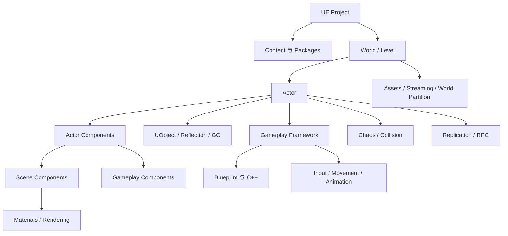

# UE 引擎基础

## 1. 模块目标

本模块以 Unreal Engine 5（UE5）的通用机制为主，从编辑器、Level、Actor 和
Component 开始，逐步讲清 UObject、反射、GC、Gameplay Framework、蓝图、资源
加载、角色移动、物理、网络、渲染和工程工具。

读完后应能：

1. 区分 UObject、Actor、Pawn、Character、Component 和普通 C++ 对象。
2. 说明 UCLASS、UPROPERTY、UFUNCTION、CDO、反射和 GC 的关系。
3. 讲清 GameMode、GameState、PlayerController、PlayerState、Pawn 和
   GameInstance 分别保存什么。
4. 使用蓝图变量、函数、宏、接口、事件分发器和 Construction Script。
5. 设计 C++ 打底、Blueprint 配置和表现扩展的协作边界。
6. 区分硬引用、软引用、Asset Manager、Level Streaming 与 World Partition。
7. 使用 Enhanced Input、CharacterMovement、Animation Blueprint 和 AI 系统。
8. 理解 Chaos 碰撞、Replication、RPC、网络所有权与服务器权威。
9. 说明 Static/Skeletal Mesh、Material Instance、Nanite、Lumen 和常见渲染 Pass。
10. 使用 Unreal Insights、`stat`、GPU Profile、Reference Viewer 等工具定位问题。

## 2. 一张总览图



一句话理解：

> World 是片场，Actor 是能进入片场的演员或道具，Component 是挂在 Actor 身上
> 的能力，UObject 是引擎对象体系的共同底座，Gameplay Framework 决定谁控制谁、
> 规则放哪里，Blueprint 则让程序、美术和策划用节点共同搭建具体玩法。

把一个空 Actor 改名为 `BP_FinalBoss` 不会自动获得 Boss 能力。最多只能让内容
浏览器看起来很有决战气氛。

## 3. 内容层级

| 顺序 | 章节 | 核心问题 |
|---:|---|---|
| 1 | [编辑器、Level、Actor 与 Component](./01-editor-level-actor-and-components.md) | UE 工程如何组织，Actor 怎样生成到 World？ |
| 2 | [UObject、反射、GC 与生命周期](./02-uobject-reflection-gc-and-lifecycle.md) | UPROPERTY 为什么影响编辑器、蓝图、序列化和 GC？ |
| 3 | [Gameplay Framework 与主循环](./03-gameplay-framework-and-game-loop.md) | GameMode、Controller、Pawn、State 应如何分工？ |
| 4 | [蓝图系统与 C++ 协作](./04-blueprints-and-cpp-collaboration.md) | 蓝图节点如何组织，接口、分发器和 C++ 怎么配合？ |
| 5 | [资源、异步加载与大世界](./05-assets-async-loading-and-world-partition.md) | 硬/软引用、Asset Manager、Streaming 有何区别？ |
| 6 | [输入、角色移动、动画与 AI](./06-input-character-animation-and-ai.md) | Enhanced Input、CharacterMovement、AnimBP 如何串联？ |
| 7 | [Chaos 物理、碰撞与网络同步](./07-physics-collision-and-networking.md) | 碰撞通道、物理材质、Replication 和 RPC 如何工作？ |
| 8 | [渲染管线、材质与 UE5 图形能力](./08-rendering-materials-and-ue5-graphics.md) | Material、Render Thread、Nanite、Lumen 分别解决什么？ |
| 9 | [常用系统、性能、构建与面试复盘](./09-common-systems-performance-build-and-interview.md) | UMG、GAS、Niagara、模块、Cook 和 Insights 还有哪些重点？ |

## 4. 推荐学习路线

### 4.1 第一次系统学习 UE

```text
Editor 与 Level
-> Actor / Component
-> UObject 与生命周期
-> Gameplay Framework
-> Blueprint 基本语法
-> 输入、角色和动画
-> 资源、物理、渲染
-> 调试与性能
```

建议每章都在 Third Person 模板或空 C++ 项目中做一个最小实验。只看蓝图截图很
容易产生“线我都看懂了，所以项目应该也能跑”的错觉；真正点击 Compile 后，
引擎通常会提供更诚实的反馈。

### 4.2 准备 UE 客户端面试

```text
C++ 生命周期与所有权
-> UObject / Reflection / GC / CDO
-> Actor 生命周期与 Tick
-> Gameplay Framework
-> Blueprint 通信与 C++ 暴露
-> 软引用和异步加载
-> CharacterMovement 与 Replication
-> Game / Render / RHI Thread
-> Unreal Insights 与 Cook
```

## 5. 版本边界

本模块以 UE5 的稳定主干为准。不同 5.x 版本和项目配置可能在以下方面存在差异：

- Enhanced Input、CommonUI、GAS、Iris 和 Modular Gameplay 的默认启用方式。
- World Partition、Data Layer、HLOD 和打包设置。
- Nanite、Lumen、Virtual Shadow Maps 和移动端支持范围。
- UObject 指针推荐类型、网络 API 和编辑器菜单位置。
- Blueprint 节点名称、插件 API 与构建工具参数。

遇到差异时先确认 Engine 版本、项目插件、Target Platform、Default 配置和源码
分支。UE 的搜索结果常跨越十多年，2016 年仍然正确的答案未必适合 2026 年的项目。
