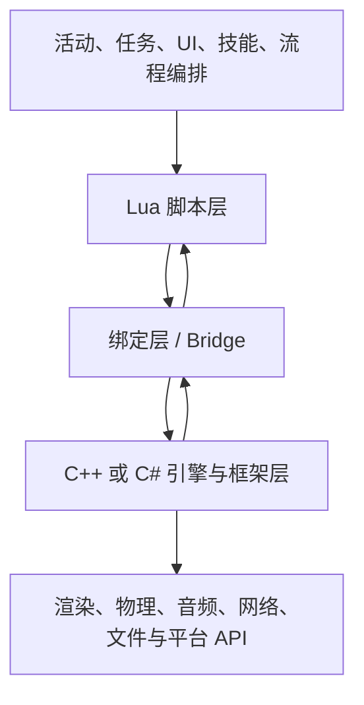

# Lua 为什么适合游戏客户端

## 1. 先看它在引擎里的位置

典型客户端不是"用 Lua 写一切"，而是把不同工作放到合适的层：



Lua 层描述"这一局发生什么"，原生层负责"怎样高效、稳定地把它执行出来"。

例如：

- Lua 决定点击按钮后打开哪个界面；
- C++/C# 负责真正创建渲染节点、加载纹理和提交 GPU 命令；
- Lua 决定技能按什么阶段播放；
- 引擎负责动画采样、碰撞查询和粒子模拟；
- Lua 决定任务完成后发什么奖励；
- 原生层负责存档、网络协议和安全校验。

这条边界不是按"高级/低级"划分，而是按**变化频率、性能需求、平台能力和所有权复杂度**划分。

## 2. Lua 的核心特征

### 2.1 小而可嵌入

Lua VM 可以作为库嵌入宿主进程。宿主创建 `lua_State`，注册原生函数，加载脚本，再调用脚本入口。它不像独立应用运行时那样必须接管整个程序生命周期。

```text
客户端进程启动
    -> 创建 Lua VM
    -> 打开允许的标准库
    -> 注册引擎 API
    -> 设置模块搜索路径
    -> 加载 bootstrap.lua
    -> 进入游戏主循环
```

这种"客随主便"的设计很适合游戏引擎：主循环仍由引擎控制，Lua 只在被调用时工作。

### 2.2 动态类型与快速迭代

变量不固定为某个静态类型，函数和 Table 都能在运行时组合：

```lua
local action = {
    name = "Fireball",
    cooldown = 3.0,
    execute = function(target)
        target:takeDamage(100)
    end,
}
```

修改玩法流程通常不需要重新编译庞大的原生工程。代价是许多错误要到执行路径真正经过时才暴露，因此测试、静态检查和运行时合同很重要。

### 2.3 Table 是统一数据结构

Lua 用 Table 同时承担：

- 数组；
- 字典；
- 对象字段；
- 模块导出表；
- 原型链；
- 集合；
- 配置。

语言概念少，学习入口低。代价是同一种外形可能承载完全不同的语义，需要团队规范给 Table 起清楚的名字、限制字段并管理生命周期。

### 2.4 函数是一等值

函数可以存入变量、Table、参数和返回值：

```lua
local handlers = {}

handlers.onClick = function(buttonId)
    print("clicked", buttonId)
end
```

事件回调、计时器、命令、行为节点和异步 continuation 都能自然表达。不过闭包会捕获外部变量，忘记注销回调时，也会自然地把整个界面一起留在内存里。

### 2.5 自动内存管理

Lua 使用垃圾回收器管理 Table、字符串、闭包、协程和完整 userdata 等对象。业务代码不用逐个 `free`，但仍然必须管理：

- 全局表中的强引用；
- 事件监听；
- 计时器和协程；
- Lua 与 C++/C# 之间的双向引用；
- 原生资源的显式释放时机。

GC 能回收"不可达对象"，不能判断"这个窗口在业务上已经没用了"。垃圾回收器不是产品经理，它看不懂界面需求文档。

## 3. Lua 在客户端中的常见应用

### 3.1 UI 与界面流程

适合处理：

- 界面打开/关闭；
- 按钮事件；
- ViewModel 或展示数据转换；
- 列表刷新策略；
- 红点、引导与页面跳转；
- 动画播放顺序。

UI 变化频繁、分支多，单次计算通常不重，Lua 的迭代优势明显。

### 3.2 活动、任务与玩法编排

```text
进入副本
    -> 播放开场
    -> 等待玩家到达区域
    -> 刷新三波敌人
    -> 等待 Boss 死亡
    -> 展示结算
```

这种跨帧、事件驱动的流程适合用模块、状态机或协程表达。真正的大量寻路、碰撞和动画计算仍放在原生系统中。

### 3.3 技能与战斗规则

Lua 可描述：

- 技能阶段；
- Buff 触发条件；
- 伤害公式的业务组合；
- 镜头、特效、音效编排；
- 客户端预测表现。

需要注意：

- 服务器权威逻辑不能只靠客户端 Lua 保证安全；
- 高频逐实体循环可能不适合脚本；
- 锁步同步要求严格控制浮点、遍历顺序、随机数和时间来源；
- 表现逻辑与判定逻辑应明确分层。

### 3.4 配置与数据驱动

Lua 文件可以直接返回 Table：

```lua
return {
    id = 1001,
    name = "Fireball",
    cooldown = 3.0,
    damage = { 100, 140, 190 },
}
```

优点是可读、可表达简单计算；缺点是它本质上是可执行代码，不是纯数据。读取不可信 Lua 配置时，不能把它当成更活泼的 JSON 直接执行。

### 3.5 工具与自动化

开发版本中，Lua 可用于：

- 调试控制台；
- GM 命令；
- 自动跑图；
- UI 冒烟测试；
- 性能场景编排；
- 数据校验。

发布版本应关闭或限制危险入口，避免调试 API 变成正式服的隐藏管理后台。

### 3.6 脚本更新与问题修复

Lua 源码或字节码可作为资源加载，因此技术上比原生代码更容易替换。但"能替换文件"只是第一步：

- 平台和商店政策是否允许？
- 脚本包如何签名、校验与回滚？
- 当前运行中的旧对象如何升级？
- 旧闭包、旧协程和旧回调如何处理？
- 数据结构版本如何迁移？
- 更新失败后如何恢复？

这些问题在 [客户端架构与脚本更新](./06-client-architecture-and-hot-update.md) 中详细讨论。

## 4. 哪些工作通常不适合 Lua

### 4.1 渲染和物理内核

渲染提交、可见性裁剪、碰撞 broad phase、动画蒙皮等工作对吞吐、内存布局和 SIMD 敏感，通常由 C++、Burst/Jobs 或专用系统完成。

Lua 可以发出"显示这个特效"的命令，不应逐顶点告诉 GPU 下一步怎么走。

### 4.2 海量实体的逐帧细粒度更新

```lua
for i = 1, #allParticles do
    -- 每帧对十万个粒子做多次 Table 访问和跨语言调用
end
```

这种代码可能同时遭遇：

- 解释器或 JIT 限制；
- Table 间接访问；
- 大量临时对象；
- Lua/原生边界切换；
- 不连续的数据布局；
- GC 压力。

更合理的做法是把批量数据交给原生系统处理，Lua 每帧只提交少量高层命令。

### 4.3 需要强 ABI、硬实时或平台底层能力的代码

设备驱动、加密底层、崩溃捕获、线程同步原语等代码不适合交给脚本层。Lua 可以配置策略，但不应承担必须在极严格时限内完成的底层责任。

### 4.4 安全权威逻辑

客户端代码和数据最终都处于玩家设备上。伤害结算、付费结果、背包资产等权威判断必须由服务端验证。把逻辑从 C++ 换成 Lua，不会让客户端突然获得可信身份。

## 5. 一次 Lua 调用的基本链路

假设脚本执行：

```lua
player:setPosition(10, 20, 30)
```

典型调用链：

```text
Lua 字节码执行
    -> 从 player 中查找 setPosition
    -> 冒号语法补入 self
    -> 进入绑定包装函数
    -> 检查参数数量和类型
    -> Lua number 转换为宿主数值
    -> 从 userdata/句柄找到原生 Player
    -> 调用 C++/C# SetPosition
    -> 转换返回值
    -> 恢复 Lua VM 执行
```

跨语言调用贵的地方往往不只是一次函数跳转，而是查找、检查、封送、包装和生命周期验证。因此：

```lua
-- 边界切换 1000 次
for i = 1, #positions do
    native.setPosition(ids[i], positions[i])
end

-- 边界切换 1 次，原生内部批处理
native.setPositions(ids, positions)
```

第二种设计通常更有扩展性。

## 6. 解释执行、字节码与 JIT

### 6.1 标准 Lua

Lua 源码先被编译成 VM 字节码，再由虚拟机执行。字节码不是跨版本、跨架构、跨构建配置都稳定的交换格式：

- Lua 版本不同可能不兼容；
- 整数、浮点和字节序配置可能不同；
- 调试信息和构建选项会影响产物；
- 字节码不是安全沙箱，加载不可信二进制块存在风险。

发布脚本字节码可以减少源码直接暴露和部分解析成本，但它不是强加密，也不能代替签名校验。

### 6.2 LuaJIT

LuaJIT 会把热点路径编译为机器码，许多纯 Lua 数值代码可能显著加速。但需要注意：

- 并非所有代码路径都能进入 JIT；
- 退出 trace 会回到解释执行；
- FFI 能力强，也扩大了安全边界；
- 平台对运行时生成机器码可能有限制；
- LuaJIT 主要兼容 Lua 5.1 语义，不能直接当作 Lua 5.4。

选用 LuaJIT 应以目标平台、项目绑定和剖析数据为依据，不要把名字中的 JIT 当作一张性能免检贴纸。

## 7. 单 VM 还是多个 VM

### 7.1 单个 VM

优点：

- 模块和对象可以直接共享；
- 绑定注册一次；
- 全局服务和调试简单；
- 内存重复较少。

缺点：

- 模块隔离弱；
- 一处全局污染影响整个脚本世界；
- 长任务会阻塞同一 VM；
- 并发执行需要额外设计。

### 7.2 多个 VM

优点：

- 可以隔离大厅、战斗、工具或不可信脚本；
- 生命周期可整组销毁；
- 在不同宿主线程各自拥有独立 VM 时更容易避免共享状态竞争。

缺点：

- VM 之间不能直接共享 Lua 对象；
- 模块、字符串和绑定可能重复占内存；
- 消息传递和状态同步更复杂；
- 调试与更新要面对多个世界。

多个 coroutine 并不等于多个独立 VM。它们通常共享同一 Lua 全局状态和 GC，只拥有各自执行栈。

## 8. Lua 与主线程

大多数游戏绑定要求 Lua VM 在固定线程，常见是主线程：

- UI 和大量引擎对象本身只能主线程访问；
- Lua VM 通常不是可被多个原生线程同时无锁调用的对象；
- 后台线程结果应通过线程安全队列回到脚本线程；
- coroutine 是协作式调度，不会自动把工作搬到 CPU 的另一核。

```text
工作线程：下载/解压/寻路
    -> 推送结果消息
主线程：取消息
    -> 恢复 Lua coroutine 或发出事件
```

如果多个线程确实需要 Lua，通常使用线程独占的多个 VM，或者由宿主对同一 VM 严格串行化访问。

## 9. 一个实用的分层原则

可以用三个问题决定逻辑放在哪里：

| 问题 | 倾向 Lua | 倾向原生 |
|---|---|---|
| 变化频率高吗？ | 活动、UI、规则、流程经常改 | 稳定底层能力 |
| 数据规模大吗？ | 少量对象、高层决策 | 海量数据、紧凑循环 |
| 边界调用密集吗？ | 能一次提交高层命令 | 每项都要访问引擎内部 |
| 需要平台底层能力吗？ | 只消费封装 API | 直接操作图形、线程、系统 API |
| 需要运行时替换吗？ | 模块和规则可能更新 | ABI 与安全边界要求强 |

最常见的好结构是：

```text
Lua：决定做什么
    -> 一次高层调用
原生：批量、高效地完成
    -> 结果事件
Lua：决定下一步流程
```

## 10. 本章小结

1. Lua 是嵌入式脚本层，不是引擎底层的替代品。
2. UI、活动、任务、技能编排和工具很适合 Lua。
3. 渲染、物理、海量实体热循环和安全权威逻辑通常不适合 Lua。
4. 标准 Lua、Lua 5.1 和 LuaJIT 的语义与平台能力不能混用。
5. 跨语言调用应高层、粗粒度、可批处理。
6. coroutine 不等于线程，Lua VM 通常由固定线程串行驱动。
7. 脚本更新既是技术问题，也是版本、状态、安全和平台合规问题。

[上一章：模块总览](./README.md) | [下一章：基本语法与数据类型](./02-basic-syntax-and-types.md)
