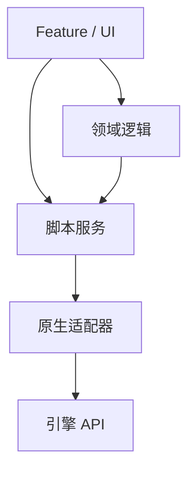
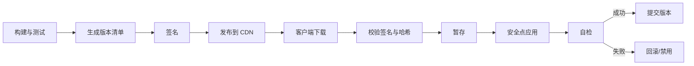

# Lua 客户端架构与脚本更新

## 1. 从一个可维护的脚本入口开始

不推荐让引擎随意执行几十个全局文件。建立唯一 bootstrap：

```lua
-- bootstrap.lua
local App = require("app")

local app = App.new({
    network = native.network,
    assets = native.assets,
    audio = native.audio,
})

function onUpdate(dt)
    app:update(dt)
end

function onShutdown()
    app:shutdown()
end
```

宿主只持有少量稳定入口，脚本内部自行组织模块：

```text
Native host
    |- bootstrap.onUpdate(dt)
    |- bootstrap.onMessage(message)
    `- bootstrap.onShutdown()

Lua App
    |- services
    |- feature modules
    |- event scopes
    |- scheduler
    |- UI router
    `- diagnostics
```

这样绑定层不需要知道每个活动和界面的函数名。

## 2. 推荐目录层级

```text
lua/
├── bootstrap.lua
├── app.lua
├── core/
│   ├── event_bus.lua
│   ├── scheduler.lua
│   ├── state_machine.lua
│   └── class.lua
├── services/
│   ├── network_service.lua
│   ├── asset_service.lua
│   └── player_service.lua
├── features/
│   ├── inventory/
│   ├── quest/
│   └── activity/
├── ui/
│   ├── router.lua
│   ├── panels/
│   └── widgets/
├── config/
└── tests/
```

目录只是起点。真正边界来自依赖方向：



底层不应反向 `require` 某个具体活动页面。需要反向通知时使用窄接口、事件或注入回调。

## 3. 模块生命周期

每个长期模块应有明确状态：

```lua
local Feature = {}
Feature.__index = Feature

function Feature.new(services)
    return setmetatable({
        services = services,
        opened = false,
        subscriptions = {},
    }, Feature)
end

function Feature:start()
    assert(not self.opened)
    self.opened = true
end

function Feature:stop()
    if not self.opened then
        return
    end
    self.opened = false
    self:clearSubscriptions()
end

function Feature:dispose()
    self:stop()
    self.services = nil
end
```

建议区分：

- **create/new**：建立纯 Lua 状态；
- **start/open**：订阅事件、创建 UI、启动任务；
- **stop/close**：取消任务、解绑监听、隐藏或销毁 UI；
- **dispose/destroy**：释放原生句柄和永久引用。

幂等关闭能减少异常路径泄漏。重复 `stop` 不应再扣一次引用或向已销毁对象发命令。

## 4. 服务、领域与展示分离

### 4.1 Service

封装网络、资源、存档和平台能力：

```lua
function InventoryService:requestUseItem(itemId)
    return self.network:request("use_item", {
        itemId = itemId,
    })
end
```

### 4.2 Domain

表达不依赖 UI 节点的规则：

```lua
function InventoryRules.canUse(item, player)
    return item.count > 0 and player.level >= item.requiredLevel
end
```

### 4.3 View/Panel

读取状态并驱动引擎 UI：

```lua
function InventoryPanel:refresh(model)
    self.emptyNode:setVisible(#model.items == 0)
    self.list:setItems(model.items)
end
```

如果每条业务规则都直接操作 UI 节点，自动测试和界面重构都会变难；如果 Panel 里直接拼网络协议，协议变化会传遍展示层。

## 5. UI 模块的实用结构

```text
Router
    -> 创建/复用 Panel
Panel
    -> 管理生命周期、输入与视图状态
Presenter/ViewModel
    -> 把领域数据转换为展示数据
Widget
    -> 复用的小型视图单元
Service
    -> 网络、资源和玩家状态
```

常见注意事项：

- 列表项复用时必须清理旧监听和异步请求；
- 关闭界面时取消资源加载回调；
- 同一事件不要触发整页无差别重建；
- 使用 dirty flag 合并同一帧多次刷新；
- 原生 UI 节点失效后，Lua wrapper 应能检测而非继续调用；
- 动画完成回调要绑定页面生命周期。

## 6. 更新循环不要变成全局广播

让每个 Lua 对象都注册 `Update`：

```text
Native Update
    -> 5000 个 Lua callback
    -> 每个 callback 再访问原生 Transform
```

会产生大量边界切换和难追踪生命周期。更好的方式：

- 单一脚本 Scheduler 管理少量活跃任务；
- Feature 在激活时注册，关闭时注销；
- 同类对象由一个 System 批量更新；
- 静态 UI 使用事件和 dirty flag，不每帧轮询；
- 高频数据交给原生/ECS 批处理。

```lua
function MovementSystem:update(dt)
    native.movement:updateBatch(self.activeEntityIds, dt)
end
```

## 7. 配置、代码与状态要分开

| 类别 | 例子 | 更新策略 |
|---|---|---|
| 配置 | 技能数值、活动时间、UI 文案 | schema 校验、版本化数据 |
| 代码 | 技能流程、界面控制器 | 模块替换、兼容性检查 |
| 运行状态 | 当前任务进度、界面实例、战斗对象 | 显式迁移或重建 |
| 原生资源 | 纹理、Prefab、Bundle、Shader | 资源系统版本与引用管理 |

把它们都叫"热更新"会隐藏不同风险。替换一个 Lua 文件，不会自动更新关联资源，也不会让旧对象变成新结构。

## 8. `require` 缓存与模块替换

简单重载：

```lua
package.loaded["features.shop"] = nil
local newModule = require("features.shop")
```

问题：

```lua
local oldModule = require("features.shop")
local cachedOpen = oldModule.open
```

其他模块仍持有 `oldModule` 和 `cachedOpen`。清空 `package.loaded` 只影响未来 `require`，不会修改已有引用。

### 8.1 原地补丁

保持模块 Table 身份：

```lua
local function patchTable(target, source)
    for key in pairs(target) do
        if source[key] == nil then
            target[key] = nil
        end
    end

    for key, value in pairs(source) do
        target[key] = value
    end

    return target
end
```

流程：

```text
加载新模块到隔离环境
    -> 校验版本与导出接口
    -> 找到 package.loaded 中旧模块
    -> 原地替换字段和方法
    -> 执行状态迁移
    -> 提交新版本
```

原地补丁能更新通过模块 Table 动态查找的方法，但不能自动处理：

- 缓存到局部变量的旧函数；
- 已创建闭包的函数体；
- 挂起 coroutine 的旧栈；
- 实例自身覆盖的方法；
- userdata 绑定类型；
- 已发往原生层的回调；
- 被删除字段对应的旧状态。

## 9. Upvalue 是热更新的隐形行李

旧模块：

```lua
local damageScale = 1.2

function Skill.calculate(base)
    return base * damageScale
end
```

即使替换 `Skill.calculate`，其他旧闭包仍可能捕获旧 `damageScale`。更复杂的热更框架会检查和替换 upvalue，但要面对：

- upvalue 名称是否稳定；
- 多个闭包是否共享同一 upvalue；
- 新旧结构是否兼容；
- 原生闭包和不可见状态；
- debug API 是否可用。

更稳妥的设计是把需要迁移的长期状态放进显式 state Table：

```lua
local state = {
    damageScale = 1.2,
}

function Skill.calculate(base)
    return base * state.damageScale
end
```

更新器可以对 `state` 做版本化迁移，而不是猜测闭包内部。

## 10. 状态迁移

模块结构从：

```lua
state = {
    coins = 100,
}
```

变为：

```lua
state = {
    currencies = {
        coin = 100,
        gem = 0,
    },
}
```

迁移函数：

```lua
local migrations = {}

migrations[2] = function(state)
    state.currencies = {
        coin = state.coins or 0,
        gem = 0,
    }
    state.coins = nil
    state.version = 2
end
```

更新过程：

```text
暂停新业务入口
    -> 记录旧版本
    -> 校验补丁签名和依赖
    -> 加载新代码但不立即公开
    -> 迁移状态
    -> 重绑回调/重建必要对象
    -> 运行 smoke test
    -> 原子切换
    -> 失败则回滚或重启脚本域
```

迁移应满足：

- 可观测：记录版本、耗时、失败原因；
- 幂等或有明确一次性标记；
- 可回滚，或至少可恢复到安全启动；
- 不在半迁移状态继续接受输入；
- 与存档 schema 迁移区分。

## 11. 安全更新点

战斗函数执行到一半时替换模块，可能让同一次技能的前半段用旧规则、后半段用新规则。常见安全点：

- 登录前；
- 返回大厅；
- 场景切换；
- 战斗结算后；
- UI 页面关闭后；
- 帧边界且无相关任务执行；
- 脚本域完整重启。

补丁越影响核心状态，安全点越应保守。紧急修复不等于可以把运行时一致性一起紧急掉。

## 12. 补丁包的完整链路



清单至少包含：

- 包版本；
- 基线版本；
- 文件哈希；
- 压缩/加密信息；
- 依赖关系；
- 最低客户端版本；
- 灰度条件；
- 回滚版本。

签名用于确认来源和完整性，加密主要降低直接读取，不应混为一谈。

## 13. 平台与合规边界

脚本和资源是否可在商店审核后动态更新，取决于：

- 目标平台规则；
- 更新是否改变应用核心功能；
- 是否下载可执行代码或解释代码；
- 资源包机制；
- 地区法规；
- 项目安全审计要求。

技术方案必须由发行、法务、安全和平台团队共同确认。不要把"Lua 文件不是机器码"当作自动通行证。

## 14. 版本兼容与协议

客户端脚本更新后仍可能连接不同版本服务器。需要：

- 网络协议版本和能力协商；
- 服务端字段缺失时的默认行为；
- 新客户端不向旧服务发送未知命令；
- 配置版本与脚本版本匹配；
- 灰度用户之间不共享不兼容回放或战斗数据；
- 崩溃和错误日志附带脚本包版本。

```lua
if serverCapabilities.newInventory then
    return requestV2()
end
return requestV1()
```

兼容分支应有清理计划，否则几年后每次请求都像在考古。

## 15. 确定性与网络同步

锁步或可回放逻辑中，应控制：

- `pairs` 无序遍历；
- 浮点差异；
- 随机种子和随机数调用顺序；
- 本地时间、帧率和设备信息；
- 原生容器返回顺序；
- 异步回调到达顺序；
- 哈希和序列化字段顺序；
- Lua 版本和数值配置。

示例：

```lua
-- 不使用 os.time 作为战斗随机种子
local rng = DeterministicRng.new(matchSeed)

-- 不依赖 pairs 决定技能结算顺序
for _, entityId in ipairs(sortedEntityIds) do
    resolve(entityId, rng)
end
```

GC 时机通常不改变正确 Lua 语义，但它会影响帧耗时；finalizer 若参与业务逻辑，会进一步破坏可预测性。

## 16. 错误隔离与降级

Feature 边界：

```lua
local ok, err = xpcall(
    function()
        activity:start()
    end,
    traceback
)

if not ok then
    diagnostics:report("activity_start_failed", err)
    activity:disable()
    router:showFallback()
end
```

设计目标：

- 一个活动错误不拖垮主循环；
- 核心模块错误触发受控重启或返回登录；
- 错误日志包含模块、脚本版本、玩家阶段和调用栈；
- 降级路径本身经过测试；
- 不反复每帧执行同一个失败入口刷爆日志。

`pcall` 不是到处包一层就完成容错。错误边界应与可独立降级的业务边界一致。

## 17. 架构反模式

### 17.1 `_G` 变成公共仓库

任何模块都能读写任何服务，依赖和生命周期不可见。

### 17.2 所有模块互相 `require`

形成循环依赖，初始化顺序决定行为。应按依赖方向拆分领域和服务。

### 17.3 每个对象都有 `update`

产生大量回调和边界调用。应批处理或事件驱动。

### 17.4 更新器直接执行下载文本

缺少签名、清单、暂存、回滚和安全点。

### 17.5 只更新代码，不迁移状态

旧实例结构与新方法假设不一致，问题延迟到某条路径才爆发。

### 17.6 把客户端 Lua 当权威

脚本可被读取、替换或调用，资产和战斗权威仍需服务端验证。

## 18. 本章小结

1. 宿主只应依赖少量稳定 Lua 入口，脚本内部通过模块和服务组织。
2. 目录结构必须配合单向依赖和明确生命周期。
3. UI、领域逻辑、服务和原生适配器应分层。
4. 配置、代码、运行状态和原生资源是四类不同的更新对象。
5. 清空 `package.loaded` 不会修改旧模块引用；原地补丁也无法自动升级闭包和 coroutine。
6. 长期状态应显式版本化并提供迁移函数。
7. 补丁系统需要签名、灰度、安全点、自检、回滚和可观测性。
8. 平台合规、网络兼容和确定性必须进入设计，而不是上线前补一页说明。

[上一章：协程、事件与状态机](./05-coroutines-events-and-state-machines.md) | [返回模块总览](./README.md) | [下一章：原生交互与对象生命周期](./07-native-interop-and-lifecycle.md)
