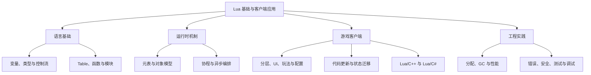

# Lua 基础与游戏客户端应用

## 1. 模块定位

Lua 是一门小巧、动态、可嵌入的脚本语言。它在游戏客户端里经常负责：

- UI、活动、任务、技能等高频变化的业务逻辑；
- 配置与数据驱动；
- 事件编排、状态机和异步流程；
- 开发期调试工具与自动化；
- 在产品和平台规则允许的范围内进行脚本更新或问题修复。

Lua 的优势不是"比 C++ 更快"，而是**改动快、嵌入容易、运行时可组合**。可以把游戏引擎想成一艘动力强劲但转向较慢的大船，Lua 像甲板上的调度员：不用亲自推动螺旋桨，却能快速决定下一批货物往哪里走。让调度员下海推船，通常就是架构开始进水的时候。

> 本系列以 Lua 5.4 为主要语义基线，同时标出游戏项目常见的 Lua 5.1、LuaJIT 与宿主绑定差异。实际项目必须先确认所用虚拟机版本。

## 2. 知识地图



## 3. 阅读导航

| 顺序 | 章节 | 主要问题 |
|---|---|---|
| 1 | [Lua 为什么适合游戏客户端](./01-why-lua-in-game-clients.md) | Lua 在引擎里处于哪一层，适合与不适合做什么？ |
| 2 | [基本语法与数据类型](./02-basic-syntax-and-types.md) | 变量、类型、运算符、流程控制和错误处理怎么写？ |
| 3 | [Table、函数、闭包与模块](./03-tables-functions-and-modules.md) | Lua 的"万能积木"如何组织数据和代码？ |
| 4 | [元表与对象模型](./04-metatables-and-object-model.md) | 没有 `class` 关键字，Lua 如何实现方法、继承效果和运算符行为？ |
| 5 | [协程、事件与状态机](./05-coroutines-events-and-state-machines.md) | 如何把跨帧流程写得清楚，又不把协程误认为线程？ |
| 6 | [客户端架构与脚本更新](./06-client-architecture-and-hot-update.md) | Lua 模块怎样分层，更新代码为何不等于迁移状态？ |
| 7 | [原生交互与对象生命周期](./07-native-interop-and-lifecycle.md) | Lua/C++、Lua/C# 调用链、绑定方式和跨语言引用如何管理？ |
| 8 | [性能、GC 与工程实践](./08-performance-gc-and-engineering.md) | 卡顿从哪里来，如何测量、优化、测试、调试与限制脚本能力？ |
| 9 | [面试复习与自测](./09-interview-review.md) | 如何在短时间内讲清原理、权衡与常见陷阱？ |

配套程序见 [Lua 游戏客户端基础示例](../../examples/lua/game-client-basics/README.md)。

## 4. 版本地图

游戏项目中的"Lua"未必是同一个运行时：

| 运行时 | 常见特点 | 需要注意 |
|---|---|---|
| Lua 5.1 | 老项目和旧绑定常见 | 没有 `goto`、`//`、原生位运算、`utf8` 标准库；环境使用 `setfenv` |
| LuaJIT 2.x | 兼容 Lua 5.1 为主，带 JIT 与 FFI | JIT 不是所有代码都能编译；GC、FFI、平台支持与标准 Lua 不同 |
| Lua 5.2 | 引入 `_ENV`、位运算库等变化 | `module`、`setfenv` 等 5.1 写法发生变化 |
| Lua 5.3 | number 区分整数/浮点子类型，加入 `//` 和位运算 | 数值和 C API 兼容假设需要重新检查 |
| Lua 5.4 | 增加 `<const>`、`<close>`、GC 模式等能力 | 新语法不能直接复制到 5.1/LuaJIT 项目 |

框架名称也不等于虚拟机版本。例如 Unity 项目可能使用 xLua、ToLua、SLua 或自研绑定，Unreal/自研引擎也可能使用不同 VM、代码生成器和生命周期策略。遇到版本问题时，优先查项目实际使用的 Lua 头文件、构建配置和绑定文档。

## 5. 推荐阅读路线

### 5.1 第一次学习

```text
定位与运行时
    -> 基本语法
    -> Table / 函数 / 模块
    -> 元表与对象模型
    -> 协程与常用结构
    -> 客户端架构
    -> 原生交互
    -> 性能与工程实践
```

边读边运行配套示例。Lua 语法不多，真正的难点在于：

- `nil`、真值和多返回值的边界；
- Table 的序列/哈希语义；
- 闭包捕获与对象生命周期；
- 元表查找链；
- 协程调度责任；
- 跨语言对象的所有权；
- 热更新中的旧状态；
- 每帧分配与 GC 抖动。

### 5.2 面试前快速复习

1. 先读本页版本表和 [面试复习](./09-interview-review.md)。
2. 再重点阅读 [Table/闭包](./03-tables-functions-and-modules.md)、[元表](./04-metatables-and-object-model.md)、[原生交互](./07-native-interop-and-lifecycle.md)。
3. 最后用 [性能与 GC](./08-performance-gc-and-engineering.md) 补齐工程权衡。

## 6. 学完应达到什么程度

完成本模块后，应该能够：

1. 解释 Lua VM 如何嵌入游戏客户端，以及脚本层和原生层的合理边界。
2. 熟练使用局部变量、Table、函数、闭包、模块、元表和协程。
3. 说明 `pairs`/`ipairs`、`#`、多返回值、冒号调用等常见边界。
4. 设计一个最小的 Lua UI/玩法模块生命周期。
5. 解释一次 Lua 调用 C++/C# 的完整链路及其成本。
6. 区分代码替换、对象升级、状态迁移和资源更新。
7. 定位 Lua 内存增长、GC 抖动、跨语言调用过密等问题。
8. 知道何时不该用 Lua，并能给出数据导向或原生实现的替代方案。

[下一章：Lua 为什么适合游戏客户端](./01-why-lua-in-game-clients.md)
