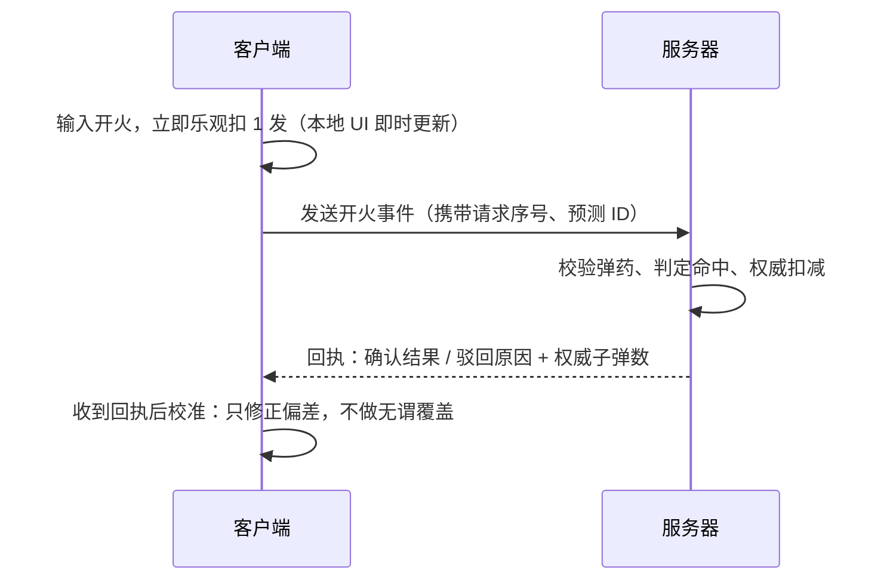

# 腾讯游戏客户端二面参考答案（面试者：？）

## 1. 使用说明

本文按[二面原题](./02.md)的顺序回答。

这轮重点是实习深度、项目复盘和网络同步设计。回答时建议：

```text
先给结论
-> 解释关键机制
-> 补充常见追问
-> 设计题给出流程、时序和取舍
```

网络题默认 C++/虚幻语境，但方案本身与引擎无关。

## 2. 实习拷打

### 2.1 实习项目是组里给的还是自己定的

回答要点：如实说明来源，但突出自己**把任务做深**的部分。

```text
无论来源是导师分配还是自主立项，重点不是"谁定的"，而是：
1. 我如何把需求澄清成技术目标；
2. 调研过程中做了什么验证和选型；
3. 是否主动扩展了范围（稳定性、性能、可维护性）。
```

### 2.2 实习过程中最大的困难

按"现象 -> 定位 -> 根因 -> 修复 -> 验证"的结构讲，突出排查手段（日志、抓包、
断点、反汇编、小实验、最小复现），避免只给结论。可选展开方向：

```text
- 逆向方向：未知二进制协议/结构，通过内存 dump + 交叉引用 + 行为对比破译。
- 性能方向：profile 定位热点后结合反汇编确认根因。
- 兼容方向：不同版本引擎/平台的行为差异。
```

### 2.3 有没有深入调查过逆向中遇到的未知数据结构/程序结构

答题框架：

```text
1. 现象：什么功能行为异常或需要解析未知数据。
2. 假设：根据上下文猜测它是什么（表？树？协议包？虚表？）。
3. 验证：
   - 内存观察：断点看内存布局，dump 后分析字段偏移与关联。
   - 交叉引用：找到谁在读写这些字段，推断类型和生命周期。
   - 行为对比：构造多组输入，观察输出变化，归纳结构字段含义。
4. 结论：还原出结构定义或调用关系，并说明如何用最小程序验证。
```

举例说明可以这样讲：

```text
遇到一段连续的指针数组 + 偏移表结构，怀疑是虚表相关或跳转表。做法是：
定位写入点看构造时机、dump 前后对比字段变化、再用调用点反推槽位语义，
最终确认它是某模块的函数分发表并还原了关键几个槽位。
```

核心是证明自己会"用证据收敛猜测"，而不是靠运气蒙。

## 3. 项目设计

### 3.1 讲一个成长最大的项目，为什么，整合了哪些知识点

回答结构：

```text
1. 选一个你最有掌控感的项目（不一定是规模最大的）。
2. 一句话讲清目标和你的职责边界。
3. 成长点：踩过什么坑、纠正过什么错误认知、形成了什么方法论。
4. 知识点清单：把用到的知识串成体系，而不是罗列名词。
```

示例串法：

```text
一个客户端框架/工具项目可以串起：
- 语言层面：C++ 对象模型、虚表、内存管理（逆向相关）。
- 引擎层面：UObject 反射与序列化、GC 机制、蓝图 VM（虚幻相关）。
- 工程层面：模块划分、接口抽象、构建与发布。
- 协作层面：需求拆解、与策划/美术的接口约定。
```

"为什么成长最大"建议落在**认知升级**上：比如从"会用引擎"到"能看懂引擎内部
机制"，或者学会"先验证假设再动手"。

## 4. 八股：FPS 开火子弹数同步

### 4.1 题目拆解

约束条件：

```text
1. 客户端开火要求即时反馈（手感不能等服务器回包）。
2. 网络抖动/延迟会导致客户端与服务器子弹数不一致。
3. 若简单用服务器权威值覆盖客户端，UI 会在开火途中跳变。
4. 要求：同步时机可控 + 判定正确（服务器权威 + 事件触发同步）。
```

核心矛盾：**即时手感要求客户端先扣子弹，权威判定要求服务器说了算**。解决
思路是客户端乐观扣减 + 服务器权威判定 + 事件驱动的状态回滚/校准，而不是
每帧拉取子弹数。

### 4.2 总体方案



关键点：

```text
1. 事件触发同步：只在"开火事件"发生时同步，而不是按帧或按需轮询。
   平时网络静默，抖动也不会制造多余流量。
2. 服务器权威：扣子弹数的唯一事实在服务器。客户端扣减只是预测。
3. 客户端不因延迟等待：输入瞬间本地立即更新，命中表现可以预测。
4. 校准策略：回执到达后比对"权威值 vs 客户端当前值"，只在真正不一致时
   平滑修正；一致时什么都不做，杜绝抖动跳变。
```

### 4.3 为什么简单覆盖会跳变

```text
t=0 客户端有 10 发，开火 -> 本地显示 9
t=0.2s 服务器才处理，期间客户端又开火 -> 本地显示 8
t=0.3s 第一个回执到达，携带服务器值 9
       -> 若直接覆盖，UI 从 8 跳到 9，再等第二个回执跳回 8
```

跳变的本质：**用服务器历史快照直接覆盖客户端的最新预测状态**。修正方式不是
"别覆盖"，而是"对齐后再覆盖"，见下文。

### 4.4 校准算法

客户端维护两个值：

```text
localAmmo：客户端本地显示的子弹数（乐观扣减后）
confirmedAmmo：已被服务器回执确认的子弹数
```

服务器回执至少携带：

```text
事件序列号（服务器已处理的最后序号）
服务器权威子弹数
事件处理结果（成功/弹药不足/非法开火）
```

客户端收到回执后：

```text
1. 找到本地所有"未被确认"的开火事件，其中服务器已经判定的部分作废。
2. 服务器已驳回的事件，把对应的乐观扣减加回来（补弹）。
3. 以服务器权威值为基准，加上"服务器尚未处理的本端后续预测扣减"，
   得到新的 localAmmo。
```

用公式表达：

```text
localAmmo = serverAmmo - pendingShots

pendingShots：本地已发出但服务器尚未确认、且预计会成功的开火数
```

这样处理：

```text
- 网络正常时，回执只是把 pending 减小，数字不变 -> UI 不跳。
- 出现偏差时（如服务器驳回了一发），数字变化只反映真实纠正量，
  且发生在事件边界上，符合"时机可控"。
- 任何时刻 final 判定都以服务器为准，符合"判定正确"。
```

### 4.5 时机可控的含义与实现

"同步时机可控"意味着：**同步只发生在定义好的事件点**。

```text
触发同步的事件：
1. 开火（上行）：客户端立即发开火事件，同时本地预测。
2. 服务器回执（下行）：确认、驳回或状态异常。
3. 显式校准请求：客户端检测到长时间无回执、重连、切地图时请求一次快照。
4. 换弹/切枪等改变弹药语义的操作。

不做的：
- 不做每帧轮询同步。
- 不用服务器值定时覆盖客户端。
```

这样子弹数的变化只有"我开火"和"服务器回执"两个来源，行为可解释、可测试。

### 4.6 边缘场景

```text
1. 连发与乱序：
   事件带单调递增序号，客户端按序号关联回执；
   服务器按序号处理，重复包幂等（同一序号只扣一次）。

2. 弹药不足：
   客户端预测扣到 0 后不能继续开火；服务器驳回的"非法开火"回执
   到达后，客户端按驳回逻辑修正（回退预测），并给出卡壳/空仓表现。

3. 断线重连：
   重连后本地预测全部失效，以服务器快照重建本地状态，
   并清空 pendingShots。这是允许"跳变"的合法时机（状态重建）。

4. 延迟高但没丢包：
   回执只是延迟，客户端继续用预测值游玩，不影响手感。

5. 作弊防护：
   客户端扣减只影响表现，服务器校验开火频率、弹药数和服务端状态，
   预测永远不会让服务器"相信"非法值。
```

### 4.7 实现骨架

```cpp
// 客户端预测状态
struct ClientWeaponState {
    int localAmmo = 0;       // UI 显示值
    int confirmedAmmo = 0;   // 服务器已确认值
    uint64_t nextShotSeq = 1;
    std::unordered_map<uint64_t, bool> pending; // seq -> 是否仍算未确认
};

void OnFirePressed(ClientWeaponState& state) {
    if (state.localAmmo <= 0) {
        return;
    }

    --state.localAmmo;                       // 乐观扣减，UI 即时更新
    uint64_t seq = state.nextShotSeq++;
    state.pending[seq] = true;

    SendShotEvent(seq);                      // 上行事件
}

void OnShotAck(ClientWeaponState& state, uint64_t ackedSeq,
               int serverAmmo, bool approved) {
    if (state.pending.erase(ackedSeq) == 0) {
        return;                              // 重复回执，幂等忽略
    }

    if (!approved) {
        ++state.localAmmo;                   // 驳回补回
    }

    // 以服务器权威值 + 剩余预测修正本地值
    state.confirmedAmmo = serverAmmo;
    int pendingShots = static_cast<int>(state.pending.size());
    state.localAmmo = state.confirmedAmmo - pendingShots;
}
```

注意：若 `pending` 中可能存在"服务器将驳回"的事件，上述简化版把它们都当作
成功。工程上应等每个事件回执后再修正，或让服务器在回执里带上"该序号之后
服务器视角的弹药基线"，客户端据此重建。要点是**修正发生在回执事件点，且
以服务器值为基准**。

### 4.8 面试精简回答

```text
我会做"客户端预测 + 服务器权威 + 事件触发校准"：

开火瞬间客户端本地立即扣 1 发保证手感，同时携带递增序号把开火事件发给
服务器；服务器做权威弹药校验与扣减，并按序回执。客户端不轮询、不按帧
同步，只在收到回执时做一次校准：以服务器权威值为基准，加上尚未回执的
本地预测数重算本地值，被驳回的事件补回弹药。这样同步时机完全由"开火"
和"回执"两个事件驱动，抖动丢包只影响回执到达时间，不会造成 UI 跳变；
重连或状态重建时才整体回退，最终判定始终以服务器为准。
```

## 5. 虚幻

### 5.1 蓝图是怎么序列化/反序列化并存储的

结论：蓝图序列化的底层是 **UObject 的序列化机制**，核心信息分两半——节点图
和编译产物。

存储形式：

```text
1. UBlueprint 继承自 UObject，随 UAsset 二进制（.uasset）保存。
2. 节点图（EdGraph）以图对象、节点、引脚、连线的形式保存编辑数据，
   序列化走 UObject 的 FArchive 二进制流（标签 + 属性 + 对象引用）。
3. 编译产物：
   - 编译中间码：节点被打平成指令流（字节码）。
   - UClass 与 FStructProperty：蓝图类编译后生成/合并出 UClass，
     蓝图里声明的变量成为对应的 UProperty（FProperty）。
   - 这些 UObject 也一并序列化到资产中，运行时不需要重新"编译蓝图"。
4. 资源引用：引用的贴图、网格等通过软/硬引用路径序列化，加载时还原。
```

FArchive 工作方式：

```text
- 写入：遍历属性，按类型写入数据；对象引用写入"包名 + 对象名/导入表"。
- 读取：根据标签恢复属性与引用，必要时触发依赖资产加载。
- 版本化：ArVer（存档版本）和自定义版本号保证向前兼容。
```

反序列化流程：

```text
加载 .uasset
-> 创建对象实例
-> FArchive 读出属性
-> 还原对象图（对象间引用、编辑节点图）
-> PostLoad 中做修复/重链接（蓝图还会做版本升级、节点编译状态校验）
```

追问点：

- 蓝图默认不需要"解释源码"，因为编译时已经生成字节码和 UClass，运行期直接
  执行字节码或反射调用。
- 文本导出格式（Copy For Diff 等）是编辑器侧的表现，资产本体是二进制。

### 5.2 蓝图运行时的虚拟机（VM）

结论：蓝图编译后生成**字节码（bytecode）**，运行时由虚幻的蓝图虚拟机逐条
解释执行。

要点：

```text
1. 编译：节点图 -> FKismetCompilerContext -> 生成表达式节点（FBPTerminal）
   并最终编码成字节码流，存入 UFunction 的 Script 数组。
2. 字节码：EExprToken 枚举定义的指令（跳转、属性读写、函数调用、
   委托绑定、数组操作等）。
3. 执行入口：UObject::ProcessEvent / UFunction::Invoke 对给定 UFunction
   的 Script 字节码启动 FFrame（栈帧、代码指针、局部变量、流出值）。
4. 解释循环：ProcessLocalScriptFunction / 对应的解释器按 token 逐条
   分发执行，变量从 FProperty 地址空间读写。
5. 函数调用：普通 C++ 函数走反射/原生绑定（EX_FinalFunction），蓝图函数
   递归进入新的 FFrame；接口调用有专门的 token。
```

运行时协作：

```text
- 蓝图父类 + C++ 子类、C++ 父类 + 蓝图子类都通过 UFunction 体系统一调用。
- UFunction 分 native（C++ 实现，ProcessInternal 绑定）和蓝图脚本函数。
- 纯节点在编译期尽量内联（EX_ 指令直接串联），减少调用开销。
```

追问点：

- 蓝图字节码是解释执行，性能比 C++ 低一个量级，热点逻辑应下沉到 C++。
- Nativized Blueprint 把部分蓝图生成 C++ 代码（旧方案）；UE5 中已淡化，
  官方倾向直接在虚拟机中优化（如 Path Trace 式常量折叠）或保持蓝图薄层。

### 5.3 虚幻的 GC

结论：虚幻 GC 是**标记-清扫（Mark-Sweep）**算法，根集是 `UObject` 引用图
的根（`GUObjectArray` 中的根对象、各对象的强引用属性），由 UProperty 体系
驱动可达性扫描。

机制拆解：

```text
1. 引用追踪：
   - 所有 UObject 注册在全局对象数组 GUObjectArray 中。
   - 每个 UObject 类的 UProperty 描述了哪些字段是 UObject 指针，
     通过反射得知引用关系，不需要开发者手动写遍历代码。

2. 标记阶段：
   - 从根集出发，通过 UProperty 找到被引用的对象，置 InternalFlags 中的
     标记位（并维护一个对象列表加快清尾阶段）。
   - 根对象（如 RootSet、在 Level 中被引用的 Actor 等）保证不被回收。

3. 清扫阶段：
   - 未被标记且没有 KeepFlags 的对象判定不可达，进入清理：
     调用 BeginDestroy / FinishDestroy，释放资源，移出全局数组。
   - 清扫可以分帧进行（Incremental Purge），避免单帧卡顿。

4. 时机：
   - 由时间/内存预算驱动，通常随 Tick 触发 CollectGarbage；
   - 低内存告警、关卡切换、垃圾超过阈值时也会触发。
```

引用规则要点：

```cpp
UPROPERTY() UObject* Ptr;            // 强引用：GC 可见，防回收
TWeakObjectPtr<UObject> Weak;        // 弱引用：不阻止回收
TSoftObjectPtr<T> / FSoftObjectPath; // 软引用：资源路径，按需加载
TStrongObjectPtr<T>;                 // 强引用：非 UPROPERTY 时手动持有
```

常见坑：

```text
1. 裸 UObject* 成员没加 UPROPERTY：GC 看不见引用，对象可能被误回收。
2. 原生容器 TArray<T*> 同样必须 UPROPERTY 包裹才被追踪。
3. 异步回调里的裸指针要先 IsValid 再使用。
4. 局部变量的 UObject* 在函数栈上：GC 通过 TStrongObjectPtr 或
   FGCObjectScopeGuard 保护当前帧使用中的对象。
```

## 6. 闲聊

### 6.1 大学课程与进入游戏行业的动机

如实回答即可，建议落点：

```text
课程：图形学、线性代数、数据结构、操作系统、计算机网络、C++，
再补一句哪门课让你真正动手做过东西（渲染器、小游戏、引擎插件）。

动机：不要只说"爱玩游戏"，落到"喜欢拆解游戏背后的技术"或具体经历，
例如自己做过 demo、读过引擎源码、参加过 GameJam、逆向研究过某游戏
客户端。这样动机和前面的技术回答互相印证。
```

## 7. 相关复习

- [C++ 专题](../../../knowledge/cpp/README.md)
- [UObject 反射、GC 与生命周期](../../../knowledge/interview-roadmap/unreal-engine/02-uobject-reflection-gc-and-lifecycle.md)
- [蓝图与 C++ 协作](../../../knowledge/interview-roadmap/unreal-engine/04-blueprints-and-cpp-collaboration.md)
- [多人游戏架构与拓扑](../../../knowledge/interview-roadmap/multiplayer-game/01-architecture-and-topology-quick-notes.md)
- [时间、延迟与补偿](../../../knowledge/interview-roadmap/multiplayer-game/04-time-latency-and-compensation-quick-notes.md)
