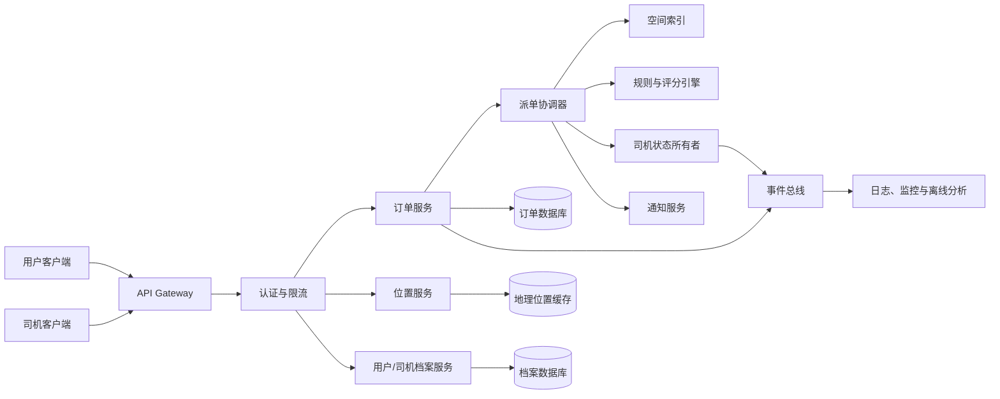

# 2026 腾讯游戏客户端二面参考答案

## 1. 使用说明

本文按[二面原题](./02.md)的顺序回答。

这轮重点是系统设计和实际工程判断。回答时不要一开始就罗列中间件或设计模式，
建议使用下面的顺序：

```text
先确认需求和一致性边界
-> 拆分核心数据与服务
-> 给出主流程
-> 解释性能、并发和容灾
-> 最后回答扩展性与取舍
```

系统设计题没有唯一答案。面试中需要主动声明假设，并随着面试官补充的条件调整
方案。下文给出的是适用于“数万级司机和用户、多个城市或区域、多集群部署”的
一种参考设计。

## 2. 项目设计：低延迟分布式派单平台

### 2.1 先确认目标和边界

可以先向面试官确认：

- 用户和司机是数万在线，还是数万总注册量？
- 派单范围按城市、行政区还是跨城？
- 是平台直接派单，还是向多个司机发抢单邀请？
- 用户更关心直线距离、预计到达时间，还是价格？
- 一个司机同一时间是否只能承接一个进行中的订单？
- 拉客、拉货是否共享司机和车辆，资格限制是否不同？
- 对司机位置允许多大延迟，对接单状态要求多强的一致性？

如果没有更多条件，可以采用下面的默认约束：

```text
司机位置：高频更新，允许秒级最终一致
司机是否空闲：低频更新，但必须防止重复占用
订单归属：必须幂等、可审计，不能同时绑定两个司机
派单延迟：正常情况下数百毫秒内产生候选并发出邀请
部署方式：按城市或地理区域分片，每个分片有明确写入所有者
```

核心原则是：**不要对所有数据使用同一种一致性策略**。位置允许短暂不一致，
司机占用和订单归属则需要服务端权威和原子条件更新。

### 2.2 总体架构



主要职责：

- **API Gateway**：认证、限流、路由、请求 ID、幂等 Key。
- **位置服务**：接收司机位置，维护带时间戳和 TTL 的最新位置。
- **档案服务**：维护司机、车辆、用户和资格等低频数据。
- **订单服务**：维护订单状态机，是订单事实的权威来源。
- **派单协调器**：组织候选召回、规则过滤、评分、预占和通知。
- **空间索引**：按地理单元快速召回附近司机。
- **规则与评分引擎**：执行硬性资格过滤和软性排序。
- **司机状态所有者**：对司机空闲、预占、服务中等状态执行原子转移。
- **事件总线**：异步处理审计、统计、通知补偿和数据分析，不进入关键同步链路。

不建议每次派单都跨所有集群扫描司机。更合理的方式是按城市或地理区域分片：

```text
请求位置
-> 定位所属区域
-> 路由到该区域的派单分片
-> 只查询本区域和必要的相邻边界单元
```

每个司机在任意时刻只有一个状态写入所有者。其它副本可以提供查询或容灾，但不能
同时接受该司机的接单写入，这样可以把大多数“全局分布式锁”问题降为分片内原子
状态转移。

### 2.3 数据存储与分片

可以按数据特征选择存储，而不是把所有数据塞进一个数据库：

| 数据 | 特征 | 参考存储方式 |
|---|---|---|
| 司机实时位置 | 高频写、短生命周期、范围查询 | Redis GEO、H3/S2 单元索引或专用内存索引 |
| 司机与车辆档案 | 低频写、按 ID 查询 | 关系型数据库或文档数据库 |
| 司机权威状态 | 需要原子条件更新 | 关系型数据库、分片状态服务或单线程 Actor |
| 订单 | 状态机、审计、幂等 | 关系型数据库 |
| 评分特征 | 高频读、可异步更新 | 特征缓存 |
| 事件和日志 | 追加写、异步消费 | Kafka 等事件总线和日志系统 |

司机位置记录至少带：

```text
driver_id
longitude / latitude
reported_at
location_sequence
accuracy
speed / heading（可选）
region_id / geo_cell
```

位置更新使用单调递增序列号或时间版本，拒绝晚到的旧位置。超过 TTL 没有更新的
司机即使状态还是 `idle`，也不能进入候选集。

多集群部署可以使用：

- 城市或区域作为一级分片，减少跨区域协调。
- 区域边界复制相邻若干地理单元，只用于候选查询。
- 司机状态写入仍回到司机所属分片，不在边界副本上直接修改。
- 分片内主备或共识保证故障转移，不做每次派单的全球同步。
- 热点区域继续按 H3/S2 单元、行政区或一致性哈希拆分。

### 2.4 一次派单的完整流程

参考流程：

1. 用户提交订单，携带客户端生成的 `idempotency_key`。
2. 订单服务校验参数并创建 `searching` 状态订单。
3. 派单协调器根据起点所在区域找到对应空间分片。
4. 以起点为中心，从近到远扩展地理单元，召回一批候选司机。
5. 执行硬性过滤：在线、空闲、位置新鲜、运输能力匹配、资格有效。
6. 批量获取 ETA、评分、接单率、取消率、当前负载等特征。
7. 对候选评分，保留 Top K。
8. 对首选司机执行带版本和租约的原子预占。
9. 预占成功后发送派单邀请；失败则尝试下一名候选。
10. 司机确认后，原子绑定 `order_id <-> driver_id` 并进入服务状态。
11. 超时、拒绝或客户端断线时释放预占，继续下一轮候选。
12. 通过事务 Outbox 发送订单已分配事件，通知用户和司机。

为什么要先预占再通知：

```text
错误顺序：
先给多个司机发送“已分配”
-> 再尝试写状态
-> 容易出现多个客户端都认为接单成功

正确顺序：
服务端先原子获得短租约
-> 再向获得租约的司机发送邀请
-> 最终确认后绑定订单
```

为了降低长尾延迟，可以向少量候选并行发送“报价/邀请”，但“已分配”结果仍必须
由服务端原子竞争决定。邀请和最终所有权不是一回事。

### 2.5 司机数据结构如何设计

不要把高频位置、强一致状态和低频档案混成一条大记录。可以拆成：

```cpp
using DriverId = std::uint64_t;
using OrderId = std::uint64_t;

enum class DriverAvailability {
    Offline,
    Idle,
    Reserved,
    Serving,
    Suspended
};

enum class ServiceType : std::uint32_t {
    Passenger = 1u << 0,
    Cargo = 1u << 1
};

struct DriverProfile {
    DriverId id = 0;
    std::string displayName;
    std::string phone;
    double rating = 0.0;
    std::uint32_t completedOrders = 0;
    std::uint32_t serviceMask = 0;
    std::vector<std::string> qualificationIds;
    std::string vehicleId;
};

struct DriverLocation {
    DriverId driverId = 0;
    double longitude = 0.0;
    double latitude = 0.0;
    std::int64_t reportedAtMs = 0;
    std::uint64_t sequence = 0;
    std::string geoCell;
};

struct DriverRuntimeState {
    DriverId driverId = 0;
    DriverAvailability availability = DriverAvailability::Offline;
    std::optional<OrderId> activeOrderId;
    std::optional<OrderId> reservedOrderId;
    std::int64_t reservationExpiresAtMs = 0;
    std::uint64_t version = 0;
    std::uint64_t fencingToken = 0;
};
```

实际工程还需要：

- 车辆类型、载客数、载重、体积、牌照和保险。
- 司机所在区域、在线会话和最后心跳。
- 接单率、取消率、最近连续工作时长。
- 风控标记和临时禁用原因。
- 当前任务阶段和预计空闲时间。

拆分后的好处：

- 位置更新不会反复改写整份司机档案。
- 派单热路径可以只读取必要字段。
- 权威状态记录足够小，便于原子更新。
- 档案、位置和状态可以分别采用适合的一致性和存储策略。

### 2.6 用户数据结构如何设计

用户数据同样分为档案、位置和当前订单上下文：

```cpp
using UserId = std::uint64_t;

struct UserProfile {
    UserId id = 0;
    std::string displayName;
    std::string phone;
    double rating = 0.0;
    std::vector<std::string> paymentMethodIds;
    std::vector<std::string> riskTags;
};

struct GeoPoint {
    double longitude = 0.0;
    double latitude = 0.0;
};

struct OrderRequest {
    OrderId id = 0;
    UserId userId = 0;
    ServiceType serviceType = ServiceType::Passenger;
    GeoPoint pickup;
    GeoPoint destination;
    std::int64_t requestedAtMs = 0;
    std::uint32_t passengerCount = 0;
    double cargoWeightKg = 0.0;
    double cargoVolumeM3 = 0.0;
    std::vector<std::string> requiredCapabilities;
    std::string idempotencyKey;
};
```

用户结构和订单请求需要分开。目的地、乘客数量、货物信息属于某次订单，不应覆盖
用户长期档案。

还应避免直接信任客户端上报：

- 服务端重新校验坐标和服务区域。
- 价格由服务端计算，客户端只提交选择。
- 支付状态以可信服务端回调为准。
- 同一个用户是否允许并行创建多单由订单状态机决定。

### 2.7 如何兼容拉人、拉货等不同运输形式

不建议不断派生 `PassengerDriver`、`CargoDriver`、`PassengerAndCargoDriver`
等类型。运输形式会组合，资格和规则也会变化，继承树很快失控。

更适合使用“能力 + 产品规则”的组合模型：

```text
Driver
  -> Vehicle
  -> Capabilities
  -> Qualifications
  -> EnabledServiceOfferings

Order
  -> ServiceType
  -> Requirements
```

例如：

```text
司机能力：
passenger
cargo
wheelchair_accessible
refrigerated
hazardous_material_certificate

订单要求：
service_type = cargo
min_load_kg = 800
required_capabilities = [refrigerated]
```

候选过滤条件：

```text
司机启用该产品
AND 车辆容量满足要求
AND 必要资格未过期
AND 当前区域允许该业务
```

新增运输形式时：

1. 注册新的 `service_type`。
2. 定义订单字段和校验器。
3. 配置必要能力和资格。
4. 注册对应过滤和评分策略。
5. 灰度开启，不修改核心派单流程。

如果不同业务有完全不同的订单生命周期，可以保留共享的候选召回和预占框架，
再让各产品提供自己的状态机和定价、评分策略。

### 2.8 不同司机状态和可扩展规则如何设计

先用显式状态机定义合法转移：

```text
Offline -> Idle
Idle -> Reserved
Reserved -> Idle       超时、拒绝、取消
Reserved -> Serving    接单成功
Serving -> Idle        订单完成
任意状态 -> Suspended  风控或管理员禁用
```

每次转移需要定义：

- 允许的来源状态。
- 触发事件和操作者。
- 进入动作、退出动作。
- 超时和补偿。
- 幂等规则。
- 持久化版本和审计事件。

设计模式可以这样使用：

- **State**：封装状态允许的行为，但持久化状态仍使用稳定枚举。
- **Strategy**：不同业务、城市或时段使用不同评分策略。
- **Specification**：把资格条件组合成可测试的布尔规则。
- **Chain of Responsibility**：按顺序执行过滤器并记录拒绝原因。
- **Factory/Registry**：按 `service_type` 查找规则集合，支持注册新业务。

示意接口：

```cpp
struct DispatchContext {
    const OrderRequest& order;
    std::int64_t nowMs = 0;
};

class DriverRule {
public:
    virtual ~DriverRule() = default;
    virtual bool accepts(
        const DispatchContext& context,
        const DriverProfile& profile,
        const DriverRuntimeState& state
    ) const = 0;
};

class DriverScorer {
public:
    virtual ~DriverScorer() = default;
    virtual double score(
        const DispatchContext& context,
        const DriverProfile& profile,
        const DriverLocation& location
    ) const = 0;
};
```

不要把所有规则都做成运行时虚调用并逐司机访问远程服务。派单热路径应批量获取
特征，先执行廉价过滤，再执行 ETA 等昂贵计算。

### 2.9 如何高效筛选附近司机

不能遍历所有司机计算距离，复杂度会随在线司机数量线性增长。常见方案是先做空间
粗筛，再算精确距离。

可选空间索引：

- **Geohash**：实现简单，可用前缀表达区域，但边界处理要查询相邻格。
- **S2**：把球面划分为层次单元，适合全球地理数据。
- **H3**：六边形分层网格，邻域扩展自然。
- **Redis GEO**：适合中等规模的附近查询和快速工程落地。
- **区域内存索引**：派单服务自己维护网格到司机集合的映射，延迟更低。

查询流程：

```text
用户起点
-> 转换为地理单元 ID
-> 查询当前单元和相邻环
-> 候选不足则逐圈扩展
-> 排除位置过期和非空闲司机
-> 用 Haversine 距离做精确粗排
-> 对较小 Top N 调用路网 ETA
```

Haversine 适合计算球面两点直线距离，但“直线近”不一定“开车快”。河流、高架、
单行道和拥堵都会影响到达时间，所以最终排序应使用路网 ETA，不能只看经纬度。

位置索引还需要处理：

- 司机移动时从旧单元移除并加入新单元。
- 更新带版本，防止网络乱序把司机移回旧位置。
- 位置超过 TTL 后自动失效。
- 边界查询包含相邻单元。
- 热点单元分片，避免市中心成为单点热点。

### 2.10 如何从附近司机中选出最优司机

建议采用“两阶段或三阶段排序”：

1. **硬性过滤**：不满足就直接排除。
2. **轻量评分**：使用缓存特征筛到几十名。
3. **精细评分**：对 Top N 计算路网 ETA、动态价格和更复杂模型。

硬性过滤包括：

```text
在线且状态为空闲
位置未过期
运输能力和车辆容量满足
资格有效
未被风控禁用
预计可到达
司机和用户没有业务黑名单关系
```

软性评分可以表示为：

```text
score =
    - w1 * normalized_eta
    + w2 * normalized_rating
    + w3 * acceptance_probability
    - w4 * cancellation_probability
    - w5 * idle_duration_penalty
    + w6 * fairness_bonus
    + w7 * destination_match
```

其中各特征先归一化，避免“评分 4.9”和“ETA 600 秒”直接相加。权重按城市、
业务、时段和实验版本配置，并记录每次派单使用的规则版本，方便复盘。

“最优”不等于只选距离最近：

- 只看距离会反复偏向热点中心司机，公平性差。
- 只看评分会让高分司机越来越容易获得订单。
- 只看接单率可能鼓励司机选择性接单。
- 需要同时考虑用户等待、司机收益、公平、取消风险和平台效率。

工程实现可以：

- 对轻量分数使用大小为 K 的小顶堆，复杂度约为 `O(n log K)`。
- 批量请求 ETA，避免每个司机一次 RPC。
- 对特征设置版本和缺失值兜底。
- 使用稳定的 tie-breaker，例如 `driver_id` 哈希，保证结果可复现。
- 评分服务超时时退化为“直线距离 + 评分”的本地规则。

### 2.11 如何避免司机同时接两单

正确性不能依赖客户端按钮变灰，也不能只靠消息到达顺序。最终决定必须在服务端
对司机状态执行原子条件更新。

关系型数据库可以用条件更新：

```sql
UPDATE driver_runtime_state
SET
    availability = 'reserved',
    reserved_order_id = :order_id,
    reservation_expires_at = :expires_at,
    version = version + 1
WHERE driver_id = :driver_id
  AND availability = 'idle'
  AND version = :expected_version;
```

只有影响行数为 1 的请求获得预占。其它集群即使同时选择了同一个司机，也会因为
状态或版本不匹配而失败。

最终绑定时还应有数据库约束：

```text
一个进行中订单只能有一个 active driver
一个司机只能有一个 active order
同一个 idempotency key 只能创建一个订单
```

可使用：

- 行级锁或带版本的 CAS 条件更新。
- 单分片 Actor：同一个 `driver_id` 的命令串行进入同一 Actor。
- Redis Lua 脚本做短期预占，但订单最终归属仍落到权威存储。
- 租约和 fencing token 防止旧持有者在超时后继续写入。

租约示例：

```text
司机 D 被订单 A 预占，token = 41，5 秒后过期
租约过期后订单 B 获得 token = 42
订单 A 的迟到确认携带 token = 41
服务端发现 token 过旧，拒绝写入
```

不要只说“使用分布式锁”：

- 锁服务也可能超时、分区或发生持有者暂停。
- 锁过期后旧进程可能恢复并继续写。
- 如果最终数据库不校验状态、订单和 fencing token，锁本身不能保证业务正确。

更稳妥的答案是：

```text
通过区域路由让司机状态尽量只有一个写入所有者；
真正竞争发生时使用权威存储的原子条件更新；
用租约、版本和 fencing token 拒绝迟到写；
用幂等 Key、唯一约束和事务 Outbox 保证订单绑定与事件一致。
```

事务 Outbox 用于解决“数据库已绑定司机，但消息未发出”的问题：

```text
同一个本地事务：
1. 更新订单和司机状态
2. 写入待发送事件

后台发送器：
3. 读取 Outbox 并投递
4. 消费者按 event_id 幂等处理
```

### 2.12 失败处理与可观测性

系统设计最后可以主动补充：

- 位置服务不可用时，不使用无限期缓存的旧位置。
- 路网 ETA 超时时降级为球面距离。
- 通知失败时保留预占租约，超时后自动释放。
- 司机客户端重复确认时按 `order_id + driver_id` 幂等返回原结果。
- 用户取消与司机确认竞争时，由订单状态机的原子转移决定唯一结果。
- 区域故障时先停止新写，再把分片所有权转移给备集群。
- 所有规则和模型带版本，支持灰度、回滚和离线回放。

关键指标：

```text
派单总延迟及 P95/P99
空间召回耗时和候选数量
过滤原因分布
预占冲突率
接单率、拒绝率、取消率
司机空驶距离和用户等待时间
位置过期率
跨分片请求比例
重复请求和幂等命中率
```

### 2.13 面试中的精简回答

如果时间有限，可以压缩成：

```text
我会按城市或地理区域分片，司机位置放在带 TTL 的 H3/S2 或 Redis GEO
索引中，司机档案、实时位置和权威状态分开存储。派单先按相邻地理单元召回，
再做资格硬过滤，然后以 ETA、评分、接单率、取消率和公平性做 Top K 排序。

司机接单不是靠客户端或普通消息保证，而是回到司机所属状态分片，对
idle -> reserved 做带版本的原子条件更新。预占带租约和 fencing token，
最终订单与司机绑定还有幂等 Key、唯一约束和事务 Outbox。这样位置可以最终
一致，但司机占用和订单归属保持强一致，也能支持多集群和新运输类型扩展。
```

## 3. 智力题：不均匀蜡烛测量 15 分钟

### 3.1 解法

取两根蜡烛 A 和 B：

1. 同时点燃 A 的两端和 B 的一端。
2. A 从两端同时燃烧，会在 30 分钟后烧完。
3. A 烧完的瞬间，点燃 B 的另一端。
4. 此时 B 还剩 30 分钟的“单端燃烧时间”，两端同时燃烧后会在 15 分钟内烧完。
5. 从点燃 B 另一端到 B 烧完，正好是 15 分钟。

时间线：

```text
t = 0:
    A 两端点燃
    B 一端点燃

t = 30:
    A 烧完
    点燃 B 的另一端

t = 45:
    B 烧完

30 -> 45 恰好 15 分钟
```

### 3.2 为什么质地不均匀不影响结果

不能通过“长度的一半”判断时间，因为一半长度可能燃烧 15 分钟，也可能燃烧
20 分钟。

但题目保证每根蜡烛从一端烧到另一端总共需要 60 分钟。两端同时点燃时，两条
火焰会在某处相遇，消耗的是同一根蜡烛的全部 60 分钟燃烧量，所以总时间必然是
30 分钟，和相遇位置是否在几何中点无关。

B 单端燃烧 30 分钟后，剩余部分从一端继续烧还需要 30 分钟；改为两端同时烧，
剩余时间减半为 15 分钟。

## 4. 先旋转后位移与先位移后旋转是否一致

### 4.1 结论

一般不一致，因为矩阵乘法不满足交换律：

```text
T * R != R * T
```

回答前应声明矩阵和向量约定。下面使用列向量，变换从右向左作用。

设点为 `p`，旋转矩阵为 `R`，平移向量为 `t`。

先旋转后平移：

```text
p1 = T * R * p
   = R * p + t
```

先平移后旋转：

```text
p2 = R * T * p
   = R * (p + t)
   = R * p + R * t
```

两者差异在于：

```text
p1 的平移量是 t
p2 的平移量是 R * t
```

除非 `R * t = t`，否则结果不同。

### 4.2 直观例子

二维点：

```text
p = (1, 0)
平移 t = (1, 0)
绕原点逆时针旋转 90 度
```

先旋转后平移：

```text
(1, 0)
-> 旋转得到 (0, 1)
-> 平移得到 (1, 1)
```

先平移后旋转：

```text
(1, 0)
-> 平移得到 (2, 0)
-> 旋转得到 (0, 2)
```

最终分别是 `(1, 1)` 和 `(0, 2)`。

### 4.3 游戏引擎中的含义

顺序通常对应不同语义：

```text
先局部旋转再世界平移：
物体先改变朝向，再整体移动到世界位置

先平移再绕世界原点旋转：
平移向量也被旋转，物体会绕原点公转
```

常见模型矩阵写成：

```text
M = T * R * S
```

在列向量约定下，点会依次经历缩放、旋转、平移。使用行向量的引擎书写顺序通常
相反，所以面试中不要脱离约定死背乘法顺序。

如果旋转绕的是物体自身轴心而不是原点，需要引入轴心 `c`：

```text
M = T(c) * R * T(-c)
```

特殊情况下两种顺序可能一致，例如：

- 平移为零。
- 旋转为单位旋转。
- 平移方向正好位于旋转轴上，因此 `R * t = t`。
- 只比较某个恰好落在不变子空间中的点。

但一般答案仍然是“不一致”。

## 5. 为什么旋转插值使用四元数而不是欧拉角

### 5.1 欧拉角插值的问题

欧拉角把旋转拆成绕三个轴的角度，但直接对三个角分别线性插值会有这些问题：

1. **万向节锁**

某些姿态下两个旋转轴重合，丢失一个自由度。表示附近的小变化可能导致角度发生
很大的跳变。

2. **表示不唯一和跨周期跳变**

```text
0 度和 360 度表示同一个方向
179 度和 -179 度实际只差 2 度
```

如果直接插值 `179 -> -179`，可能走 358 度长路。

3. **插值路径依赖旋转顺序**

XYZ 和 ZYX 欧拉角不是同一个变换。分别插值三个分量，得到的姿态路径通常不是
旋转空间中的最短路径。

4. **角速度不均匀**

三个角分量匀速变化，不代表物体在三维旋转空间中保持恒定角速度，视觉上可能忽快
忽慢或出现摆动。

### 5.2 四元数的优势

单位四元数使用四个数表示三维旋转：

```text
q = (w, x, y, z)
|q| = 1
```

优势：

- 不会像欧拉角那样发生万向节锁。
- 旋转组合可通过四元数乘法稳定表达。
- 单位四元数位于四维单位球面上，适合做球面线性插值。
- SLERP 可以沿球面大圆的短弧插值，角速度恒定。
- 相比 3x3 旋转矩阵更紧凑，也更容易保持为合法旋转。

需要准确表述：四元数不是“任何情况下都没有问题”。它仍需要归一化，并且
`q` 和 `-q` 表示同一个三维旋转，插值时必须处理这个双重表示。

### 5.3 SLERP

设两个单位四元数为 `q0` 和 `q1`：

```text
cos(theta) = dot(q0, q1)
```

球面线性插值：

```text
slerp(q0, q1, t) =
    sin((1 - t) * theta) / sin(theta) * q0
  + sin(t * theta) / sin(theta) * q1
```

其中 `t` 在 `[0, 1]`。

工程实现要处理：

1. 如果点积小于 0，把 `q1` 取反，选择等价表示中的短弧。
2. 如果两个四元数非常接近，`sin(theta)` 很小，改用归一化线性插值，避免数值
   不稳定。
3. 插值结果重新归一化。

C++ 风格伪代码：

```cpp
Quaternion slerp(Quaternion a, Quaternion b, float t) {
    float cosTheta = dot(a, b);

    if (cosTheta < 0.0f) {
        b = -b;
        cosTheta = -cosTheta;
    }

    if (cosTheta > 0.9995f) {
        return normalize(a * (1.0f - t) + b * t);
    }

    float theta = std::acos(std::clamp(cosTheta, -1.0f, 1.0f));
    float sinTheta = std::sin(theta);

    float wa = std::sin((1.0f - t) * theta) / sinTheta;
    float wb = std::sin(t * theta) / sinTheta;

    return normalize(a * wa + b * wb);
}
```

### 5.4 SLERP、NLERP 和欧拉角插值如何选择

| 方法 | 优点 | 缺点 | 常见用途 |
|---|---|---|---|
| 欧拉角分量插值 | 直观、方便编辑 | 万向节锁、跨周期和路径问题 | UI 参数、受控单轴旋转 |
| NLERP | 便宜、稳定、走短弧后效果自然 | 角速度不严格恒定 | 每帧大量姿态混合 |
| SLERP | 短弧、恒定角速度 | `acos/sin` 成本较高 | 镜头、关键姿态和高质量旋转 |

动画系统中并不一定所有骨骼都逐个使用完整 SLERP。大规模骨骼混合常使用经过
最短弧处理的 NLERP，或者使用引擎优化过的批量插值。选择取决于质量要求和性能
预算。

### 5.5 面试中的精简回答

```text
欧拉角不是旋转空间的线性坐标，分量插值会受到旋转顺序、角度周期和万向节锁
影响，也不能保证走最短路径或保持恒定角速度。单位四元数位于四维单位球面上，
可以用 SLERP 沿短弧做恒角速度插值，组合旋转也更稳定。

实现时还要处理 q 和 -q 表示同一旋转：如果点积小于 0 就翻转一个四元数；
两者很接近时用 NLERP 避免 sin(theta) 过小，并在插值后归一化。
```

## 6. 相关复习

- [系统、网络与数学](../../../knowledge/interview-roadmap/foundations/02-systems-network-and-math.md)
- [坐标空间与 CPU 准备](../../../knowledge/interview-roadmap/rendering/02-coordinate-spaces-and-cpu-preparation.md)
- [多人游戏架构与拓扑](../../../knowledge/interview-roadmap/multiplayer-game/01-architecture-and-topology-quick-notes.md)
- [会话、匹配与状态机](../../../knowledge/interview-roadmap/multiplayer-game/02-session-lobby-and-matchmaking-quick-notes.md)
