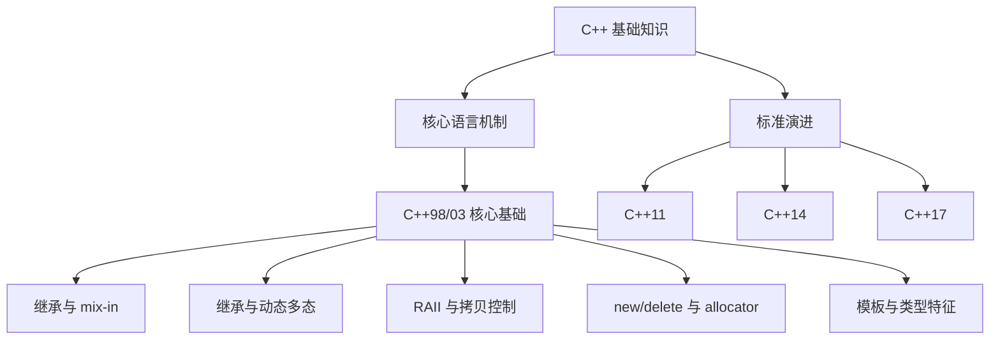

# C++ 基础知识

## 1. 模块定位

本模块不再只按标准年份堆放特性，而是分成两条互相交叉的主线：

- **核心语言机制**回答"它为什么这样工作"：对象模型、继承与多态、资源管理、内存管理和模板。
- **标准演进**回答"从哪个版本开始可以这样写"：C++11、C++14、C++17 的语法与库能力。

把两条线结合起来，才能既看懂底层，又不把现代 C++ 写成"披着新语法的 C with Classes"。

> 适用方向：Unreal、自研引擎、渲染和性能相关岗位；同时为阅读 ECS 与面试知识库提供语言层基础。
>
> 引擎层面的分配策略和运行时架构不在本模块范围，见 [引擎基础](../engine/README.md)。

## 2. 知识层级



## 3. 核心语言机制

| 顺序 | 模块 | 内容 | 建议 |
|---|---|---|---|
| 1 | [C++98/03 核心基础](./01-cpp98.md) | 继承与动态多态、mix-in、RAII、拷贝控制、内存管理、模板 | 建立对象、分派与资源的基本模型 |

多态不只包含虚函数：模板和重载在编译期选择实现，虚函数在运行时通过对象的动态类型分派，`std::variant` 适合封闭类型集合，类型擦除则隐藏具体类型并保留统一接口。复习时应比较决策时机、类型集合、内联机会、对象布局与 ABI 成本。

## 4. 标准演进

| 顺序 | 标准 | 文件 | 重点 |
|---|---|---|---|
| 1 | C++11 | [02-cpp11](./02-cpp11.md) | 统一初始化、Lambda、类型擦除、移动语义、智能指针 |
| 2 | C++14 | [03-cpp14](./03-cpp14.md) | 通用 Lambda、变量模板、移动捕获、`make_unique` |
| 3 | C++17 | [04-cpp17](./04-cpp17.md) | `std::apply`、结构化绑定、`if constexpr`、库组件 |

C++03 是修订性标准，没有新增主要语言特性，因此与 C++98 合并为同一语言基线，不单列章节。

## 5. 推荐阅读路线

### 5.1 第一次系统学习

```text
C++98/03 核心基础
    -> C++11
    -> C++14 / C++17
    -> 回头比较虚函数、模板、类型擦除与 std::variant
```

### 5.2 面试前快速复习

1. 阅读 [C++98/03 核心基础](./01-cpp98.md)，复习继承、动态分派、RAII 与模板。
2. 阅读 [C++11](./02-cpp11.md)，复习 `override`/`final`、Lambda 与 `std::function` 类型擦除。
3. 阅读 [C++17](./04-cpp17.md)，复习 `std::variant`、`std::any` 与 `if constexpr`。
4. 比较虚函数、模板、`std::variant` 和类型擦除的适用边界与成本。

## 6. 掌握标准

完成本模块后，应该能够：

1. 区分对象生命周期、资源所有权和内存分配三个不同问题。
2. 解释静态多态与动态多态分别在何时决定调用目标。
3. 从对象内存布局一路说明一次虚函数调用如何抵达最终函数。
4. 在虚函数、模板、`std::variant`、类型擦除和普通组合之间做有理由的选择。
5. 识别对象切片、非虚析构、构造期虚调用、名称隐藏等典型错误。
6. 说明抽象带来的收益，也能诚实计算它在缓存、内联、ABI 和可维护性上的成本。
