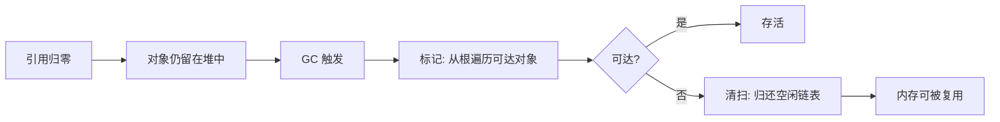

# GC 基础：可达性与标记-清扫

## 1. 为什么需要 GC

手动内存管理（`new`/`delete`）在大型程序里会带来三类问题：

| 问题 | 表现 |
|---|---|
| 悬垂指针 | 提前释放仍被引用的对象，访问即崩溃 |
| 内存泄漏 | 对象不再使用但从未释放，内存持续增长 |
| 双重释放/所有权混乱 | 多处 delete 同一块内存，行为未定义 |

GC 的核心承诺是**自动回收"不再可达"的对象**：程序员只管创建和使用，不用决定何时释放。

## 2. 两类思路：引用计数 vs 追踪

| | 引用计数（如 `shared_ptr`） | 追踪式 GC（本文重点） |
|---|---|---|
| 原理 | 每对象记引用数，归零即释放 | 定期从根遍历引用图，不可达即垃圾 |
| 回收时机 | 引用归零立即释放 | 批量、延迟，GC 运行时才回收 |
| 环引用 | 无法处理（A↔B 互相引用永不归零） | 自动处理（环不可达即整体回收） |
| 代表 | C++ 智能指针、Objective-C ARC | UE、Unity、.NET、Java、Go |

## 3. 追踪式 GC 的四个要素

### 3.1 根集合（Root Set）

GC 不从"所有对象"出发，而从一组被认定为**必然存活**的起点出发：

```
根集合 = 全局/静态变量
       + 各线程栈上的局部变量与寄存器
       + 显式注册的保活句柄（如 UE 的 AddToRoot、.NET 的 GCHandle）
```

被根直接/间接引用的对象存活，其余为垃圾。

### 3.2 可达性分析

从根出发沿引用边遍历整张对象图，遍历到的对象打上标记。图遍历天然处理环引用。

### 3.3 标记（Mark）与清扫（Sweep）

```
Mark:   从根出发 DFS/BFS，标记所有可达对象
Sweep:  遍历堆，未标记的块放回空闲链表
```

### 3.4 分配与触发

- 分配器按需提供内存（空闲链表或 bump 指针）。
- GC 的触发由**分配阈值、时间、内存压力、手动调用**驱动，不保证引用归零立刻回收。

## 4. 标记-清扫的完整流程



## 5. 分代假说

> 大部分对象活不久；活得越久的对象，越可能继续活下去。

据此把堆分成若干代：新对象放年轻代，频繁、廉价地回收；幸存多次的对象晋升老年代，远离高频回收。代价是**写屏障**：老对象引用新对象时必须登记，否则年轻代回收会漏标。

## 6. 压缩与移动对象

- **移动式（压缩）**：回收后把幸存对象紧凑排列，自动整理内存、抗碎片，但必须更新所有指向它们的引用——只有**精确**知道每个引用的 GC 才敢移动对象。
- **非移动式**：对象原地不动，原生代码持有的裸指针永远有效、无需固定（pin），代价是长期运行会碎片化。

## 7. 精确 vs 保守

| | 精确 GC | 保守 GC（Boehm） |
|---|---|---|
| 引用判定依据 | 编译期/运行期元数据精确指出引用字段 | 扫描内存字节流，"像指针的值就是指针" |
| 假指针 | 不存在 | 存在：数字被误认为引用，对象幽灵存活 |
| 误回收 | 理论上不会 | 理论上不会（宁可漏收，绝不误收） |
| 能否移动对象 | 能 | 不能（假指针无法被更新） |
| 代表 | .NET、JVM、UE（反射） | Unity（Mono 与 IL2CPP） |

## 8. 评价一个 GC 的指标

| 指标 | 说明 |
|---|---|
| 分配速度 | bump 指针 > 空闲链表 |
| 平均回收成本 | 分代只扫年轻区，成本低；全堆扫描随存活对象线性增长 |
| 停顿 | stop-the-world 时长；并发/增量 GC 用于摊薄 |
| 碎片 | 压缩式无碎片；非移动式随运行时间恶化 |
| 确定性 | 回收时机是否可预测、可控制 |
| 互操作 | 与原生代码共享指针是否需要 pinning |

## 9. 阅读结论

1. 追踪式 GC 的最小模型就是"根集合 + 可达性 + 标记-清扫"。
2. 后续三篇（UE、Unity、.NET）全部是标记-清扫族的变体，区别只在三个正交维度：**引用如何发现、对象是否移动、堆是否分代**。
3. 评价 GC 不能只看"吞吐"，还要看停顿分布、碎片化趋势与互操作成本——游戏尤其在意停顿。
