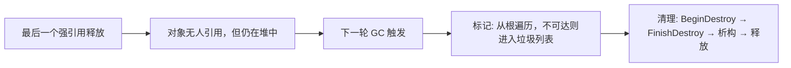

# Unreal Engine GC：反射式标记-清扫

## 1. 定位

UE 的 GC 是**基于 UHT 反射的精确标记-清扫（Mark-Sweep）**，非移动、非分代、无引用计数，靠可达性分析处理环引用。

它最独特的一点：**只回收 `UObject`，不回收 C++ 原生对象**。普通 C++ 对象由智能指针（`TUniquePtr`/`TSharedPtr`）管理，两套体系井水不犯河水。

## 2. 反射是 GC 的"眼睛"

UHT（Unreal Header Tool）在编译前扫描 `UCLASS/USTRUCT/UPROPERTY` 宏，生成反射数据。GC 不靠运行时类型识别，而是靠这些编译期数据知道"对象的哪些成员是指向其他对象的引用"：

```cpp
UCLASS()
class UMyActor : public AActor
{
    GENERATED_BODY()

    UPROPERTY()          // ✅ GC 能跟踪这条引用
    UMeshComponent* Mesh;

    UMaterial* RawMat;   // ❌ 裸指针无 UPROPERTY，GC 看不到
                         //    即使持有，GC 也可能把对象销毁
};
```

只有标了 `UPROPERTY` 的引用才会进入引用图。这就是 UE 开发最高频事故的根源：**漏标 = 悬垂指针**。

## 3. 根集合怎么确定

| 根来源 | 机制 | 典型用途 |
|---|---|---|
| `RF_RootSet` 对象 | `AddToRoot()`/`RemoveFromRoot()` 挂到全局链表 | 引擎核心对象、显式保活 |
| `FGCObject` 子类 | 重写 `AddReferencedObjects`，向收集器上报引用 | 子系统、管理器、单例 |
| `TStrongObjectPtr` | RAII 封装强引用，构造即保活 | 局部/成员强持有 |
| 全局 `UPROPERTY` 变量 | 反射根 | 蓝图资产、配置对象 |
| 引擎内部强持有链 | `GEngine`/`GWorld` 逐级可达 | 组合成对象图 |

软引用与弱引用**不是根**：

```cpp
UPROPERTY()
TSoftObjectPtr<UTexture2D> SoftTex;   // ❌ 不算根，可能被 GC 回收
TObjectPtr<UTexture2D> StrongTex;     // ✅ 强引用，GC 跟踪
```

## 4. 什么时候被回收

关键认知：**引用归零 ≠ 立即销毁**。回收是惰性、批量的：



GC 的触发条件：

| 触发来源 | 说明 |
|---|---|
| 手动调用 | `CollectGarbage()` / `ForceGarbageCollection(true)` |
| 关卡/世界切换 | 地图加载、Streaming 卸载时强制 GC |
| 定时器 | 距上次清理超过 `gc.TimeBetweenPurgingPendingKillObjects`（默认 60 秒） |
| 数量阈值 | 待清理对象积累超过阈值 |
| 内存压力 | 平台报告低内存 |

UE4.24+ 的**增量 GC**把标记拆到多帧执行，每帧只花几毫秒，避免大卡顿。

## 5. 销毁过程：除析构外还调什么

```cpp
// 1. ConditionalBeginDestroy() → 虚函数 BeginDestroy()
//    释放渲染/GPU 资源、停线程、注销子系统
// 2. （异步销毁时）反复检查 IsReadyForFinishDestroy()
// 3. ConditionalFinishDestroy() → 虚函数 FinishDestroy()
// 4. C++ 析构链 ~UYourClass() → ... → ~UObject()，再释放内存
```

要点：

- 手动销毁（`MarkPendingKill`/`Destroy()`）与 GC 销毁走同一条清理路径；**不要直接 `delete` UObject**。
- `AActor` 走正规 `Destroy()` 流程时，在 GC 清理之前还会调用 `EndPlay()` 并广播 `OnDestroyed`——这是游戏逻辑层的拆除，由 `Destroy()` 触发，GC 不会替你补做。

## 6. 连带回收会递归析构吗

**不会。** UObject 的析构函数从不 `delete` 它引用的其他 UObject；回收是"先整体算账、再平铺清扫"：

- 标记阶段把所有不可达对象收集进垃圾列表；
- 清理阶段对列表做扁平循环：先对所有对象调 `BeginDestroy`，再对所有对象调 `FinishDestroy` + 析构。

"连带"的语义由**子对象规则**保证：对象的 outer 不可达时，它自己也被视为不可达（除非标了 `RF_Standalone`）。所以 Actor 与它的组件同批进垃圾列表，但各自独立走完销毁流程。推论：

1. 垃圾之间的析构顺序没有保证，不要依赖它；确定性拆除用 `EndPlay`/`Destroy()` 编排。
2. 子对象若仍被其他根引用（如组件被别的系统持有），会**幸存下来**，不会随父对象级联删除。

## 7. 簇（Cluster）GC

把一组对象（如静态网格体及其材质）打包成簇，GC 时以簇为单位判定，避免逐对象遍历。这贴合游戏资产"批次同生共死"的生命周期。

## 8. 常见坑

| 坑 | 后果 |
|---|---|
| 漏写 `UPROPERTY` | 对象被误回收，裸指针悬垂，访问即崩溃 |
| 直接 `delete` UObject | 绕过 GC 生命周期，状态不一致 |
| 不调 `Destroy()` 就丢引用 | GC 直接收，跳过 `EndPlay` 等游戏逻辑回调 |
| `AddToRoot()` 后忘 `RemoveFromRoot()` | 永久泄漏 |
| 析构函数里访问其他 UObject | 顺序无保证，可能已销毁 |

## 9. 阅读结论

1. UE GC = 反射精确 + 非移动 + 标记-清扫，只管理 UObject，引用关系靠 `UPROPERTY` 显式声明。
2. 回收时机由 GC 触发条件决定，与引用归零时刻解耦。
3. 销毁是 `BeginDestroy → FinishDestroy → 析构` 的分阶段流程，连带回收是扁平清扫而非递归析构。
