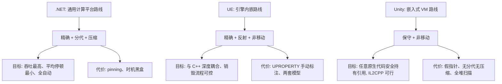

# 三种 GC 对比：UE、Unity 与 .NET

## 1. 一表总览

| 维度 | **UE（UObject GC）** | **Unity（Boehm GC）** | **.NET（C#）GC** |
|---|---|---|---|
| 算法 | 反射辅助的**标记-清扫** | **保守式标记-清扫** | **分代 + 标记-压缩** |
| 是否移动对象 | 否 | 否 | 是（0/1/2 代压缩） |
| 引用识别 | 精确（UHT 反射数据） | 保守（扫内存猜指针） | 精确（JIT 元数据） |
| 管理范围 | 只有 UObject | 所有托管对象 | 所有托管对象 |
| 分代 | 无（全堆标记） | 无（全堆标记） | Gen0/1/2 + LOH + POH |
| 分配方式 | 全局对象数组注册，较重 | malloc 式空闲链表 | Bump 指针，极快 |
| 停顿控制 | 增量 GC、多线程标记 | 增量 GC（2019.1+） | 后台/并发 GC、Server GC |
| 环引用 | 自动 | 自动 | 自动 |
| 析构时机 | BeginDestroy→FinishDestroy→析构，分阶段可异步 | Finalizer 线程，不确定 | Finalizer 线程，不确定 |
| 碎片 | 会（无压缩） | 会（无压缩） | 年轻代自动压缩，LOH 默认不压缩 |
| 与原生互操作 | 同语言，裸指针零成本 | 非移动 ⇒ 无需 pin | 需 pinning/marshal |
| 程序员负担 | 高（UPROPERTY 手动标注） | 低 | 低 |

## 2. 各自的优缺点

### 2.1 UE：反射式标记-清扫

**优点**：

- 引用判定精确，无假指针问题；
- 对象图有结构（outer/inner、GC 簇），可按资产批次整体回收；
- `BeginDestroy`/`FinishDestroy` 分阶段销毁，安全释放 GPU 资源、停线程、注销子系统；
- 与 C++ 同语言零摩擦，非移动 ⇒ 原生指针在两次 GC 之间永远有效；
- 时机半确定（60 秒定时 + 显式 `Destroy()`/`CollectGarbage()`）。

**缺点**：

- 只覆盖 UObject，普通 C++ 对象另一套体系（两套心智模型）；
- 漏标 `UPROPERTY` 即悬垂指针崩溃，编译器不报错、运行时才爆炸；
- `NewObject` 分配开销大，无分代、无压缩，长期运行碎片化；
- UObject 基本活在游戏线程，线程模型受限。

### 2.2 Unity：Boehm 保守式

**优点**：

- 保守 + 非移动 ⇒ 任意原生代码都能安全持有托管指针，无需 pinning（IL2CPP 架构的前提）；
- 全自动，无标注，环引用自动处理；
- 增量 GC 缓解了历史卡顿；
- 有明确逃逸通道（DOTS/ECS、`Unity.Collections`、Burst 完全绕开托管堆）。

**缺点**：

- 假指针：对象被幽灵钉住，内存缓慢膨胀且难排查；
- 无分代：每次回收全堆扫描，成本随存活对象线性增长；
- 无压缩：长期运行碎片化，堆只增不减；
- stop-the-world，几乎无调优空间，只能靠"少分配"规避。

### 2.3 .NET：分代压缩式

**优点**：

- Bump 分配最快；分代让平均回收成本极低（Gen0 亚毫秒）；
- 自动压缩：抗碎片、保局部性；
- 精确：无误回收、无假指针膨胀；
- 后台/并发 GC、Server GC、延迟模式、NoGCRegion——几乎每个维度都有旋钮；
- 工具链成熟（ETW、dotnet-counters、gcdump、dotMemory）。

**缺点**：

- 对象头 + 写屏障的固定税；
- pinning 破坏压缩、LOH 默认不压缩——碎片问题被"赶到角落"而非根治；
- 终结器不确定 + 复活语义复杂，需 IDisposable 双轨制补救；
- 停顿依旧存在，硬实时系统不适用；
- 分配即负债：高频分配场景仍需池化/结构体纪律。

## 3. 为什么三者选择不同（设计哲学）

几个值得玩味的结论：

1. **"全自动"与"高性能"在游戏里是矛盾的**：.NET 自动化程度最高，但游戏团队最后往往反过来追求确定性（`NoGCRegion`、池化）；UE 自动化程度最低，但控制力最强。
2. **分代假设在游戏里部分失效**：帧临时对象确实短命，但游戏实体（角色、组件、资产引用）活得很久，晋升 Gen2 后反而成为重灾区；UE 的簇机制更贴合游戏资产"批次同生共死"的生命周期。
3. **非移动是引擎 GC 的共性**：UE 和 Unity 都不移动对象，根源都在"原生代码持有裸指针"——移动式 GC 的代价是全局 pinning，引擎无法接受。
4. **三者都无法保证零卡顿**：UE 靠增量 + 显式编排，Unity 靠增量 + 少分配，.NET 靠后台并发 + 低延迟模式。

## 4. 面试速答模板

被问"XX 的 GC 是什么"时，按这个顺序答：

1. **报算法名**：UE 是反射辅助的标记-清扫；Unity 是 Boehm 保守式标记-清扫；C# 是分代标记-压缩。
2. **讲根与可达性**：根集合从哪来，如何判定对象存活。
3. **讲回收过程与触发**：标记-清扫（-压缩）各阶段做什么，GC 何时触发。
4. **落到工程代价**：UE 的 UPROPERTY 坑、Unity 的假指针与碎片、.NET 的 pinning 与 LOH。
5. **给一句权衡**：精确 vs 保守、移动 vs 非移动、分代 vs 全堆，分别换来了什么。

## 5. 阅读结论

1. 三个 GC 都是标记-清扫族的变体，区别只在三个正交维度：引用如何发现、对象是否移动、堆是否分代。
2. 没有"最好的 GC"，只有与宿主架构的匹配度：UE 匹配反射与 C++ 资产图，Unity 匹配 IL2CPP 互操作，.NET 匹配通用计算吞吐。
3. 面试的核心竞争力不是背细节，而是能说清"每个设计决策换来了什么、付出了什么"。
