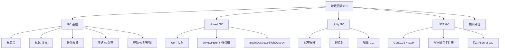

# 垃圾回收（GC）

## 1. 文档范围

本文档系统整理游戏客户端开发中最常遇到的三种垃圾回收体系，并比较其设计与取舍：

- GC 基础：可达性分析、标记-清扫、分代、压缩、精确与保守。
- Unreal Engine GC：反射辅助的标记-清扫，只管理 UObject。
- Unity GC：Boehm 保守式标记-清扫，Mono 与 IL2CPP 共用。
- .NET（C#）GC：分代、压缩、支持后台并发的精确追踪式收集器。

> 本文讨论的是"自动回收托管对象"的 GC，与语言层/引擎层的手动内存管理互补：
> C++ 智能指针与 RAII 见 [C++ 基础知识](../cpp/README.md)，引擎侧分配器策略见
> [引擎基础](../engine/README.md)。

## 2. 阅读导航

| 顺序 | 文件 | 内容 |
|---|---|---|
| 1 | [01-gc-fundamentals](./01-gc-fundamentals.md) | 追踪式 GC 的基本模型：根、可达性、标记-清扫、分代与压缩 |
| 2 | [02-unreal-gc](./02-unreal-gc.md) | UE 的反射式标记-清扫、根集合与 UObject 生命周期 |
| 3 | [03-unity-gc](./03-unity-gc.md) | Unity 的 Boehm 保守式 GC 与增量回收 |
| 4 | [04-dotnet-gc](./04-dotnet-gc.md) | C#/.NET 的分代压缩式 GC |
| 5 | [05-comparison](./05-comparison.md) | 三者横向对比、优缺点与选型逻辑 |

## 3. 知识结构

## 4. 阅读结论

1. 三种 GC 的区别可以收敛为三个正交问题：引用如何被发现（精确/保守）、对象是否移动（压缩/非移动）、堆是否分代。
2. 引擎 GC（UE、Unity）都选择**非移动**，因为原生代码持有裸指针，移动对象无法更新未知引用；.NET 选择**移动压缩**，因为它精确知道所有引用。
3. 面试回答"某引擎/语言的 GC"时，先报出算法名（反射标记-清扫 / 保守标记-清扫 / 分代标记-压缩），再讲根集合、触发时机与回收过程，最后落到工程代价与常见坑。
