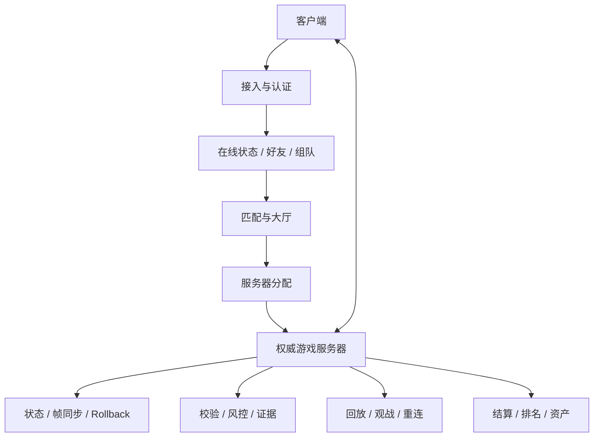

# 多人游戏面试复习

## 模块定位

多人游戏不是“给单机逻辑加一个 Socket”，而是让多个不可靠、不同步、可能恶意的客户端，通过服务器和协议共同维护一条可恢复的游戏时间线。

完整链路：

```text
认证 -> 在线状态/组队 -> 大厅与匹配 -> 分配游戏服务器
-> 建立连接 -> 输入与状态同步 -> 断线重连/观战
-> 结算、排名与资产 -> 防作弊和运营观测
```

## 系统地图



这张图是职责关系，不要求每个框都部署成独立微服务。

## 子模块

| 子模块 | 核心问题 |
|---|---|
| [游戏同步模型](./game-synchronization/README.md) | 同步状态还是输入，客户端如何预测，服务器下发什么？ |
| [游戏防作弊](./game-anti-cheat/README.md) | 客户端不可信时，怎样预防、检测、举证和处置？ |

## 速记文件

1. [架构、权威与网络拓扑](./01-architecture-and-topology-quick-notes.md)
2. [会话、大厅、组队与匹配](./02-session-lobby-and-matchmaking-quick-notes.md)
3. [传输、可靠性与协议](./03-transport-and-protocol-quick-notes.md)
4. [时间、延迟与体验补偿](./04-time-latency-and-compensation-quick-notes.md)
5. [复制、兴趣管理与带宽](./05-replication-interest-and-bandwidth-quick-notes.md)
6. [调试、测试与可观测性](./06-debugging-testing-and-observability-quick-notes.md)
7. [多人游戏面试冲刺](./07-multiplayer-interview-quick-notes.md)

## 不要混淆的层次

| 层次 | 典型选择 |
|---|---|
| 拓扑 | Dedicated、Listen Server、P2P、Relay |
| 权威 | 服务器权威、房主权威、对等协商 |
| 传输 | TCP、UDP、QUIC、WebSocket、自研可靠层 |
| 同步 | 状态同步、确定性帧同步、Rollback、混合 |
| 体验补偿 | 预测、插值、外推、延迟补偿 |
| 安全 | 最小信息、服务器校验、完整性、行为风控 |

这些维度可以组合，不能把“用 UDP”当成“使用帧同步”，也不能把“P2P”当成“没有服务器”。

## 设计题回答框架

```text
规模：玩家数、实体数、Tick、单局时长
-> 权威与拓扑：谁裁决，部署在哪里
-> 会话：如何组队、匹配、分配、加入和重连
-> 协议：传什么，可靠性、版本和安全
-> 同步：状态/输入、预测、插值和校正
-> 容量：CPU、内存、带宽和地域
-> 失败：掉线、服崩、迁移、重复结算
-> 观测：网络、同步、服务和业务指标
-> 防作弊：最小信息、校验、检测和处置
```

## 30 秒回答

> 多人游戏需要同时解决连接与会话、权威模拟、同步体验、容量和安全。玩家先经过认证、组队和匹配，由分配服务选择区域与游戏服务器；游戏内根据规模和交互精度选择状态同步、帧同步或 Rollback，并用预测、插值和延迟补偿隐藏网络延迟。服务器维护关键权威状态，协议按业务选择可靠性、版本和幂等，断线通过快照或检查点恢复。最终要监控 RTT、丢包、校正、Tick、房间容量、重连和结算，并将防作弊建立在服务器验证和多源证据上。

[返回游戏客户端面试路线](../README.md)
